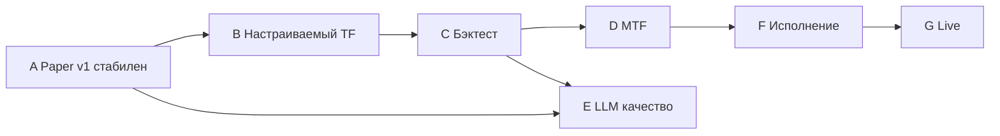

# Roadmap развития системы

Долгосрочные **вехи эволюции** автоматической торговой системы. Краткосрочные баги и hotfix'ы сюда не входят.

Связанные документы:
- [Дорожная карта реализации (этапы 1–N)](../n8n_automation/docs/roadmap.md) — что уже построено по инфраструктуре
- [Crypto flow design](../trading_wiki/06-Стратегии%20автоматизированной%20LLM%20торговли/Crypto_flow_design.md)
- [Guardrails](../trading_wiki/09-LLM%20промпты%20и%20инструменты/LLM_rules_and_guardrails.md)

---

## Текущее состояние (v1)

| Компонент | Статус |
|-----------|--------|
| Crypto swing `llm_swing` | Один TF **4h**, rule filter → LLM → guardrails |
| MOEX swing | Дневные свечи, аналогичный пайплайн |
| Частота workflow | Настраивается в UI (отдельно от TF сигнала) |
| Universe (пары/тикеры) | Runtime в «Поднастройки стратегии» |
| Пресеты риска | Консервативный / Сбалансированный / Агрессивный (runtime) |
| Guardrails G6/G7 | Daily loss + max open positions **в коде** |
| MTF (1d + 4h + 1h) | Только в wiki, не в пайплайне |
| Бэктест стратегии | **FINSABER walk-forward** — `POST /api/backtest/finsaber`, workflow `finsaber-backtest-weekly` |
| LLM validate-only | **Реализовано** — `guardrails.yaml` → `llm.mode: validate_only` |
| Retail guard (BIS) | **В crypto_pipeline** — `retail_guard` после rule filter |
| DeepFund live-paper | Workflow `deepfund-live-paper`, `POST /api/deepfund/cycle` |
| On-chain filter | `GET /api/onchain/context`, интеграция в crypto pipeline |
| Factor sleeve MOEX | Workflow `securities-factor-sleeve`, `POST /api/factor-sleeve/rebalance` |
| Regulatory monitor | Workflow `regulatory-monitor`, RSS ESRB/FSB + `POST /api/regulatory/scan` |
| NeuraTrade harness | Workflow `neuratrade-harness`, `POST /api/neuratrade/cycle` |
| TradingAgents | `POST /api/trading-agents/run`, опция `use_trading_agents` в pipeline |
| Bond ladder | Workflow `bond-ladder-flow`, `GET /api/bond-ladder/evaluate` |
| Geopolitical overlay | `GET /api/geopolitical/score`, sizing в securities pipeline |
| Papers automation | Workflow `papers-monitor-weekly`, arXiv + CrossRef → `papers_candidates` |

---

## Веха A — Стабильный paper v1 ✅ (частично)

**Цель:** предсказуемая работа на testnet/sandbox без сюрпризов в риске и конфиге.

| Задача | Описание |
|--------|----------|
| A.1 | Единый source of truth для лимитов риска — `guardrails.yaml` + runtime пресеты |
| A.2 | Проверка `daily_loss_limit` и `max_open_positions` в `enforce_guardrails` |
| A.3 | UI «Поднастройки стратегии»: котировки + пресет риска |
| A.4 | Символы workflow universe = эффективный allowlist (не дублировать whitelist вручную) |
| A.5 | Блокировка смены пресета при daily halt и открытых позициях |

**Критерий готовности:** 2+ недели paper без ручного редактирования YAML для риска и пар.

---

## Веха B — Настраиваемый таймфрейм сигнала

**Цель:** отделить «как часто запускать» от «на каких свечах считать».

| Задача | Описание |
|--------|----------|
| B.1 | Параметр `timeframe` в runtime / UI (1h, 4h, 1d) с записью в конфиг |
| B.2 | Синхронизация расписания: рекомендация «частота ≥ TF сигнала» в UI |
| B.3 | Опция «LLM только после закрытия свечи TF» (без сигналов по формирующейся свече) |
| B.4 | Обновление промптов и golden set под выбранный TF |

**Критерий:** смена 4h → 1d без правки кода; бенчмарк LLM проходит на новом TF.

---

## Веха C — Бэктест и калибровка порогов

**Цель:** обосновать пороги RSI/MACD данными, а не эвристиками v1.

| Задача | Описание |
|--------|----------|
| C.1 | Исторический прогон rule filter на BTC/ETH (и выбранных alts) за 2+ года |
| C.2 | Метрики: частота сигналов, forward return (6 баров TF), max DD, win rate |
| C.3 | Сравнение TF: 1h / 4h / 1d на одних правилах |
| C.4 | Human-in-the-loop: изменение порогов только после отчёта в Obsidian |
| C.5 | Связка с `benchmark_cases` и `historical_benchmark` |

**Критерий:** документ «обоснование порогов v2» со ссылкой на отчёт бэктеста.

---

## Веха D — MTF (multi-timeframe)

**Цель:** снизить сделки против старшего тренда.

Схема из wiki:

| Слой | TF | Роль |
|------|-----|------|
| Тренд | 1d | EMA200, направление |
| Сигнал | 4h | RSI, MACD, rule filter |
| Вход | 1h (опц.) | Тайминг, не генерация сигнала |

| Задача | Описание |
|--------|----------|
| D.1 | Загрузка 1d + 4h klines в одном прогоне |
| D.2 | Trend gate: long только если 1d `close > EMA200` (настраиваемо) |
| D.3 | Правило «старший TF важнее» в rule filter и промпте LLM |
| D.4 | Расширение `inputs_hash` для MTF-контекста |
| D.5 | Golden set и бенчмарк для MTF-кейсов |

**Критерий:** доля long против 1d-даунтренда → 0% (кроме явного counter-trend режима).

**Не путать с вехой B:** сначала один настраиваемый TF и бэктест, потом MTF.

---

## Веха E — Качество LLM-слоя

| Задача | Описание |
|--------|----------|
| E.1 | Дедупликация вызовов LLM при том же `inputs_hash` + тех же новостях |
| E.2 | Champion/challenger промптов на paper |
| E.3 | Калибровка confidence vs фактический forward return |
| E.4 | Опциональный ансамбль моделей (консенсус approve) |

---

## Веха F — Исполнение и мониторинг

| Задача | Описание |
|--------|----------|
| F.1 | Bracket orders SL/TP на testnet (OCO или связанные ордера) |
| F.2 | Trailing stop (отдельный monitor workflow) |
| F.3 | Reconciliation позиций exchange vs журнал событий |
| F.4 | Combined daily loss crypto + MOEX (`portfolio.combined_daily_loss_limit_pct`) |
| F.5 | WebSocket klines для monitor (опционально, не для swing v1) |

---

## Веха G — Live с ручным контуром

| Задача | Описание |
|--------|----------|
| G.1 | Разделение signal workflow / execute workflow (manual approve) |
| G.2 | Telegram approve/reject перед ордером |
| G.3 | Compliance checklist из `crypto_config.compliance` |
| G.4 | Отдельный ledger и tax export для live |

---

## Веха H — Расширение рынков и стратегий

| Задача | Описание |
|--------|----------|
| H.1 | Стратегия `dca_btc` в полноценном UI (сейчас в конфиге) |
| H.2 | On-chain фильтры как macro context (не HFT-триггер) |
| H.3 | Корреляция с BTC dominance для alts в LLM-контексте |

---

## Рекомендуемый порядок

1. **A** — закрепить риск и поднастройки (текущий спринт)
2. **B + C** — обосновать TF и пороги данными
3. **D** — MTF после статистики на одном TF
4. **E** — параллельно с paper
5. **F → G** — только после метрик paper

---

## Принципы развития

1. **Guardrails важнее LLM** — модель не отменяет лимиты риска.
2. **YAML = git, runtime = оператор** — смена риска и пар через UI с audit log.
3. **Один TF не равен частоте cron** — документировать и показывать в UI.
4. **Нет live без paper-статистики** — минимум N сделок и отчёт эффективности.
5. **Не расширять universe без ликвидности** — whitelist/каталог + предупреждения.

---

## Метрики успеха (сводка)

| Веха | KPI |
|------|-----|
| A | 0 сделок вне пресета; daily halt срабатывает в тесте |
| B | Смена TF без деплоя кода |
| C | Отчёт бэктеста с ≥100 сигналов на актив |
| D | MTF gate в ≥95% прогонов |
| E | Benchmark regression green; calibration drift < порога |
| F | 100% позиций с SL на testnet |
| G | Manual approve на каждый live-ордер |

---

*Обновлено: 2026-07-10. Веха A частично реализована. P0–P2 из papers-research-report внедрены в код и n8n.*
