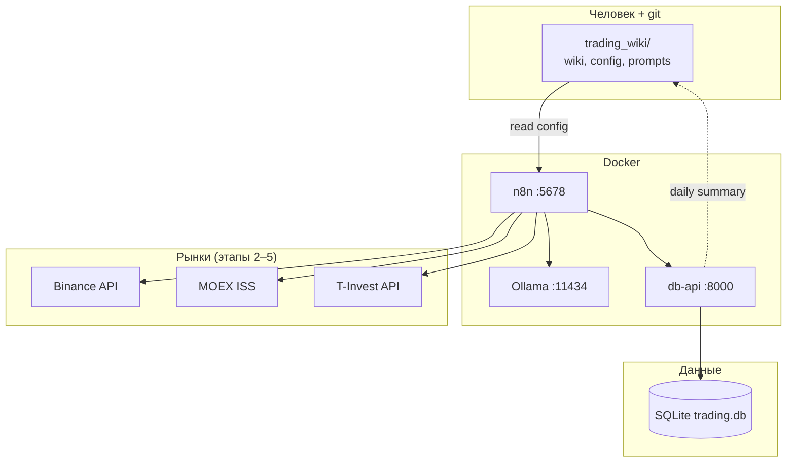

# Автоматизация PROJECT Trading

Система автоматической торговли на базе **n8n**, **Ollama**, **SQLite** и **Obsidian**.

> Образовательный проект. Не инвестиционная рекомендация. Оператор несёт ответственность за live-торговлю.

## Содержание

- [Архитектура](#архитектура)
- [Быстрый старт](#быстрый-старт)
- [Компоненты](#компоненты)
- [Дорожная карта](#дорожная-карта)
- [Документация](#документация)

---

## Архитектура



### Принципы

| Принцип | Реализация |
|---------|------------|
| LLM не исполняет ордера | approve/reject + confidence; size и order — Code node |
| Fail-closed | Ollama недоступен → не торговать |
| Раздельные flows | crypto 24/7 ≠ MOEX session + T+1 |
| Два слоя данных | Obsidian = правила; SQLite = факты |
| Воспроизводимость | `inputs_hash`, `prompt_version`, `model` в каждом событии |

Подробнее в wiki: [[n8n_architecture_overview]].

---

## Быстрый старт

### Требования

- Docker Desktop (Windows) или Docker + Compose
- 8+ GB RAM (Ollama 7B на CPU)
- Git

### 1. Конфигурация

```powershell
cd C:\Users\freim\Documents\GitHub\PROJECT_Trading
copy .env.example .env
# Отредактируйте N8N_PASSWORD в .env
```

### 2. Запуск инфраструктуры

```powershell
docker compose up -d --build
```

Сервисы:

| URL | Сервис |
|-----|--------|
| http://localhost:5678 | n8n (логин из `.env`) |
| http://localhost:11434 | Ollama API |
| http://localhost:8000/health | DB API |
| http://localhost:8000/docs | OpenAPI (Swagger) |

### 3. Модель Ollama

```powershell
docker exec -it trading-ollama ollama pull llama3.2
```

### 4. Инициализация БД (если не через Docker)

```powershell
cd python
python -m venv .venv
.\.venv\Scripts\activate
pip install -r requirements.txt
python -m db.init_db
```

### 5. Импорт workflows в n8n

1. Откройте http://localhost:5678
2. Import → `n8n_automation/workflows/shared/shared-global-error-handler.json`
3. Import → `n8n_automation/workflows/shared/shared-health-check.json`
4. **Settings → Error workflow** → `shared-global-error-handler`
5. Активируйте `shared-health-check`

### 6. Проверка

```powershell
curl http://localhost:8000/health
curl http://localhost:8000/api/health/latest
```

После 5 минут health-check в `api/health/latest` появятся записи по ollama, binance, moex_iss, db_api.

---

## Компоненты

### n8n (`docker-compose` → `trading-n8n`)

Оркестрация: triggers, HTTP, условия, sub-workflows, credentials.

- Workflows: `n8n_automation/workflows/`
- Read-only mount: `trading_wiki/` (config, prompts)

### Ollama (`trading-ollama`)

Локальный LLM. Валидация сигналов, не исполнение ордеров.

### DB API (`trading-db-api`)

Python FastAPI sidecar для записи событий из n8n.

| Endpoint | Метод | Назначение |
|----------|-------|------------|
| `/health` | GET | Liveness |
| `/api/health/batch` | POST | Health-check batch |
| `/api/health/latest` | GET | Последние проверки |
| `/api/events` | POST | Событие торгового pipeline |
| `/api/events` | GET | Список событий |
| `/admin/init` | POST | Пересоздать схему |

Схема: `data/schema.sql`. Документация: [docs/database.md](docs/database.md).

### Obsidian (`trading_wiki/`)

| Путь | Назначение |
|------|------------|
| `config/guardrails.yaml` | Жёсткие лимиты (G1–G12) |
| `config/crypto_config.yaml` | Параметры crypto flow |
| `config/securities_config.yaml` | Параметры MOEX flow |
| `prompts/` | Версионированные промпты |
| `logs/` | Человекочитаемые сводки (генерируются) |

### Python (`python/`)

| Модуль | Этап | Назначение |
|--------|------|------------|
| `db/` | 1 ✅ | SQLite, init |
| `api/` | 1 ✅ | HTTP для n8n |
| `indicators/` | 2 | RSI, MACD, EMA |
| `bridges/` | 5 | T-Invest gRPC → HTTP |
| `backtest/` | 6 | Исторический replay |
| `evaluation/` | 6 | Сравнение LLM-моделей |

---

## Режимы исполнения

| Режим | Ордер на биржу | Описание |
|-------|----------------|----------|
| `dry_run` | Нет | Полный pipeline, только лог |
| `paper` | Testnet / Sandbox | Виртуальные деньги |
| `shadow` | Нет | Параллельная запись «как будто» |
| `live` | Да | Реальные деньги + manual flag |

Текущий режим по умолчанию: **`dry_run`** (`guardrails.yaml` → `trading.mode`).

---

## Дорожная карта

| Этап | Статус | Содержание |
|------|--------|------------|
| **1. Инфраструктура** | ✅ | Docker, SQLite, DB API, health-check |
| **2. Crypto dry_run** | ✅ | `POST /api/crypto/signal`, `crypto-signal-dry-run` |
| **3. База новостей** | ✅ | RSS ingest, `news-ingest` |
| **4. Crypto paper** | ✅ | Binance testnet order, monitor workflows |
| **5. Securities DCA** | ✅ | T-Invest bridge, `securities-dca-sandbox` |
| **6. Evaluation** | ✅ | replay, metrics, `analysis-llm-report` |
| **7. Securities swing** | ✅ | MOEX swing + LLM, `securities-swing-dry-run` |
| **8. Live gates** | ✅ | checklist API, `live_promotion.md` |

Детали: [docs/roadmap.md](docs/roadmap.md). Live — только после ручной проверки [docs/live_promotion.md](docs/live_promotion.md).

### Smoke test (после docker compose up)

```powershell
docker exec trading-db-api python smoke_test.py
```

---

## Документация

| Файл | Тема |
|------|------|
| [docs/system_overview.md](docs/system_overview.md) | Полное описание системы |
| [docs/database.md](docs/database.md) | Схема БД, API, примеры |
| [docs/roadmap.md](docs/roadmap.md) | Поэтапный план |
| [workflows/README.md](workflows/README.md) | Импорт workflows |
| [docs/live_promotion.md](docs/live_promotion.md) | Checklist testnet → live |
| [docs/control_panel.md](docs/control_panel.md) | Web Console + Telegram bot |
| [../trading_wiki/06-Стратегии автоматизированной LLM торговли/](../trading_wiki/06-Стратегии%20автоматизированной%20LLM%20торговли/) | Wiki: архитектура, flows, guardrails |

---

## Безопасность

- API-ключи — **только** n8n Credentials (не в git, не в промптах).
- Binance: **Disable Withdrawals**.
- `kill_switch: true` в `guardrails.yaml` → halt всех trading workflows.
- Live требует `live_requires_manual_flag: true` + тег `#env/live`.

---

## Связанные материалы wiki

- [[n8n_architecture_overview]]
- [[Crypto_flow_design]]
- [[Securities_flow_design]]
- [[LLM_rules_and_guardrails]]
- [[Automation_system]]
