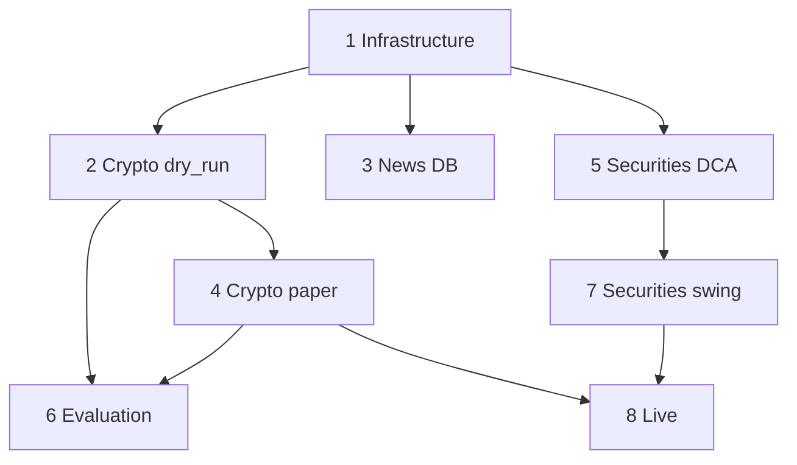

# Дорожная карта автоматизации

Поэтапный план реализации. Каждый этап завершается проверяемым результатом.

**Долгосрочные вехи развития** (MTF, бэктест, live): [`docs/roadmap-razvitiya.md`](../../docs/roadmap-razvitiya.md)

---

## Этап 1 — Инфраструктура ✅

| Артефакт | Путь |

|----------|------|

| Docker Compose | `docker-compose.yml` |

| SQLite schema | `data/schema.sql` |

| DB API | `python/api/main.py` |

| Config | `trading_wiki/config/*.yaml` |

| Health workflow | `shared-health-check.json` |

---

## Этап 2 — Crypto dry_run ✅

| Артефакт | Путь |

|----------|------|

| Indicators | `python/indicators/technical.py` |

| Crypto pipeline | `python/crypto_pipeline.py` |

| API | `POST /api/crypto/signal` |

| Workflow | `crypto/crypto-signal-dry-run.json` |

---

## Этап 3 — База новостей v1 ✅

| Артефакт | Путь |

|----------|------|

| News service | `python/news_service.py` |

| API | `POST /api/news/ingest`, `GET /api/news/context` |

| Workflow | `news/news-ingest.json` |

| Seed sources | ЦБ РФ, MOEX, CoinDesk RSS |

---

## Этап 4 — Crypto paper (testnet) ✅

| Артефакт | Путь |

|----------|------|

| Binance client | `python/binance_client.py` |

| API | `POST /api/binance/order`, open-orders, balances |

| Workflows | `crypto-execute-testnet`, `crypto-monitor-testnet` |

| Credentials | `.env` → `BINANCE_TESTNET_*` |

---

## Этап 5 — Securities index_dca ✅

| Артефакт | Путь |

|----------|------|

| T-Invest bridge | `python/bridges/tinvest_bridge.py` |

| Securities pipeline | `python/securities_pipeline.py` |

| API | `POST /api/securities/dca` |

| Workflow | `securities-dca-sandbox.json` |

---

## Этап 6 — Evaluation pipeline ✅

| Артефакт | Путь |

|----------|------|

| Replay | `python/evaluation/replay.py` |

| Backtest metrics | `python/backtest/metrics.py` |

| API | `/api/evaluation/*`, `/api/backtest/*`, `POST /api/reports/daily` |

| Workflow | `analysis-llm-report.json` |

---

## Этап 7 — Securities swing + LLM ✅

| Артефакт | Путь |

|----------|------|

| API | `POST /api/securities/swing` |

| MOEX candles | ISS API в `securities_pipeline.py` |

| Workflow | `securities-swing-dry-run.json` |

---

## Этап 8 — Live ✅ (gates + checklist)

| Артефакт | Путь |

|----------|------|

| Live checklist API | `GET /api/live/checklist` |

| Promotion doc | `docs/live_promotion.md` |

| Env gate | `LIVE_TRADING_ENABLED`, `kill_switch` |

| Telegram | `shared-telegram-alert.json` |

**Live workflows не активировать до ручной проверки checklist.**

---

## Зависимости

