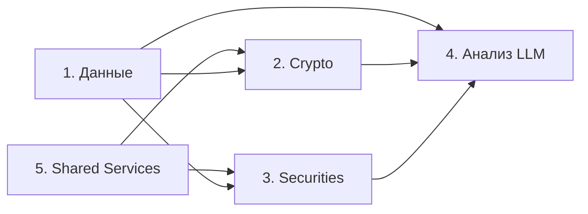
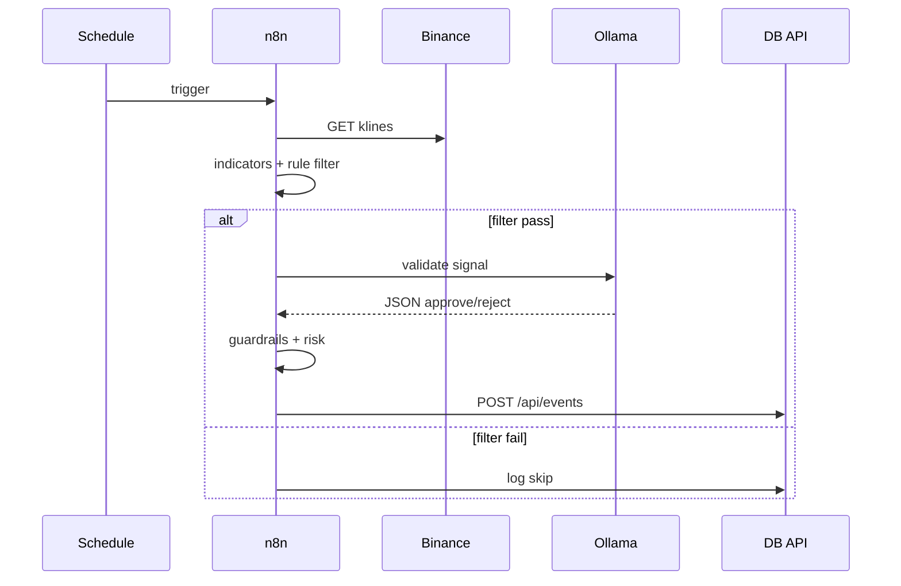

# Обзор системы — PROJECT Trading Automation

Документ описывает автоматическую систему трейдинга целиком: цели, границы, потоки данных и роли компонентов.

## 1. Цель системы

Полуавтоматическая торговля на двух рынках:

- **Криптовалюты** (Binance Spot, 24/7)
- **Ценные бумаги** (MOEX через T-Invest, сессионная торговля)

LLM (Ollama) выполняет роль **валидатора сигналов**, а не трейдера. Исполнение, размер позиции и guardrails — детерминированный код.

## 2. Границы ответственности

| Компонент | Делает | Не делает |
|-----------|--------|-----------|
| n8n | Оркестрация, triggers, HTTP, логика ветвлений | Тяжёлые расчёты, gRPC T-Invest |
| Ollama | approve/reject, counter_thesis, confidence | Ордера, quantity, API keys |
| DB API + SQLite | Факты: сделки, health, новости, replay | Промпты, wiki-контент |
| Obsidian | Wiki, config, prompts, дневные сводки | Высокочастотные логи |
| Python sidecar | Индикаторы, бэктест, T-Invest bridge | UI, credentials |

## 3. Пять логических блоков

### Блок 1 — Данные

- **Wiki**: образовательный контент + RAG для LLM
- **Config**: `guardrails.yaml`, market-specific yaml
- **SQLite**: операционные логи, новости, свечи, позиции
- **Wiki pipeline** (позже): проверка ссылок, RAG reindex; без автопереписывания фактов

### Блок 2 — Crypto

Workflows: `crypto-signal-*`, `crypto-execute-*`, `crypto-monitor-*`

Pipeline: klines → indicators → rule filter → LLM → guardrails → risk → order → log

### Блок 3 — Securities

Workflows: `securities-dca-*`, `securities-swing-*`

Особенности: session gate, T+1, lot size, FIGI mapping

### Блок 4 — Анализ

- Dry-run / paper / shadow метрики
- Replay по `inputs_hash`
- Champion vs challenger для моделей и промптов
- Модуль `python/evaluation/`

### Блок 5 — Shared Services (сквозной)

Sub-workflows, используемые обоими рынками:

| Workflow | Назначение |
|----------|------------|
| `shared-health-check` | Мониторинг Ollama, API, DB |
| `shared-global-error-handler` | Глобальные ошибки → DB |
| `shared-llm-validate` | (этап 2) Ollama + schema parse |
| `shared-risk-manager` | (этап 2) Position sizing, daily limit |
| `shared-log-event` | (этап 2) POST /api/events |
| `shared-enforce-guardrails` | (этап 2) G1–G12 |

## 4. Поток одного сигнала (crypto, dry_run)

## 5. Конфигурация

Все торговые лимиты читаются из `trading_wiki/config/` при старте workflow.

Приоритет при конфликте: `guardrails.yaml` > market config > defaults в Code node.

## 6. Наблюдаемость

- **Health**: `system_health_checks` каждые 5 мин
- **Events**: `trade_events` — каждый этап pipeline
- **LLM audit**: `llm_decisions` — полный ответ модели
- **Alerts** (этап 2+): Telegram при CRITICAL

## 7. Продвижение testnet → live

Checklist в [[n8n_architecture_overview#Promotion checklist: testnet → live]].

Кратко: ≥4 недели paper, задокументированный drawdown, kill switch проверен, withdrawals disabled.
