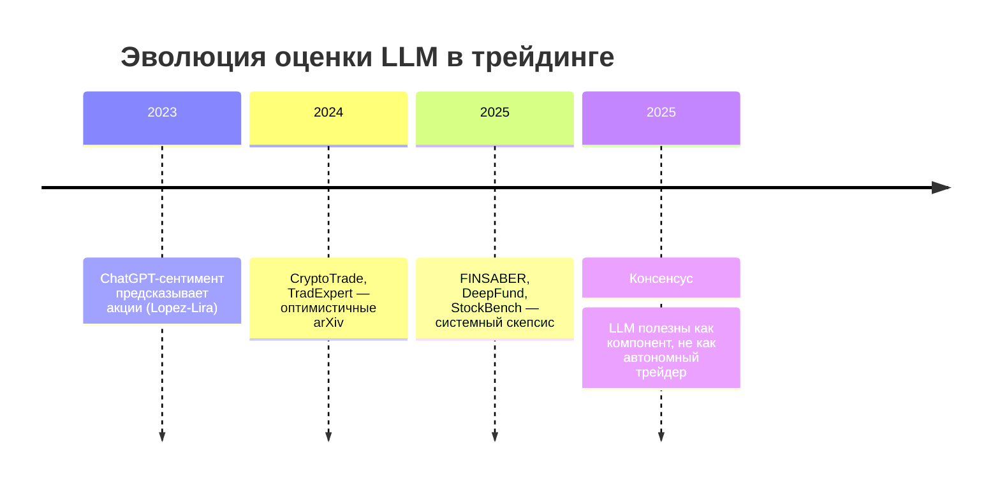

# Тренды в финансах и трейдинге (2021–2026)

> Синтез по **74 проверяемым источникам** из `papers/`. Учтены только публикации с прямой ссылкой; блоги с непроверенной доходностью не используются как доказательная база.

---

## 1. LLM в трейдинге: от хайпа к скептическому консенсусу

### Что показывают достоверные исследования

| Работа | Уровень достоверности | Главный вывод |
|--------|----------------------|---------------|
| Lopez-Lira & Tang, *Can ChatGPT Forecast…* (2024) | Высокий (рецензируемый процесс, out-of-sample) | ChatGPT-сентимент из новостей **предсказывает** дневные доходности; эффект сильнее у малых акций |
| FINSABER (2025) | Средний (arXiv, системный бенчмарк) | «Успех» LLM-стратегий **исчезает** при 20-летнем бэктесте и устранении survivorship/look-ahead bias |
| StockBench (2025) | Средний | Большинство LLM **не бьют** buy-and-hold на multi-month горизонте |
| DeepFund (2025) | Средний | Live-тест: даже топ-модели (DeepSeek-V3, Claude) **теряют** на реальном рынке |
| LiveTradeBench (2025) | Средний | Высокий LMArena score **≠** торговый альфа |

### Тренд



**Практический вывод для n8n + Ollama:** LLM — аналитик, парсер, RAG-слой (подтверждает Smart-Lab `sl-001`), но не исполнитель сделок без жёстких guardrails и live-мониторинга.

---

## 2. Криптовалюты: розница проигрывает, инфраструктура институционализируется

### BIS-консенсус (WP 1049, Bulletin 69, WP 1087, WP 1227)

1. **Розничные инвесторы входят на пиках.** Рост BTC → приток новых пользователей → крупные держатели продают ([BIS WP 1049](https://www.bis.org/publ/work1049.htm)).
2. **Большинство розницы в убытке.** ~75% скачали приложения при BTC > $20k; симуляции показывают потери у большинства ([BIS Bulletin 69](https://www.bis.org/publ/bisbull69.pdf)).
3. **Crypto carry до 40% годовых** — следствие limits-to-arbitrage и спроса розницы на плечо; ETF spot BTC (2024) частично сжал basis ([BIS WP 1087](https://www.bis.org/publ/work1087.htm)).
4. **DeFi не демократизирует рынок.** На Uniswap V3 ликвидность концентрирована у sophisticated LP ([BIS WP 1227](https://www.bis.org/publ/work1227.htm)).

### Регуляторный тренд (ESRB 2025, IMF 2025)

- Крипто и стейблкоины **встроены** в традиционные финансы → системные риски растут.
- ESRB рекомендует ограничить third-country multi-issuer stablecoins в EU к 2026.
- IMF документирует стейблкоины как near-money с рисками run и фрагментации резервов.

**Практический вывод:** стратегии на crypto carry и DEX LP требуют учёта регуляторных шоков и асимметрии «умных денег vs розница».

---

## 3. Российский рынок: структурный перелом 2022–2024

| Фактор | Источник | Следствие для трейдинга |
|--------|----------|------------------------|
| Herding при падениях | MOEX, RBF 2023 | Контр-тренд рискован; стопы обязательны |
| Momentum работает | Financial Journal 2023 (HSE) | 16 стратегий положительны с учётом комиссий (данные 2019–2021) |
| Factor investing | HSE / Корп. финансы 2025 | 15 long-factor портфелей бьют MOEX-TR (2007–2024) |
| Volatility spillovers | Economy of Region 2025 | Секторные риски передаются нелинейно при шоках 2020–2024 |
| Санкции MOEX 06.2024 | Reuters 2024 | USD/EUR только OTC → спреды, непрозрачность цен |

**Тренд:** российский рынок остаётся **факторно предсказуемым** на исторических данных, но **микроструктура 2024+** требует новых исследований (gap в коллекции).

---

## 4. Факторное инвестирование и пассивные потоки

### Подтверждённые эффекты

- **Momentum жив.** Jegadeesh & Titman (2023), Gao et al. (2024) — momentum не «избыточен».
- **Value + momentum объединимы.** Boudoukh et al. (2024) — momentum как прокси роста прибыли.
- **Factor momentum > local.** Bartel et al. (2024) — глобальные сигналы лучше локальных.
- **Пассивные потоки искажают цены.** Jiang et al. (2024) — mega-caps растут непропорционально при inflows в индексные фонды.

**Тренд:** smart beta и factor timing — активная область; pure passive страдает от концентрации в mega-cap.

---

## 5. Алготрейдинг и AI: эффективность vs коллюзия

| Направление | Источник | Вывод |
|-------------|----------|-------|
| AT улучшает efficiency | Yuferova, J. Financial Markets 2024 | AT снижает предсказуемость order flow |
| RL-агенты коллюзируют | NBER w34054 (2025) | AI speculators автономно поддерживают надконкурентные цены |
| Алгоритмическое принуждение | NBER w34070 (2025) | Быстрая реакция алгоритма → coercive equilibrium |

**Тренд:** регуляторы и биржи будут усиливать надзор за AI-trading; для частного алготрейдера — конкуренция с institutional AT растёт.

---

## 6. Риск-менеджмент и портфели

- **End-to-end ML > двухэтапный Markowitz** (NBER w34861, 2025).
- **RATS** оптимизирует VaR + P&L на реальных портфелях (Bianchetti et al., 2024).
- **Tail risk + sentiment + DRL** улучшает портфели (Abdullah et al., 2023).
- **Disposition effect** снижается налоговой осведомлённостью (JFQA 2022) и информационными интервенциями (Frontiers 2024).

**Тренд:** риск-менеджмент интегрируется в ML-пайплайн, а не применяется постфактум.

---

## 7. Сентимент и альтернативные данные

- **StockTwits:** полярность предсказывает события (volume spikes), не unconditional next-day returns (Digital Finance 2024) — согласуется с EMH.
- **ChatGPT > словари** для сентимента новостей (Lopez-Lira 2024).
- **SPB + соцсети:** российский retail sentiment влияет на US-акции в вечерней сессии (Eurasian Economic Review 2023).

**Тренд:** сентимент работает **условно** (события, ликвидность, арбитражные ограничения), не как универсальный сигнал.

---

## 8. Иерархия достоверности (для принятия решений)

```
Tier 1 — Peer-reviewed top journals + центральные банки
  JFE, JFQA, Nature Sci Rep, BIS, ESRB, IMF, NBER

Tier 2 — SSRN/NBER working papers от известных авторов
  Jegadeesh, Moskowitz, Bianchetti, Lopez-Lira

Tier 3 — arXiv с воспроизводимым кодом / системными бенчмарками
  FINSABER, DFT (GitHub), DeepFund (GitHub)

Tier 4 — Образовательный контент бирж (Binance Academy, Finam basics)

Tier 5 — НЕ использовать как доказательство alpha
  Блоги с заявленной доходностью без аудита (Smart-Lab +75%/+147%)
  Работы с Sharpe > 5 без независимой репликации (StockGPT, часть FRL)
```

---

## 9. Пробелы для следующего этапа сбора

1. Peer-reviewed MOEX **после** санкций июня 2024
2. On-chain метрики в рецензируемых журналах (2024–2025)
3. Репликации LLM-стратегий на **открытых** моделях (Ollama: Llama, Mistral)
4. Tinkoff/MOEX ISS API — академические кейсы автоматизации

---

## Источники трендов

Полный каталог: [`papers_analysis.yaml`](./papers_analysis.yaml)  
Навигация по папкам: [`README.md`](./README.md)
