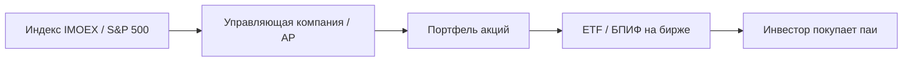

# ETF на индексы

> ETF (Exchange-Traded Fund) — биржевой фонд: паи торгуются в течение дня, как акции, а портфель обычно отслеживает индекс. В России аналог — БПИФ.

## Главное

- Один пай ETF/БПИФ заменяет покупку десятков акций из корзины индекса — меньше комиссий и хлопот.
- TER (комиссия за управление) уменьшает доходность — сравнивайте перед покупкой.
- Tracking error неизбежен: фонд редко повторяет индекс точно.
- Цена пая может отличаться от NAV (premium/discount).
- Для DCA в индекс LLM не нужен — только отчёты и compliance checks.

---

## Для новичка

Вместо покупки 50 акций из корзины IMOEX по отдельности можно купить один пай ETF/БПИФ — он уже держит бумаги в пропорциях, близких к индексу.

Expense ratio (TER) — ежегодная комиссия за управление; она уменьшает итоговую доходность. SEC и FINRA: перед покупкой читайте prospectus и понимайте, что именно отслеживает фонд.

---

## Подтверждённые факты

| # | Факт | Источник |
|---|------|----------|
| 1 | ETF — фонд, паи которого торгуются на бирже в течение дня по рыночной цене. | [Investor.gov: ETFs](https://www.investor.gov/introduction-investing/investing-basics/investment-products/exchange-traded-funds-etfs) |
| 2 | Многие ETF designed to track index (stock, bond, commodity). | [Investor.gov: ETFs](https://www.investor.gov/introduction-investing/investing-basics/investment-products/exchange-traded-funds-etfs) |
| 3 | SEC: ETF shares торгуются как акции; цена может отличаться от NAV в течение дня. | [SEC: ETFs](https://www.sec.gov/answers/etf.htm) |
| 4 | FINRA: учитывайте commissions, operating expenses, bid-ask spread, premiums/discounts to NAV. | [FINRA: ETFs](https://www.finra.org/investors/investing/investment-products/etfs) |
| 5 | IMOEX — benchmark MOEX; лимит 15% на бумагу, 55% на топ-5; ребаланс 3-я пятница квартала. | [MOEX Indices](https://www.moex.com/a6231) |
| 6 | БПИФ в РФ — паи торгуются на бирже; надзор — Банк России. | [CBR: Надзор за ПИФами](https://www.cbr.ru/finmarkets/supervision/supervision_pif/) |
| 7 | Index ETF может иметь tracking error — отклонение доходности от индекса. | [FINRA: ETFs](https://www.finra.org/investors/investing/investment-products/etfs) |

---

## ETF vs ПИФ vs акции

| Критерий | Index ETF / БПИФ | Открытый ПИФ | Отдельные акции |
|----------|------------------|--------------|-----------------|
| Торговля в течение дня | Да | Обычно 1 раз в день (СЧА) | Да |
| Диверсификация | Высокая (корзина) | Высокая | Низкая (1 ticker) |
| Комиссия УК (TER) | Есть, обычно ниже active | Есть | Нет TER (есть комиссия брокера) |
| Контроль состава | Нет (passive) | Нет | Полный |
| Tracking index | Цель passive ETF | Зависит от правил фонда | N/A |

Подробнее о российских фондах — [[ETFs_and_funds]].

---

## Как работает index ETF (упрощённо)



1. **Index provider** (MOEX, S&P DJI) публикует состав и веса.
2. **Fund manager** создаёт/ребалансирует портфель.
3. **Authorized Participant (AP)** — механизм создания/погашения паёв (для US ETF; в РФ — своя документация УК).
4. Инвестор покупает **паи на бирже** по рыночной цене.

---

## Ключевые риски и параметры

### Tracking error

Разница между return индекса и return ETF из‑за:
- TER и прочих расходов;
- cash drag (остаток cash в фонде);
- методики репликации (full replication vs sampling);
- timing ребаланса относительно индекса.

### Premium / Discount to NAV

Рыночная цена ETF может торговаться **выше** или **ниже** NAV (стоимости активов на пай). FINRA рекомендует учитывать spread.

### Ликвидность

Узкий spread и высокий объём — критичны для **крупных** автоматических заявок. Проверяйте average daily volume у брокера.

### Репликация IMOEX в РФ

БПИФ на индекс MOEX стремится повторить **IMOEX** (или близкий индекс по правилам фонда). После **реконституции IMOEX** (3-я пятница квартала) фонды обновляют портфель — возможен краткосрочный tracking drift.

---

## Примеры (типы продуктов, не рекомендация)

| Рынок | Тип продукта | Benchmark (типично) |
|-------|--------------|----------------------|
| Россия | БПИФ | IMOEX / MOEX Russia Index |
| США | ETF (SPY, IVV, VOO) | S&P 500 |
| США | ETF (QQQ) | NASDAQ-100 |
| Crypto (US, spot) | ETF | Bitcoin spot price (после одобрений SEC — см. актуальный prospectus) |

**Ticker и доступность** проверяйте у лицензированного брокера. Не используйте устаревшие тикеры из примеров без верификации.

---

## Index ETF и IMOEX: связь

Официальные параметры **IMOEX** ([moex.com/a6231](https://www.moex.com/a6231)):

- Free-float cap-weighted;
- Расчёт **09:50–19:00** MSK;
- Лимиты **15%** / **55%**;
- Ребаланс состава — **3-я пятница** мар, июн, сен, дек.

БПИФ на MOEX должен **следовать** изменениям индекса с лагом ребаланса фонда (см. правила конкретного фонда на сайте УК и CBR registry).

---

## Частые ошибки новичков

1. **Не читать правила фонда** — «индексный» в названии ≠ 100% IMOEX.
2. **Игнорировать TER** — 0,5% в год за 20 лет существенно съедает compound.
3. **Покупать на пике premium to NAV** — особенно illiquid ETF.
4. **Ждать точного совпадения с индексом** — tracking error неизбежен.
5. **Путать ETF на индекс и leveraged/inverse ETF** — последние для daily reset, не для long-term DCA.
6. **Забыть про налоги** — см. [[Russia_tax_basics]] для MOEX.

---

## FAQ

### ETF = акция?

Юридически паи ETF/БПИФ — **другой** инструмент, но **торгуются** как акции на бирже (limit/market orders).

### Можно ли автоматизировать DCA в ETF?

Да — см. раздел автоматизации и [[ETFs_and_funds]]. Cron + broker API + фиксированная сумма.

### Чем БПИФ отличается от US ETF?

Регуляторика РФ (CBR), номинал в RUB, документация на русском. Экономическая идея — биржевая торговля паёв фонда — схожа.

### Нужен ли LLM для index DCA?

**Нет** для выбора бумаг — только для **отчётов** и **compliance checks**. LLM не должен менять ticker benchmark-фонда без human rule ([[LLM_rules_and_guardrails]]).

### Как проверить состав?

US ETF — daily holdings на сайте issuer. БПИФ — раскрытие УК + CBR. Индекс — MOEX factsheet для IMOEX.

---

## Проверенные источники

1. **[Investor.gov: Exchange-Traded Funds (ETFs)](https://www.investor.gov/introduction-investing/investing-basics/investment-products/exchange-traded-funds-etfs)**
2. **[FINRA: ETFs](https://www.finra.org/investors/investing/investment-products/etfs)**
3. **[SEC.gov: ETFs](https://www.sec.gov/answers/etf.htm)**
4. **[MOEX Indices — IMOEX](https://www.moex.com/a6231)**
5. **[Банк России: Надзор за ПИФами](https://www.cbr.ru/finmarkets/supervision/supervision_pif/)**

---

## Академические источники

Полный свод университетских курсов и научных публикаций (2021+) — в заметке [[Academic_sources]].

| Учреждение | Ресурс (2021+) | Что подтверждает для этой темы | Ссылка |
|-----------|----------------|--------------------------------|--------|
| Stanford GSB | FINANCE 341 — Modeling for Investment Management (2024–2025) | Моделирование портфелей, ETF, risk/return | [explorecourses.stanford.edu/search?q=FINANCE+341](https://explorecourses.stanford.edu/search?q=FINANCE+341) |
| SSRN | Jaeger & Marinelli (2022) — abstract 4068889 | Network-based diversification через ETF и корзины активов | [papers.ssrn.com/sol3/papers.cfm?abstract_id=406...](https://papers.ssrn.com/sol3/papers.cfm?abstract_id=4068889) |
| MIT | 15.481X Adaptive Markets (Fall 2022) | Индексные фонды как инструмент диверсификации | [ocw.mit.edu/courses/15-481x-adaptive-markets-fi...](https://ocw.mit.edu/courses/15-481x-adaptive-markets-financial-market-dynamics-and-human-behavior-fall-2022/) |
| ВШЭ | Курс «Инвестиционный анализ» | Оценка фондов, сравнение ETF и активного управления | [www.hse.ru/edu/courses/987071016](https://www.hse.ru/edu/courses/987071016) |

---

## В автоматической системе

### Режим `index_dca` в securities-flow

Passive стратегия **не** использует intraday LLM-сигналы по отдельным акциям:

```yaml
# Obsidian: strategies/index_dca.yaml
strategy: index_dca
instrument_ticker: FXRL   # ПРИМЕР — верифицировать у брокера
benchmark_index: IMOEX
schedule: "0 10 1 * *"    # 10:00 MSK, 1-е число месяца
amount_rub: 15000
order_type: market        # или limit с offset
max_premium_to_nav_pct: 0.5
```

### n8n workflow `moex-index-dca`

```
Cron (1st of month, 10:00 MSK)
  → Read config from Obsidian sync / static JSON
  → T-Invest API: getLastPrice(ticker)
  → Code: lots = floor(amount / (price * lot_size))
  → IF lots < 1 → Telegram warn, skip
  → POST order (market or limit)
  → Wait fill → log to Obsidian trades/
  → Fetch IMOEX close for tracking error note (MOEX ISS)
```

### Сравнение с benchmark

```javascript
const fundReturn30d = ($json.fund_nav_end / $json.fund_nav_start - 1) * 100;
const imoexReturn30d = ($json.imoex_end / $json.imoex_start - 1) * 100;
const trackingDiff = fundReturn30d - imoexReturn30d;
return [{ json: { trackingDiff, alert: Math.abs(trackingDiff) > 1.0 } }];
```

### LLM role (ограниченный)

| Разрешено | Запрещено |
|-----------|-----------|
| Ежемесячный текстовый отчёт «вложено X, benchmark Y» | Выбор altcoin вместо БПИФ |
| Проверка «premium > max_premium» human-readable summary | Override DCA schedule |
| Напоминание о реконституции IMOEX | Market timing «пропустить месяц» |

### Rebalance calendar integration

За **5 торговых дней** до 3-й пятницы квартала workflow `imoex-rebalance-check` (см. [[IMOEX_RTS]]) обновляет `benchmark_constituents.yaml`. Index DCA **не** требует ручной смены ticker, но логирует event для audit.

### Obsidian: `etf_universe.yaml`

```yaml
funds:
  - ticker: EXAMPLE
    name: "БПИФ на индекс MOEX"
    benchmark: IMOEX
    ter_pct: 0.79
    min_lot: 1
    currency: RUB
    verified_date: 2026-07-05
    source_url: "https://www.moex.com/a6231"
notes: >
  Тикеры и TER меняются. Обновлять quarterly.
  SEC/FINRA rules apply to US ETFs only.
```

### Crypto parallel: Bitcoin ETF

Для `crypto-flow` в режиме **spot ETF proxy** (если доступен у брокера) — отдельный config; **не** смешивать с MOEX DCA в одном workflow без явного asset allocation rule.

### Мониторинг

- Fill rate DCA orders;
- Tracking error vs IMOEX (30d rolling);
- Alert если order rejected (insufficient funds, halt).

---

## Связанные темы

- [[IMOEX_RTS]]
- [[ETFs_and_funds]]
- [[Global_indices]]
- [[Portfolio_diversification]]
- [[Tinkoff_Invest_API]]
- [[Securities_flow_design]]
- [[LLM_rules_and_guardrails]]

---

## Создание и погашение паёв (US ETF mechanics)

SEC описывает роль **Authorized Participants (AP)**:

1. AP создаёт **creation unit** (крупный блок паёв), поставляя basket акций фонду.
2. AP погашает паи, получая basket обратно.
3. Этот механизм помогает **сближать** market price и NAV.

БПИФ в РФ имеет **свою** документацию по созданию/погашению — см. правила конкретной УК и CBR. Не переносите US mechanics буквально без чтения российского prospectus.

---

## Tax considerations (overview)

- **US ETF:** distributions могут быть taxable events ([Investor.gov](https://www.investor.gov/introduction-investing/investing-basics/investment-products/exchange-traded-funds-etfs)).
- **БПИФ РФ:** см. [[Russia_tax_basics]] — НДФЛ при продаже паёв, купоны в bond funds.

Automation **логирует** gross PnL; net tax — отдельный accounting workflow.

---

### Slippage model для DCA

```javascript
const price = $json.last_price;
const spread = $json.ask - $json.bid;
const estSlippagePct = (spread / 2 / price) * 100;
return [{ json: { estSlippagePct, skip: estSlippagePct > $json.max_slippage_pct } }];
```

Если slippage > threshold — defer order to next session или use limit.

---

## Сравнение expense ratios (methodology)

При выборе между двумя ETF на **один** S&P 500:

```
net_return ≈ index_return - TER - tracking_error - trading_costs
```

FINRA: lower expenses **generally** mean more money stays invested — но не единственный критерий ([FINRA mutual funds](https://www.finra.org/investors/investing/investment-products/mutual-funds)).

---

## Практический чеклист покупки index ETF/БПИФ

1. Прочитать **инвестиционную декларацию** / prospectus.
2. Сверить **benchmark** с IMOEX или S&P 500 official page.
3. Сравнить **TER** с альтернативами (только same benchmark).
4. Проверить **средний дневной объём** и spread на MOEX/NYSE.
5. Установить DCA schedule в n8n **до** первой live заявки.
6. Запланировать review после **3-й пятницы** квартала (ребаланс IMOEX).

---

## Расширенный FAQ

### Inverse / leveraged ETF?

FINRA и SEC предупреждают: **daily reset** — не hold long-term. **Не** использовать в `index_dca` automation.

### ETF vs mutual fund tax efficiency?

Зависит от jurisdiction и structure; для US — ETF often more tax-efficient; для РФ — consult local rules.

### Можно ли два БПИФ на один IMOEX?

Да; сравнивайте TER, tracking error, liquidity — выбор **фиксируется** в YAML, не LLM.

---

## Упражнение

Fund вернул +8% за год, IMOEX +10%, TER 0,9%. Rough tracking gap ≈ 2% + fees. Какие **другие** факторы могут объяснить разницу? (Cash drag, timing rebalance, dividend policy, sampling.)

---

## Что изучить дальше

1. [[ETFs_and_funds]] — ПИФ, БПИФ, СЧА, надзор CBR.
2. [[IMOEX_RTS]] — параметры benchmark.
3. [[Russia_tax_basics]] — налогообложение паёв.
4. [[Portfolio_diversification]] — доля index ETF в allocation.
