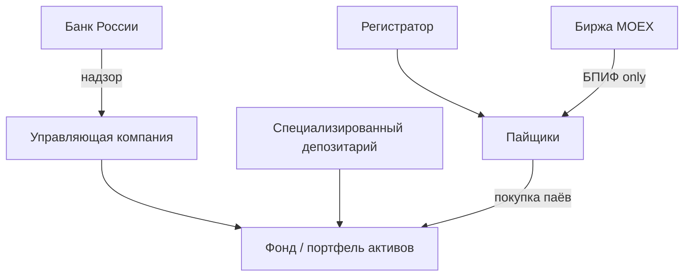

# ETF, ПИФы и БПИФы

> **ПИФ** (паевой инвестиционный фонд) — форма **коллективного инвестирования**: средства пайщиков в доверительном управлении **управляющей компании (УК)**. **БПИФ** — биржевой ПИФ (паи на MOEX). **ETF** — международный термин exchange-traded fund с аналогичной идеей.

---

## Для новичка

Вместо самостоятельного выбора 20 акций можно купить **один пай** фонда. УК формирует портфель по **правилам инвестиционной декларации** фонда.

| Тип | Торгуется на бирже | Цена в течение дня |
|-----|-------------------|-------------------|
| **Закрытый ПИФ** | Нет (выкуп через УК) | Раз в день (СЧА) |
| **Открытый ПИФ (не биржевой)** | Нет | Раз в день по заявке |
| **БПИФ** | Да (MOEX) | Real-time как акция |
| **US ETF** | Да (NYSE/NASDAQ) | Real-time |

**СЧА (стоимость чистых активов)** — активы фонда минус обязательства. **Цена пая** на бирже может **отличаться** от СЧА (premium/discount) — аналогично US ETF ([SEC](https://www.sec.gov/answers/etf.htm)).

---

## Подтверждённые факты

| # | Факт | Источник |
|---|------|----------|
| 1 | **Mutual fund** pools money from many investors to purchase securities portfolio. | [Investor.gov: Mutual Funds & ETFs](https://www.investor.gov/introduction-investing/investing-basics/investment-products/mutual-funds-and-exchange-traded-funds-etfs) |
| 2 | **ETF** shares trade on exchange like stock; many ETFs track index. | [Investor.gov: ETFs section](https://www.investor.gov/introduction-investing/investing-basics/investment-products/exchange-traded-funds-etfs) |
| 3 | FINRA: mutual funds charge **fees and expenses** reducing returns. | [FINRA: Mutual Funds](https://www.finra.org/investors/investing/investment-products/mutual-funds) |
| 4 | **Банк России** осуществляет **надзор** за деятельностью УК и ПИФов в РФ. | [CBR: Надзор за ПИФами](https://www.cbr.ru/finmarkets/supervision/supervision_pif/) |
| 5 | **IMOEX** — benchmark MOEX; free-float weighted; расчёт **09:50–19:00** MSK; ребаланс **3-я пятница** квартала. | [MOEX Indices](https://www.moex.com/a6231) |
| 6 | SEC: ETF market price can trade at **premium or discount** to NAV. | [SEC: ETFs](https://www.sec.gov/answers/etf.htm) |
| 7 | SEC: **mutual fund** prices once daily at NAV after market close (traditional open-end). | [SEC: Mutual Funds](https://www.sec.gov/answers/mutfund.htm) |

---

## Структура ПИФ в РФ (упрощённо)



- **УК** — инвестиционные решения в рамках декларации.
- **Депозитарий** — хранение активов фонда.
- **Регистратор** — учёт паёв.
- **CBR** — supervision ([cbr.ru](https://www.cbr.ru/finmarkets/supervision/supervision_pif/)).

---

## СЧА, TER и доходность

### СЧА на пай

```
СЧА на пай = (Стоимость активов − Обязательства) / Число паёв
```

БПИФ публикует **iNAV** intraday на MOEX для ряда фондов — см. раздел iNAV на moex.com.

### TER (Total Expense Ratio)

Ежегодные расходы фонда (вознаграждение УК, депозитарий, прочее) как **% от активов**. FINRA и Investor.gov: expenses **reduce** investor returns.

### Tracking error (для index БПИФ)

Отклонение доходности фонда от **IMOEX** / другого benchmark — см. [[Index_ETF]].

---

## БПИФ vs классический ПИФ

| Критерий | Открытый ПИФ | БПИФ |
|----------|--------------|------|
| Покупка/продажа | Заявка УК, NAV раз в день | Биржевая сделка |
| Минимум | По правилам фонда | Lot на MOEX |
| Ликвидность | T+ несколько дней | Intraday |
| Automation | Сложнее | T-Invest API как акции |

---

## Примеры продуктов (типы, не рекомендация)

| Категория | Benchmark / focus |
|-----------|-------------------|
| БПИФ на индекс MOEX | IMOEX |
| БПИФ облигаций | Bond index / ОФЗ basket |
| US ETF S&P 500 | S&P 500 |
| Money market funds | Short-term instruments |

**Ticker, TER, ISIN** — только из disclosure УК и registry CBR на дату покупки.

---

## Риски

| Риск | Описание |
|------|----------|
| Market risk | Падение акций/облигаций в портфеле |
| Tracking error | Index БПИФ ≠ index |
| Liquidity | Wide spread на niche БПИФ |
| Regulatory | Изменение правил CBR |
| Counterparty | УК/депозитарий (regulated, not zero) |

---

## Связь с IMOEX

БПИФ «на индекс MOEX» стремится повторять **IMOEX** ([moex.com/a6231](https://www.moex.com/a6231)):

- Лимит **15%** на одну бумагу, **55%** на топ-5 в самом индексе;
- Реконституция **3-я пятница** мар/июн/сен/дек;
- Фонд ребалансирует с **лагом** по своим правилам — возможен краткий tracking drift.

---

## Примеры

### Пример 1: DCA в БПИФ

1-го числа каждого месяца 10 000 ₽ в БПИФ на IMOEX — см. automation ниже.

### Пример 2: Premium to iNAV

Рыночная цена БПИФ +0,8% выше iNAV → automation skip if `max_premium > 0.5%`.

### Пример 3: Смена TER

УК снижает комиссию — улучшение long-term return; логировать в Obsidian `fund_events`.

### Пример 4: Налоги

При продаже паёв — НДФЛ на прибыль; [[Russia_tax_basics]].

---

## Частые ошибки новичков

1. **Не читать инвестиционную декларацию** — «облигационный» фонд может иметь equity risk.
2. **Игнор TER** — 1% vs 0,3% критично на 10+ лет.
3. **Market buy при wide spread** — переплата.
4. **Частая смена фондов** — tax + costs.
5. **Ждать точного IMOEX return** — tracking error нормален.
6. **LLM выбирает random БПИФ** — forbidden in automation policy.

---

## FAQ

### БПИФ = ETF?

Экономически близко (биржевой фонд). Юридически — **российский** ПИФ под надзором CBR.

### Где реестр ПИФов?

[cbr.ru/finmarkets/supervision/supervision_pif/](https://www.cbr.ru/finmarkets/supervision/supervision_pif/)

### Можно ли short БПИФ?

Зависит от брокера (margin, qualified); default automation — long only.

### iNAV vs СЧА?

iNAV — intraday estimate; official NAV — по регламенту УК.

### Автоматизация через MOEX ISS?

Цены и iNAV — ISS; **ордера** — broker API ([[Tinkoff_Invest_API]]).

---

## Проверенные источники

1. **[Investor.gov: Mutual Funds and ETFs](https://www.investor.gov/introduction-investing/investing-basics/investment-products/mutual-funds-and-exchange-traded-funds-etfs)**
2. **[FINRA: Mutual Funds](https://www.finra.org/investors/investing/investment-products/mutual-funds)**
3. **[CBR: Надзор за ПИФами](https://www.cbr.ru/finmarkets/supervision/supervision_pif/)**
4. **[MOEX Indices — IMOEX](https://www.moex.com/a6231)**
5. **[SEC: Mutual Funds](https://www.sec.gov/answers/mutfund.htm)**
6. **[SEC: ETFs](https://www.sec.gov/answers/etf.htm)**

---

## В автоматической системе

### Strategy `moex_index_dca`

Optimal use case для БПИФ — **passive DCA**, не LLM stock picking.

```yaml
# strategies/moex_index_dca.yaml
strategy: moex_index_dca
instrument_ticker: EXAMPLE  # verify with broker
benchmark: IMOEX
schedule: "0 10 1 * *"
amount_rub: 15000
order_type: limit
limit_offset_pct: 0.05
max_premium_to_inav_pct: 0.5
```

### n8n workflow

```
Cron 1st month 10:00 MSK
  → Read strategy YAML
  → T-Invest: getTradingStatus(ticker)
  → MOEX ISS / broker: last price, iNAV if available
  → Code: lots, premium check
  → IF premium OK → PostOrder
  → MOEX ISS: IMOEX close for tracking note
  → Obsidian trades/ + monthly summary
```

### Tracking error monitor

```javascript
const fundRet = $json.fund_price_end / $json.fund_price_start - 1;
const imoexRet = $json.imoex_end / $json.imoex_start - 1;
return [{ json: {
  tracking_error_30d: (fundRet - imoexRet) * 100,
  benchmark: 'IMOEX',
  source: 'https://www.moex.com/a6231'
}}];
```

### LLM restrictions

| Allowed | Forbidden |
|---------|-----------|
| Monthly human-readable summary | Switch fund ticker weekly |
| Explain tracking error | Market timing «skip DCA» |
| Remind IMOEX rebalance date | Override TER-based fund choice |

Rule **G8** [[LLM_rules_and_guardrails]]: fund universe fixed in YAML.

### fund_universe.yaml

```yaml
funds:
  - ticker: EXAMPLE
    type: BPIF
    benchmark: IMOEX
    ter_pct: null  # fill from UK disclosure
    cbr_registry_url: "https://www.cbr.ru/finmarkets/supervision/supervision_pif/"
    verified: 2026-07-05
allocation:
  equity_index_bpip: 60
  bond_bpip: 30
  cash: 10
```

### Rebalance calendar

Sync with [[IMOEX_RTS]] `imoex-rebalance-check` — log event when index reconstitutes; DCA ticker unchanged unless benchmark rule changes.

### Broker API

Same path as [[MOEX_stocks]] — `PostOrder` with figi/instrument_id; map ticker via daily instruments sync.

### Reporting

Quarterly Obsidian note:
- Total invested;
- Fund return vs IMOEX;
- TER paid (estimate);
- Sources: CBR, MOEX, broker statements.

---

## Связанные темы

- [[Index_ETF]]
- [[IMOEX_RTS]]
- [[MOEX_stocks]]
- [[Bonds_basics]]
- [[Portfolio_diversification]]
- [[Tinkoff_Invest_API]]
- [[Russia_tax_basics]]
- [[Securities_flow_design]]

---

## Закрытые и interval funds

**Closed-end fund** (US) trades on exchange at premium/discount to NAV — похоже на БПИФ поведение цены.

**Interval fund** — limited liquidity windows — **не** intraday. Проверяйте liquidity profile перед automation.

---

## ESG и thematic ПИФы

Thematic funds (ESG, tech) — **concentration** выше index БПИФ. MOEX publishes ESG-related indices ([moex.com/a6231](https://www.moex.com/a6231) thematic section) — не путать с broad IMOEX.

Default automation: **broad index only** unless `fund_universe.yaml` explicitly lists thematic with human approval.

---

### Monthly DCA report template (Obsidian)

```markdown
## DCA Report {{month}}

- Invested: {{amount_rub}} RUB
- Fund ticker: {{ticker}}
- Benchmark IMOEX: {{imoex_return}}%
- Fund return: {{fund_return}}%
- Tracking diff: {{tracking_diff}}%
- TER (annual): {{ter}}%
- Source: MOEX a6231, CBR supervision
```

LLM may **draft** prose from this template; numbers from Code node only.

---

## Сравнение US mutual fund vs БПИФ

| | US open-end mutual | БПИФ MOEX |
|---|-------------------|-----------|
| NAV frequency | Daily | Intraday market price |
| Regulator | SEC | CBR |
| Purchase | Via fund company/broker | Exchange order |

---

## Практический чеклист ПИФ/БПИФ

1. Verify fund in [CBR registry](https://www.cbr.ru/finmarkets/supervision/supervision_pif/).
2. Read декларация + ключевые информационные документы.
3. Compare TER of 2+ funds same benchmark.
4. Check MOEX average volume 20d.
5. Configure DCA in n8n with premium guard.
6. Quarterly tracking error report vs IMOEX.

---

## Расширенный FAQ

### ЗПИФ vs БПИФ?

ЗПИФ — closed-end structure; liquidity через продажу паёв УК, не биржа — **не** для `moex_index_dca` cron.

### Дублирование IMOEX через акции + БПИФ?

Double exposure — allocation rules should prevent overlap.

### Dividend policy БПИФ?

Some distribute, some accumulate — affects cash flow vs total return comparison.

---

## Упражнение

TER 0,79%, benchmark IMOEX +12%. Rough net ≈ 11,2% before tracking error and taxes. Name two other drags. (Cash drag, transaction costs at rebalance.)

---

## Что изучить дальше

1. [[Index_ETF]] — US ETF vs БПИФ.
2. [[IMOEX_RTS]] — параметры benchmark.
3. [[Portfolio_diversification]] — allocation.
4. [[Russia_tax_basics]] — налог при продаже паёв.
