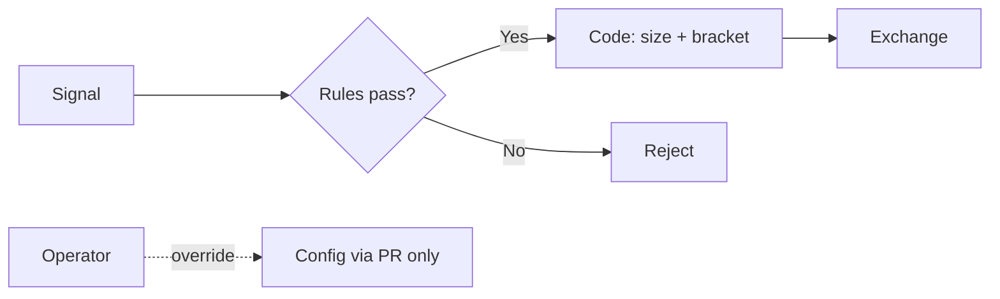

# Психология трейдера

> Эмоции и привычки влияют на исполнение плана не меньше, чем индикаторы. SEC, FINRA и CFA Institute: импульсивные решения систематически ухудшают результат.

## Главное

- FOMO, «отыграться», revenge trading и overtrading — типичные ловушки, не «слабость характера».
- План до входа: thesis, stop, size, max loss — см. [[Stop_loss_take_profit]], [[Position_sizing]].
- Эмоциональные bias (CFA) не убирают — снижают правилами: cooldown, журнал, фиксированный sizing.
- Автоматизация исполняет stop без колебаний; оператор всё равно может override — нужны guardrails.
- SEC: active trading в среднем даёт underperformance; держите written rule.

---

## Для новичка

Знаете RSI и стоп — и всё равно покупаете на пике (FOMO), держите убыток («отыграюсь»), удваиваете ставку после минуса (revenge), торгуете от скуки (overtrading).

SEC перечисляет девять поведенческих паттернов, бьющих по результату — от active trading до manias ([Bulletin #72](https://www.investor.gov/introduction-investing/general-resources/news-alerts/alerts-bulletins/investor-bulletins-72)).

n8n и правила не заменят психологию: оператор может отключить стоп. Но формализованные правила снижают импульс в стрессе.

---

## Подтверждённые факты

| # | Факт | Источник |
|---|------|----------|
| 1 | **Active trading** (регулярная активная покупка/продажа с мониторингом для «выгодных условий») — по отчёту Library of Congress для SEC — **в целом приводит к underperformance** портфеля. | [SEC: Behavioral Patterns](https://www.investor.gov/introduction-investing/general-resources/news-alerts/alerts-bulletins/investor-bulletins-72) |
| 2 | **Disposition effect** — склонность **дольше держать** losing investments и **раньше продавать** winning; после продажи winners часто **продолжают outperform** losers в портфеле. | [SEC: Behavioral Patterns](https://www.investor.gov/introduction-investing/general-resources/news-alerts/alerts-bulletins/investor-bulletins-72) |
| 3 | **Manias and panics** — «mania/bubble»: быстрый рост цены на collective enthusiasm, затем **panic selling** и резкое падение. | [SEC: Behavioral Patterns](https://www.investor.gov/introduction-investing/general-resources/news-alerts/alerts-bulletins/investor-bulletins-72) |
| 4 | **Noise trading** — решения **без fundamental data**; noise traders часто имеют **poor timing**, следуют trends, **overreact** на news. | [SEC: Behavioral Patterns](https://www.investor.gov/introduction-investing/general-resources/news-alerts/alerts-bulletins/investor-bulletins-72) |
| 5 | SEC/FINRA (Social Sentiment Bulletin): real-time social sentiment tools могут вести к **emotionally-driven, impulsive** investment decisions — **рискованный** подход. | [SEC/FINRA Bulletin: Social Sentiment](https://www.investor.gov/introduction-investing/general-resources/news-alerts/alerts-bulletins/investor-bulletins-18) |
| 6 | SEC (FOMO): решения из **fear of missing out** — не лучший способ планировать финансовое будущее; **time in the market**, не timing; придерживаться **long-term plan**. | [Investor.gov: Say NO GO to FOMO](https://www.investor.gov/additional-resources/spotlight/formerdirectorlorischock-directors-take/say-no-go-fomo) |
| 7 | FINRA: при падении рынков легко **реагировать импульсом** — продать всё или резко менять allocation; в turbulent markets — **остановиться**, оценить tax и long-term goals. | [FINRA: Volatility](https://www.finra.org/investors/investing/investing-basics/volatility) |
| 8 | FINRA: успешное инвестирование — **цели, informed actions, баланс рисков**; избегать **hunches and hot tips**; **не прекращать** обучение. | [FINRA: Investing Basics](https://www.finra.org/investors/investing/investing-basics) |
| 9 | CFA Institute: **emotional biases** (loss aversion, overconfidence, self-control и др.) **труднее исправить**, чем cognitive errors — их можно только **adapt to** через процессы и правила. | [CFA: Behavioral Biases of Individuals](https://www.cfainstitute.org/insights/professional-learning/refresher-readings/2026/the-behavioral-biases-of-individuals) |

---

## Подробно: эмоциональные ловушки

| Ловушка | Проявление | Противоядие |
|---------|------------|-------------|
| **FOMO** | Вход после pump, meme stock | Written plan, whitelist, cooldown ([SEC FOMO](https://www.investor.gov/additional-resources/spotlight/formerdirectorlorischock-directors-take/say-no-go-fomo)) |
| **Loss aversion** | Держать loser, не ставить stop | Stop до входа ([[Stop_loss_take_profit]]) |
| **Revenge trading** | Увеличение size после убытка | `daily_loss_limit` + 24h cooldown ([[Position_sizing]]) |
| **Overtrading** | Лишние сделки от скуки | max trades/day, quality filter |
| **Overconfidence** | Size ↑ после серии wins | Fixed fractional sizing |
| **Panic selling** | Продать всё на crash | IPS в Obsidian; stops по плану ([FINRA Volatility](https://www.finra.org/investors/investing/investing-basics/volatility)) |
| **Paralysis** | Страх войти при valid signal | Чеклист; paper trading; механическое исполнение |

---

## Дисциплина: план и журнал

**Чеклист до входа:** thesis → entry → stop ([[Stop_loss_take_profit]]) → target → size ([[Position_sizing]]) → max loss → time stop → counter-thesis.

**Журнал Obsidian** — planned vs actual:
```yaml
planned_entry: 250
actual_entry: 252        # slippage / FOMO chase
planned_stop: 242.5
actual_stop: null         # ERROR: moved stop
exit_reason: stop_loss
emotion_tags: [fomo, hesitation]
deviation_notes: "Вошёл на +0.8% выше плана"
```

### Cooldown rules

| Триггер | Действие |
|---------|----------|
| 3 losses подряд | 24h no new trades |
| daily_loss_limit hit | halt until next day |
| manual override used | mandatory post-mortem note |
| vol spike > 2σ (system) | reject new signals |

---

## Психология vs автоматизация

**Решает хорошо:** исполнение stop/TP, fixed sizing, cooldown после daily loss.

**Не решает:** отключение flow оператором, смена config «в гневе», игнор alerts.



---

## Примеры

### Пример 1: FOMO на meme stock (SEC scenario)

Social media hype → покупка без research. SEC/FINRA: short-term trading on social sentiment → **significant unanticipated losses**; создайте **financial plan**, не let emotions disrupt long-term objectives ([Social Sentiment Bulletin](https://www.investor.gov/introduction-investing/general-resources/news-alerts/alerts-bulletins/investor-bulletins-18)).

**Система:** signal source = social only → auto reject; require technical + fundamental checklist.

### Пример 2: Disposition effect

Купили A @ 100 (winner, now 110) — продаёте быстро. Держите B @ 100 (loser, now 85) — «подождём».

SEC: после продажи winners они **часто продолжают outperform** held losers.

**Система:** одинаковые SL rules для всех; no «special hold» for losers.

### Пример 3: Revenge после −3% day

Утро: −15 000 ₽. Impulse: «верну на BTC 2× size».

**Система:** `daily_loss_limit: 0.03` → trading **halted**; Telegram alert; journal template «revenge prevented».

### Пример 4: Panic на crash

IMOEX −5% за день. Impulse: sell all at market.

FINRA: спросите — как action повлияет на **future** portfolio, tax, **long-term goals**?

**Система:** equity leg = separate flow; swing stops срабатывают **по плану**, не «sell everything» button.

---

## Частые ошибки новичков

1. **Торговать без плана** — каждый вход «с нуля» emotionally.
2. **Менять правила mid-trade** — двигать stop, отменять TP.
3. **Смотреть PnL каждую минуту** — amplifies loss aversion (CFA: myopic evaluation).
4. **Игнорировать journal** — не видите паттерн FOMO/revenge.
5. **Доверять «гуру» и influencers** — SEC FOMO bulletin.
6. **Overtrading от скуки** — active trading underperformance (SEC).
7. **Отключать automation после одного false signal** — теряете дисциплину системы.
8. **Путать paper profit с skill** — overconfidence после lucky streak.

---

## FAQ

### Можно ли «полностью убрать эмоции»?

Нет (CFA). Цель — процессы, снижающие ущерб.

### Автоматизация делает бесстрастным?

Нет. Stress переходит на мониторинг и temptation override. Read-only UI + delayed config — by design.

### Сколько убытков подряд — остановиться?

Система: 3 losses или `daily_loss_limit`. Важна **written rule**.

### Как LLM помогает?

`counter_thesis`, `biases_detected` — [[Cognitive_biases]], [[LLM_prompts_trading]]. Без hype — [[LLM_rules_and_guardrails]].

---

## Ключевые понятия

| Термин | Определение | Источник |
|--------|-------------|----------|
| Disposition effect | Hold losers, sell winners too soon | [SEC Bulletin #72](https://www.investor.gov/introduction-investing/general-resources/news-alerts/alerts-bulletins/investor-bulletins-72) |
| FOMO | Fear of missing out on investment | [Investor.gov](https://www.investor.gov/additional-resources/spotlight/formerdirectorlorischock-directors-take/say-no-go-fomo) |
| Active trading | Frequent buy/sell for market conditions | [SEC Bulletin #72](https://www.investor.gov/introduction-investing/general-resources/news-alerts/alerts-bulletins/investor-bulletins-72) |
| Noise trading | Decisions without fundamental data | [SEC Bulletin #72](https://www.investor.gov/introduction-investing/general-resources/news-alerts/alerts-bulletins/investor-bulletins-72) |
| Emotional bias | Feelings-driven deviation from rational plan | [CFA Institute](https://www.cfainstitute.org/insights/professional-learning/refresher-readings/2026/the-behavioral-biases-of-individuals) |
| Revenge trading | Oversized/rushed trade after loss | Trading psychology (mitigate via rules) |

---

## Проверенные источники

1. **[Investor Bulletin: Behavioral Patterns — SEC/OIEA](https://www.investor.gov/introduction-investing/general-resources/news-alerts/alerts-bulletins/investor-bulletins-72)** — active trading, disposition effect, manias, noise trading.
2. **[Say NO GO to FOMO — Investor.gov (SEC OIEA)](https://www.investor.gov/additional-resources/spotlight/formerdirectorlorischock-directors-take/say-no-go-fomo)** — FOMO, influencers, long-term plan, diversification.
3. **[Social Sentiment Investing Tools — SEC/FINRA](https://www.investor.gov/introduction-investing/general-resources/news-alerts/alerts-bulletins/investor-bulletins-18)** — impulsive decisions from social sentiment.
4. **[Volatility — FINRA](https://www.finra.org/investors/investing/investing-basics/volatility)** — impulse reactions, goals, diversification in stress.
5. **[Investing Basics — FINRA](https://www.finra.org/investors/investing/investing-basics)** — goals, patience, avoid hot tips.
6. **[The Behavioral Biases of Individuals — CFA Institute](https://www.cfainstitute.org/insights/professional-learning/refresher-readings/2026/the-behavioral-biases-of-individuals)** — cognitive vs emotional biases, adaptation strategies.
7. **Library of Congress Report** (cited in SEC Bulletin #72) — первичный обзор investor behavior.

---

## Академические источники

См. также: [[Academic_sources]].

| Категория | Что изучать | Почему полезно | URL |
|---|---|---|---|
| ВШЭ (курс) | Behavioral Finance (2024/2025) | Психология инвестора и систематические ошибки принятия решений; базовая теория для чеклистов и guardrails | https://nes.hse.ru/edu/courses/902185688 |
| MIT / A. Lo (2022) | 15.481x Adaptive Markets: Financial Market Dynamics and Human Behavior (Fall 2022) | Логика «адаптивных рынков» и связь поведения/режимов рынка с риском и исполнением | https://ocw.mit.edu/courses/15-481x-adaptive-markets-financial-market-dynamics-and-human-behavior-fall-2022/resources/mit-economist-andrew-w-lo-on-finance-ai-and-human-behavior/ |
| Stanford GSB (курс) | GSBGEN 646 Behavioral Economics and the Psychology of Decision Making | Heuristics/biases, framing, prospect theory, mental accounting — полезно для построения дисциплины и процедур снижения ошибок | https://explorecourses.stanford.edu/search?view=catalog&filter-coursestatus-Active=on&page=0&catalog=&q=GSBGEN+646%3A+Behavioral+Economics+and+the+Psychology+of+Decision+Making&collapse= |
| BIS (крипто, 2023) | The crypto ecosystem: key elements and risks | Риски экосистемы крипто/DeFi (фрагментация, централизация, системные риски) — полезно для crypto-flow risk gates | https://www.bis.org/publ/othp72.pdf |
| ESRB (крипто, 2025) | Crypto-assets and decentralised finance | Макропруденциальные риски (stablecoins, crypto-investment products, multi-function groups) | https://www.esrb.europa.eu/pub/pdf/reports/esrb.report202510_cryptoassets.en.pdf |
| IEEE (2025) | Evolving Portfolio Heuristics: A Self-Correcting LLM Framework for Portfolio Optimization | Пример академического подхода к LLM в портфельных эвристиках; полезно для сравнения с вашими prompt/guardrails | https://ieeexplore.ieee.org/document/11200704/ |
| arXiv (2025) | Decision by Supervised Learning with Deep Ensembles (arXiv:2503.13544) | Практическая схема «обучать модель под решение» + ансамбли для устойчивости портфельных весов | https://arxiv.org/abs/2503.13544 |
| ВШЭ (ВКР, 2024) | Hedging Derivatives Under Incomplete Markets with Deep Learning (VKR 929592108) | Пример end-to-end подхода: модель выдаёт веса хедж-портфеля → можно маппить на ордера (важно для автоматизации) | https://www.hse.ru/en/edu/vkr/929592108 |

---

## В автоматической системе

### Design principles (anti-psychology)

| Принцип | Реализация |
|---------|------------|
| Rules over feelings | All entries via checklist workflow |
| No size from confidence | [[Position_sizing]] fixed fractional |
| Mandatory brackets | [[Stop_loss_take_profit]] place-bracket-order |
| Cooldown | daily_loss_limit, 3-loss streak |
| No live override | UI read-only; config via git/Obsidian PR |
| Anti-hype LLM | Prompts ban «moon», «guaranteed» — [[LLM_rules_and_guardrails]] |

### Cooldown workflow (n8n)

```
Trigger: trade closed with pnl < 0
  → Increment consecutive_losses counter (Redis/Obsidian)
  → IF consecutive_losses >= 3 OR daily_pnl <= -limit:
       SET trading_halt = true
       Notify Telegram: "COOLDOWN — review journal"
  → Reset consecutive_losses on calendar day win (optional config)
```

### Ollama pre-flight (psychology-aware)

```
Before approving signal, answer:
1. Is this momentum/FOMO entry (price extended > X%)?
2. counter_thesis in 2 sentences
3. biases_detected: list from [[Cognitive_biases]] taxonomy
4. recommendation: approve | reject | reduce_confidence_only

If biases_detected non-empty AND confidence < 0.75 → auto reject (code node)
```

### Journaling automation

Каждый trade → Obsidian note с:
- `planned_vs_actual` diff
- `emotion_tags` (manual optional tag post-trade)
- weekly Ollama digest: «patterns in deviations»

### Operator guidelines (README excerpt)

1. **Не** micromanage каждую сделку — weekly digest достаточно.
2. Config changes — **не** в день большого PnL swing.
3. Post-mortem обязателен после **любого** manual intervention.
4. Paper mode 30 days перед live size > minimum.

### Metrics dashboard

- `trades_during_cooldown_attempts` (should be 0)
- `stop_moved_manually_count`
- `override_count` per month
- Correlation: `emotion_tag:fomo` vs PnL (internal stats only — не публиковать как «исследование»)

---

## Связанные темы

- [[Cognitive_biases]]
- [[Stop_loss_take_profit]]
- [[Position_sizing]]
- [[Portfolio_diversification]]
- [[LLM_rules_and_guardrails]]
- [[LLM_prompts_trading]]

---

## Что изучить дальше

1. [[Cognitive_biases]] — детальный разбор bias и mitigation в LLM.
2. [[Stop_loss_take_profit]] — механическое исполнение exit rules.
3. [[Position_sizing]] — защита от revenge через fixed risk.
4. [[Portfolio_diversification]] — снижение panic через allocation.
5. [[LLM_rules_and_guardrails]] — guardrails G1–G10 против override.
