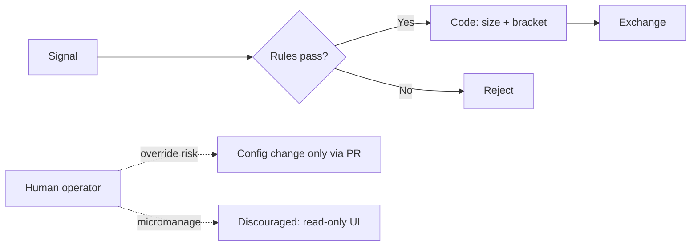

# Психология трейдера

> **Психология трейдера** — совокупность эмоций, привычек и **дисциплины**, влияющих на исполнение торгового плана. Регуляторы (SEC, FINRA) и CFA Institute подчёркивают: **импульсивные** и **эмоционально driven** решения систематически **ухудшают** инвестиционные результаты — независимо от качества «идеи».

---

## Для новичка

Вы изучили индикаторы, прочитали про стоп-лосс — и всё равно:

- покупаете на **пике**, потому что «все покупают» (FOMO);
- **не закрываете** убыток, потому что «отыграюсь»;
- после минуса **увеличиваете** ставку (revenge trading);
- от **скуки** открываете лишние сделки (overtrading).

Это **не** слабость характера — это **нормальные** человеческие реакции. SEC в Investor Bulletin перечисляет **девять** поведенческих паттернов, подрывающих performance — от active trading до manias ([SEC Bulletin #72](https://www.investor.gov/introduction-investing/general-resources/news-alerts/alerts-bulletins/investor-bulletins-72)).

**Автоматизация (n8n + правила)** не заменяет психологию полностью — оператор может отключить стопы или override config. Но **формализованные правила** снижают долю impulsive decisions в момент stress.

---

## Подтверждённые факты

| # | Факт | Источник |
|---|------|----------|
| 1 | **Active trading** (регулярная активная покупка/продажа с мониторингом для «выгодных условий») — по отчёту Library of Congress для SEC — **в целом приводит к underperformance** портфеля. | [SEC: Behavioral Patterns](https://www.investor.gov/introduction-investing/general-resources/news-alerts/alerts-bulletins/investor-bulletins-72) |
| 2 | **Disposition effect** — склонность **дольше держать** losing investments и **раньше продавать** winning; после продажи winners часто **продолжают outperform** losers в портфеле. | [SEC: Behavioral Patterns](https://www.investor.gov/introduction-investing/general-resources/news-alerts/alerts-bulletins/investor-bulletins-72) |
| 3 | **Manias and panics** — «mania/bubble»: быстрый рост цены на collective enthusiasm, затем **panic selling** и резкое падение. | [SEC: Behavioral Patterns](https://www.investor.gov/introduction-investing/general-resources/news-alerts/alerts-bulletins/investor-bulletins-72) |
| 4 | **Noise trading** — решения **без fundamental data**; noise traders часто имеют **poor timing**, следуют trends, **overreact** на news. | [SEC: Behavioral Patterns](https://www.investor.gov/introduction-investing/general-resources/news-alerts/alerts-bulletins/investor-bulletins-72) |
| 5 | SEC/FINRA (Social Sentiment Bulletin): real-time social sentiment tools могут вести к **emotionally-driven, impulsive** investment decisions — **рискованный** подход. | [SEC/FINRA Bulletin: Social Sentiment](https://www.investor.gov/introduction-investing/general-resources/news-alerts/alerts-bulletins/investor-bulletins-18) |
| 6 | SEC (FOMO): решения из **fear of missing out** — не лучший способ планировать финансовое будущее; **time in the market**, не timing; придерживаться **long-term plan**. | [Investor.gov: Say NO GO to FOMO](https://www.investor.gov/additional-resources/spotlight/formerdirectorlorischock-directors-take/say-no-go-fomo) |
| 7 | FINRA: при падении рынков легко **реагировать импульсом** — продать всё или резко менять allocation; в turbulent markets — **остановиться**, оценить tax и long-term goals. | [FINRA: Volatility](https://www.finra.org/investors/investing/investing-basics/volatility) |
| 8 | FINRA: успешное инвестирование — **цели, informed actions, баланс рисков**; избегать **hunches and hot tips**; **не прекращать** обучение. | [FINRA: Investing Basics](https://www.finra.org/investors/investing/investing-basics) |
| 9 | CFA Institute: **emotional biases** (loss aversion, overconfidence, self-control и др.) **труднее исправить**, чем cognitive errors — их можно только **adapt to** через процессы и правила. | [CFA: Behavioral Biases of Individuals](https://www.cfainstitute.org/insights/professional-learning/refresher-readings/2026/the-behavioral-biases-of-individuals) |

---

## Подробно: эмоциональные ловушки трейдера

### 1. FOMO (Fear of Missing Out)

**Проявление:** вход после резкого роста, покупка «hot stock» / meme / crypto из-за social media и influencers.

**Регуляторная позиция:** SEC — «NO GO to FOMO»; не инвестировать **только** по рекомендации influencer; trendy assets могут терять **20–50% за день** (гипотетический вопрос SEC для self-reflection, не статистика рынка).

**Противоядие:** written plan, whitelist тикеров, cooldown после missed move.

### 2. Loss aversion и «отыграться»

Связано с **disposition effect** (SEC) и **loss aversion** (CFA: emotional bias). Держать loser «до нуля», не ставить stop — см. [[Stop_loss_take_profit]], [[Cognitive_biases]].

**Противоядие:** обязательный stop **до** входа; правило «no averaging down» без отдельного written thesis.

### 3. Revenge trading

**Проявление:** после убытка — **увеличение** size или frequency «вернуть деньги».

**Связь с regulation:** FINRA Rule 2270 предупреждает о **extreme risk** day trading; revenge amplifies leverage/margin risk.

**Противоядие:** daily loss limit + 24h cooldown ([[Position_sizing]] circuit breaker).

### 4. Overtrading

SEC: **active trading** → underperformance. Комиссии, slippage, emotional exhaustion.

**Противоядие:** max trades/day в config; quality filter (confidence threshold).

### 5. Overconfidence после серии wins

CFA: **overconfidence** — emotional bias; после wins трейдер **увеличивает** risk.

**Противоядие:** **fixed** position sizing — LLM confidence **не** меняет quantity.

### 6. Panic selling на дне

FINRA: volatile markets → impulse sell. SEC: **manias and panics** — collective panic после bubble.

**Противоядие:** IPS (investment policy statement) в Obsidian; pre-commitment «не продавать equity leg без rebalance review».

### 7. Paralysis / analysis freeze

Противоположность overtrading — **страх** войти даже при valid signal.

**Противоядие:** чеклист входа; paper trading phase; automation исполняет **механически** при pass all checks.

---

## Дисциплина: торговый план и журнал

### Торговый план (до входа)

Минимальный checklist:

| Элемент | Вопрос |
|---------|--------|
| Thesis | Почему long/short? |
| Entry | Цена / условие |
| Stop | Где invalidation? ([[Stop_loss_take_profit]]) |
| Target | TP или trailing rule |
| Size | [[Position_sizing]] расчёт |
| Max loss | ₽ и % equity |
| Time stop | Закрыть через N баров? |
| Counter-thesis | Что если не прав? |

### Журнал сделок (planned vs actual)

SEC не требует journal, но CFA и практики wealth management рекомендуют **document decisions** when calm — refer back in volatility.

**Поля Obsidian:**
```yaml
planned_entry: 250
actual_entry: 252        # slippage / FOMO chase
planned_stop: 242.5
actual_stop: null         # ERROR: moved stop
exit_reason: stop_loss
emotion_tags: [fomo, hesitation]
deviation_notes: "Вошёл на +0.8% выше плана"
```

### Cooldown rules

| Триггер | Действие |
|---------|----------|
| 3 losses подряд | 24h no new trades |
| daily_loss_limit hit | halt until next day |
| manual override used | mandatory post-mortem note |
| vol spike > 2σ (system) | reject new signals |

---

## Психология vs автоматизация



**Что автоматизация решает хорошо:**
- Исполнение stop/TP без hesitation.
- Fixed sizing без «удвоения после win».
- Cooldown после daily loss.

**Что автоматизация НЕ решает:**
- Оператор отключает flow «на одну сделку».
- Изменение config в anger (нужен PR + delay).
- Игнорирование alerts.

---

## Примеры

### Пример 1: FOMO на meme stock (SEC scenario)

Social media hype → покупка без research. SEC/FINRA: short-term trading on social sentiment → **significant unanticipated losses**; создайте **financial plan**, не let emotions disrupt long-term objectives ([Social Sentiment Bulletin](https://www.investor.gov/introduction-investing/general-resources/news-alerts/alerts-bulletins/investor-bulletins-18)).

**Система:** signal source = social only → auto reject; require technical + fundamental checklist.

### Пример 2: Disposition effect

Купили A @ 100 (winner, now 110) — продаёте быстро. Держите B @ 100 (loser, now 85) — «подождём».

SEC: после продажи winners они **часто продолжают outperform** held losers.

**Система:** одинаковые SL rules для всех; no «special hold» for losers.

### Пример 3: Revenge после −3% day

Утро: −15 000 ₽. Impulse: «верну на BTC 2× size».

**Система:** `daily_loss_limit: 0.03` → trading **halted**; Telegram alert; journal template «revenge prevented».

### Пример 4: Panic на crash

IMOEX −5% за день. Impulse: sell all at market.

FINRA: спросите — как action повлияет на **future** portfolio, tax, **long-term goals**?

**Система:** equity leg = separate flow; swing stops срабатывают **по плану**, не «sell everything» button.

---

## Частые ошибки новичков

1. **Торговать без плана** — каждый вход «с нуля» emotionally.
2. **Менять правила mid-trade** — двигать stop, отменять TP.
3. **Смотреть PnL каждую минуту** — amplifies loss aversion (CFA: myopic evaluation).
4. **Игнорировать journal** — не видите паттерн FOMO/revenge.
5. **Доверять «гуру» и influencers** — SEC FOMO bulletin.
6. **Overtrading от скуки** — active trading underperformance (SEC).
7. **Отключать automation после одного false signal** — теряете дисциплину системы.
8. **Путать paper profit с skill** — overconfidence после lucky streak.

---

## FAQ

### Можно ли «полностью убрать эмоции»?

**Нет.** CFA: emotional biases **adapt to**, не eliminate. Цель — **процессы**, снижающие damage.

### Автоматизация делает меня бесстрастным?

**Нет.** Stress переходит на **мониторинг** и temptation override. Read-only UI + delayed config changes — by design.

### Сколько убытков подряд — повод остановиться?

Система: **3 losses** или **daily_loss_limit** — что наступит раньше. Лично — SEC не фиксирует число; важна **written rule**.

### Нужен ли перерыв после big win?

Не обязателен regulatorом, но **fixed sizing** уже prevents oversize после win. Опционально: «no increase risk 24h after +5% day».

### Как LLM помогает психологии?

Structured output: `counter_thesis`, `biases_detected` — см. [[Cognitive_biases]], [[LLM_prompts_trading]]. LLM **не** должен hype language — [[LLM_rules_and_guardrails]].

### Day trading и психология

FINRA: day trading **extremely risky**; margin → losses **beyond** initial investment. Психологически — highest overtrading/revenge risk.

---

## Ключевые понятия

| Термин | Определение | Источник |
|--------|-------------|----------|
| Disposition effect | Hold losers, sell winners too soon | [SEC Bulletin #72](https://www.investor.gov/introduction-investing/general-resources/news-alerts/alerts-bulletins/investor-bulletins-72) |
| FOMO | Fear of missing out on investment | [Investor.gov](https://www.investor.gov/additional-resources/spotlight/formerdirectorlorischock-directors-take/say-no-go-fomo) |
| Active trading | Frequent buy/sell for market conditions | [SEC Bulletin #72](https://www.investor.gov/introduction-investing/general-resources/news-alerts/alerts-bulletins/investor-bulletins-72) |
| Noise trading | Decisions without fundamental data | [SEC Bulletin #72](https://www.investor.gov/introduction-investing/general-resources/news-alerts/alerts-bulletins/investor-bulletins-72) |
| Emotional bias | Feelings-driven deviation from rational plan | [CFA Institute](https://www.cfainstitute.org/insights/professional-learning/refresher-readings/2026/the-behavioral-biases-of-individuals) |
| Revenge trading | Oversized/rushed trade after loss | Trading psychology (mitigate via rules) |

---

## Проверенные источники

1. **[Investor Bulletin: Behavioral Patterns — SEC/OIEA](https://www.investor.gov/introduction-investing/general-resources/news-alerts/alerts-bulletins/investor-bulletins-72)** — active trading, disposition effect, manias, noise trading.
2. **[Say NO GO to FOMO — Investor.gov (SEC OIEA)](https://www.investor.gov/additional-resources/spotlight/formerdirectorlorischock-directors-take/say-no-go-fomo)** — FOMO, influencers, long-term plan, diversification.
3. **[Social Sentiment Investing Tools — SEC/FINRA](https://www.investor.gov/introduction-investing/general-resources/news-alerts/alerts-bulletins/investor-bulletins-18)** — impulsive decisions from social sentiment.
4. **[Volatility — FINRA](https://www.finra.org/investors/investing/investing-basics/volatility)** — impulse reactions, goals, diversification in stress.
5. **[Investing Basics — FINRA](https://www.finra.org/investors/investing/investing-basics)** — goals, patience, avoid hot tips.
6. **[The Behavioral Biases of Individuals — CFA Institute](https://www.cfainstitute.org/insights/professional-learning/refresher-readings/2026/the-behavioral-biases-of-individuals)** — cognitive vs emotional biases, adaptation strategies.
7. **Library of Congress Report** (cited in SEC Bulletin #72) — первичный обзор investor behavior.

---

## В автоматической системе

### Design principles (anti-psychology)

| Принцип | Реализация |
|---------|------------|
| Rules over feelings | All entries via checklist workflow |
| No size from confidence | [[Position_sizing]] fixed fractional |
| Mandatory brackets | [[Stop_loss_take_profit]] place-bracket-order |
| Cooldown | daily_loss_limit, 3-loss streak |
| No live override | UI read-only; config via git/Obsidian PR |
| Anti-hype LLM | Prompts ban «moon», «guaranteed» — [[LLM_rules_and_guardrails]] |

### Cooldown workflow (n8n)

```
Trigger: trade closed with pnl < 0
  → Increment consecutive_losses counter (Redis/Obsidian)
  → IF consecutive_losses >= 3 OR daily_pnl <= -limit:
       SET trading_halt = true
       Notify Telegram: "COOLDOWN — review journal"
  → Reset consecutive_losses on calendar day win (optional config)
```

### Ollama pre-flight (psychology-aware)

```
Before approving signal, answer:
1. Is this momentum/FOMO entry (price extended > X%)?
2. counter_thesis in 2 sentences
3. biases_detected: list from [[Cognitive_biases]] taxonomy
4. recommendation: approve | reject | reduce_confidence_only

If biases_detected non-empty AND confidence < 0.75 → auto reject (code node)
```

### Journaling automation

Каждый trade → Obsidian note с:
- `planned_vs_actual` diff
- `emotion_tags` (manual optional tag post-trade)
- weekly Ollama digest: «patterns in deviations»

### Operator guidelines (README excerpt)

1. **Не** micromanage каждую сделку — weekly digest достаточно.
2. Config changes — **не** в день большого PnL swing.
3. Post-mortem обязателен после **любого** manual intervention.
4. Paper mode 30 days перед live size > minimum.

### Metrics dashboard

- `trades_during_cooldown_attempts` (should be 0)
- `stop_moved_manually_count`
- `override_count` per month
- Correlation: `emotion_tag:fomo` vs PnL (internal stats only — не публиковать как «исследование»)

---

## Связанные темы

- [[Cognitive_biases]]
- [[Stop_loss_take_profit]]
- [[Position_sizing]]
- [[Portfolio_diversification]]
- [[LLM_rules_and_guardrails]]
- [[LLM_prompts_trading]]

---

## Что изучить дальше

1. [[Cognitive_biases]] — детальный разбор bias и mitigation в LLM.
2. [[Stop_loss_take_profit]] — механическое исполнение exit rules.
3. [[Position_sizing]] — защита от revenge через fixed risk.
4. [[Portfolio_diversification]] — снижение panic через allocation.
5. [[LLM_rules_and_guardrails]] — guardrails G1–G10 против override.
