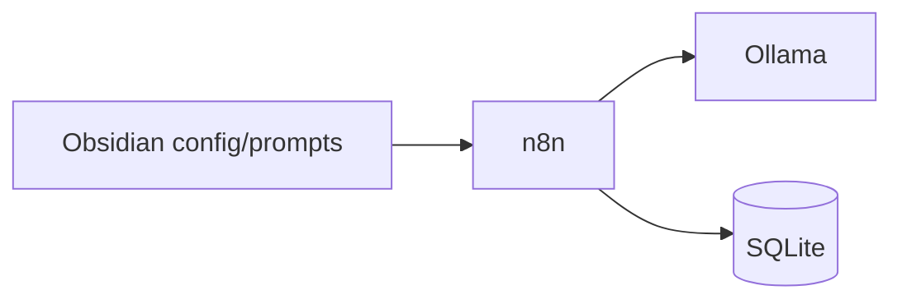

# Система автоматизации — обзор

> Реализация автоматической торговли: n8n + Ollama + SQLite + Obsidian.  
> Полная документация: [`n8n_automation/README.md`](../../n8n_automation/README.md) в репозитории.  
> **Telegram + Wiki→код:** [[Automat_documentation]].

## Главное

- **5 блоков:** данные, crypto, securities, анализ LLM, shared services.
- **Obsidian** — правила и промпты; **SQLite** — факты и логи.
- Текущий режим по умолчанию: **dry_run** (ордера не отправляются).
- Этап 1 (инфраструктура) реализован; торговые flows — этапы 2–8.

---

## Архитектура (кратко)



Конвейер сигнала: **биржа → индикаторы → rule filter → LLM → guardrails → risk → order → log**.

Подробная диаграмма: [[n8n_architecture_overview]].

---

## Где что лежит

| Что | Путь в репозитории |
|-----|-------------------|
| Docker, запуск | `docker-compose.yml` |
| Документация системы | `n8n_automation/README.md` |
| Workflows n8n | `n8n_automation/workflows/` |
| Схема БД | `data/schema.sql` |
| DB API (Python) | `python/api/` |
| Guardrails | `trading_wiki/config/guardrails.yaml` |
| Crypto config | `trading_wiki/config/crypto_config.yaml` |
| Securities config | `trading_wiki/config/securities_config.yaml` |
| Промпты | `trading_wiki/prompts/` |

---

## Дорожная карта

| Этап | Статус | Содержание |
|------|--------|------------|
| 1. Инфраструктура | ✅ | Docker, SQLite, health-check |
| 2. Crypto dry_run | ✅ | Signal pipeline, indicators, LLM |
| 3. База новостей | ✅ | RSS ingest, dedup |
| 4. Crypto paper | ✅ | Binance testnet, monitor |
| 5. Securities DCA | ✅ | T-Invest bridge, tax stub |
| 6. Evaluation | ✅ | Replay, champion/challenger |
| 7. Securities swing | ✅ | Session + LLM |
| 8. Live gates | ✅ | Checklist API (активация вручную) |

Детали: `n8n_automation/docs/roadmap.md`.

---

## Быстрый старт

```powershell
copy .env.example .env
docker compose up -d --build
docker exec -it trading-ollama ollama pull llama3.2
```

Импорт workflows: `n8n_automation/workflows/shared/`.

Проверка: http://localhost:8000/health

---

## Режимы исполнения

| Режим | Ордер | Когда |
|-------|-------|-------|
| `dry_run` | Нет | Отладка pipeline (сейчас) |
| `paper` | Testnet/Sandbox | 4+ недели перед live |
| `shadow` | Нет | Параллельная оценка |
| `live` | Да | После checklist |

---

## В автоматической системе

### Shared workflows (этап 1)

- `shared-health-check` — Ollama, Binance ping, MOEX ISS, DB API каждые 5 мин
- `shared-global-error-handler` — ошибки n8n → SQLite

### Config

n8n читает YAML из `/data/trading_wiki/config/` (read-only mount в Docker).

`kill_switch: true` в guardrails → halt всех trading workflows.

### Логирование

Каждый этап → `POST /api/events` с полями `inputs_hash`, `prompt_version`, `model`.

Человекочитаемые сводки → `trading_wiki/logs/` (генерируются workflow).

---

## Связанные темы

- [[n8n_architecture_overview]]
- [[Crypto_flow_design]]
- [[Securities_flow_design]]
- [[LLM_rules_and_guardrails]]
- [[Ollama_integration]]

---

## Подтверждённые факты

| # | Факт | Источник |
|---|------|----------|
| 1 | n8n поддерживает self-hosted Docker deployment с volume persistence. | [n8n Docker](https://docs.n8n.io/hosting/installation/docker/) |
| 2 | Ollama HTTP API по умолчанию на порту 11434. | [Ollama API](https://github.com/ollama/ollama/blob/main/docs/api.md) |
| 3 | Разделение crypto (24/7) и MOEX (сессия) — архитектурная необходимость. | [[Securities_flow_design]], [[Crypto_flow_design]] |

---

## Дисклеймер

Автоматизация не снимает ответственность оператора. Материалы образовательные, не инвестиционная рекомендация.
