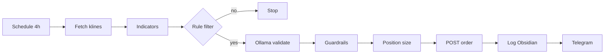

# Crypto flow — проектирование

> n8n-workflow для крипто 24/7: Binance Spot API, Ollama для валидации. Размер позиции и ордера — только код.

## Главное

- Pipeline: klines → индикаторы → rule filter → LLM → risk → order → log.
- v1: Schedule 4h + REST; testnet (`testnet.binance.vision`) до live.
- Pre-filter отсекает 70–90% вызовов LLM; confidence ≥ 0.7 для approve.
- Signed POST с HMAC SHA256; API key без withdrawals.
- Отдельные workflows для signal / execute / monitor.

---

## Для новичка

Робот следит за BTC/ETH (whitelist), считает RSI/MACD/EMA, спрашивает LLM «сигнал разумен?», проверяет риск и выставляет ордер на testnet или live.

Crypto торгуется круглосуточно — session gate не нужен, но нужен мониторинг 24/7 и учёт волатильности в выходные.

---

## Подтверждённые факты

| # | Факт | Источник |
|---|------|----------|
| 1 | Binance Spot REST API: свечи через `GET /api/v3/klines`; параметры `symbol`, `interval`, `limit`. | [Binance Spot REST API](https://developers.binance.com/docs/binance-spot-api-docs/rest-api) |
| 2 | Binance Spot: новая заявка через `POST /api/v3/order`; signed request с HMAC SHA256. | [Binance New Order](https://developers.binance.com/docs/binance-spot-api-docs/rest-api#new-order-trade) |
| 3 | Binance **Testnet** REST base URL: `https://testnet.binance.vision` — отдельные API keys. | [Binance Spot Testnet](https://developers.binance.com/docs/binance-spot-api-docs/testnet) |
| 4 | WebSocket kline stream: `wss://stream.binance.com:9443/ws/{symbol}@kline_{interval}` (lowercase symbol). | [Binance WebSocket Streams](https://developers.binance.com/docs/binance-spot-api-docs/web-socket-streams) |
| 5 | Rate limits: Binance возвращает заголовки `X-MBX-USED-WEIGHT-*`; превышение → HTTP 429. | [Binance REST API — Limits](https://developers.binance.com/docs/binance-spot-api-docs/rest-api#limits) |
| 6 | Ollama `/api/chat` с `"format": "json"` возвращает structured JSON для парсинга в n8n. | [Ollama API](https://github.com/ollama/ollama/blob/main/docs/api.md) |
| 7 | API key Binance: рекомендуется **Enable Reading + Spot Trading**, **Disable Withdrawals**. | [Binance API Key Security](https://developers.binance.com/docs/binance-spot-api-docs/rest-api#endpoint-security-type) |

---

## Подробно: pipeline (пошагово)

### Общая схема



### 1. Trigger

| Вариант | n8n node | Настройка |
|---------|----------|-----------|
| **Schedule (рекомендуется v1)** | Schedule Trigger | Cron `5 */4 * * *` — 5 мин после закрытия 4h свечи |
| **Webhook от TradingView** | Webhook Trigger | Опционально; verify secret header |
| **WebSocket (v2)** | Python sidecar → n8n Webhook | Real-time kline close events |

Для v1 достаточно Schedule + REST klines — проще отладка.

### 2. Fetch data (HTTP Request)

**Production:**
```
GET https://api.binance.com/api/v3/klines?symbol=BTCUSDT&interval=4h&limit=100
```

**Testnet:**
```
GET https://testnet.binance.vision/api/v3/klines?symbol=BTCUSDT&interval=4h&limit=100
```

**Ответ kline (массив):**
```
[
  open_time, open, high, low, close, volume,
  close_time, quote_volume, trades, taker_buy_base, taker_buy_quote, ignore
]
```

**Code node — normalize:**
```javascript
const klines = $input.first().json;
return [{
  json: {
    symbol: 'BTCUSDT',
    timeframe: '4h',
    candles: klines.map(k => ({
      t: k[0],
      o: parseFloat(k[1]),
      h: parseFloat(k[2]),
      l: parseFloat(k[3]),
      c: parseFloat(k[4]),
      v: parseFloat(k[5])
    }))
  }
}];
```

### 3. Indicators (Execute Workflow → `calculate-indicators`)

Расчёт: RSI(14), MACD(12,26,9), EMA50, EMA200. См. [[Key_indicators_RSI_MACD]].

**Output schema:**
```json
{
  "symbol": "BTCUSDT",
  "rsi_14": 28.4,
  "macd": -120.5,
  "macd_signal": -95.2,
  "macd_histogram": -25.3,
  "ema50": 60100,
  "ema200": 58500,
  "trend": "up",
  "close": 60200
}
```

### 4. Rule-based pre-filter (IF / Switch)

**Цель:** не вызывать Ollama на каждом tick — экономия GPU и latency.

```javascript
// Code node — rule evaluation
const d = $input.first().json;
const rules = [];

if (d.rsi_14 < 35) rules.push('rsi_oversold');
if (d.macd_histogram > 0 && d.macd > d.macd_signal) rules.push('macd_bullish_cross');
if (d.close > d.ema200 && d.ema50 > d.ema200) rules.push('golden_cross_context');

if (rules.length === 0) {
  return [{ json: { ...d, proceed: false, reason: 'no_rule_match' } }];
}
return [{ json: { ...d, proceed: true, rule_name: rules.join('+') } }];
```

**IF node:** `proceed === true` → continue to LLM.

### 5. LLM validation (Ollama)

**Execute Workflow** → `llm-validate-signal`.

System prompt: Obsidian `prompts/trading_validator_system.md`.  
User prompt template: [[LLM_prompts_trading]].

**Expected JSON output:**
```json
{
  "action": "approve",
  "confidence": 0.78,
  "direction": "long",
  "counter_thesis": "BTC dominance falling, alt season risk",
  "biases_detected": ["recency"],
  "reason": "Oversold RSI in uptrend with MACD turn"
}
```

**IF:** `action === 'approve' AND confidence >= 0.7` → continue.

### 6. Risk manager (Execute Workflow → `risk-check-and-size`)

Проверки ([[Position_sizing]], [[Stop_loss_take_profit]], [[LLM_rules_and_guardrails]]):

| Check | Условие reject |
|-------|----------------|
| Daily loss limit | PnL today ≤ −3% equity |
| Max open positions | open_count ≥ 2 |
| Whitelist | symbol ∉ config.pairs |
| Min notional | qty × price < exchange MIN_NOTIONAL |
| Existing position | already long same symbol |

**Output:**
```json
{
  "quantity": 0.001,
  "entry_price": 60200,
  "stop_price": 58394,
  "take_profit_price": 63812,
  "risk_usdt": 18.06
}
```

### 7. Execute order (HTTP Request — signed POST)

**Testnet endpoint:**
```
POST https://testnet.binance.vision/api/v3/order
```

**Code node — signature:**
```javascript
const crypto = require('crypto');
const symbol = $json.symbol;
const side = 'BUY';
const type = 'LIMIT';
const quantity = $json.quantity;
const price = $json.entry_price;
const timestamp = Date.now();

const query = `symbol=${symbol}&side=${side}&type=${type}&timeInForce=GTC&quantity=${quantity}&price=${price}&timestamp=${timestamp}`;
const signature = crypto.createHmac('sha256', $env.BINANCE_API_SECRET).update(query).digest('hex');

return [{
  json: {
    url: `https://testnet.binance.vision/api/v3/order?${query}&signature=${signature}`,
    method: 'POST',
    headers: { 'X-MBX-APIKEY': $env.BINANCE_API_KEY }
  }
}];
```

После fill — отдельные ордера SL/TP или OCO. См. [[Binance_API]], [[Stop_loss_take_profit]].

### 8. Log & alert

**Append Obsidian** `trades/crypto-2026-07-05.md`:
```yaml
trade_id: crypto-2026-07-05-001
symbol: BTCUSDT
side: BUY
quantity: 0.001
entry: 60200
stop: 58394
take_profit: 63812
llm_confidence: 0.78
rule: rsi_oversold+macd_bullish_cross
env: testnet
```

**Telegram node:** «✅ BUY BTCUSDT qty=0.001 @ 60200 SL=58394 TP=63812 [testnet]»

---

## Конфиг (Obsidian `config/crypto_config.yaml`)

```yaml
env: testnet  # testnet | live
pairs:
  - BTCUSDT
  - ETHUSDT
timeframe: 4h
schedule_cron: "5 */4 * * *"
max_open_positions: 2
risk_per_trade: 0.01
daily_loss_limit: 0.03
llm_min_confidence: 0.7
ollama_model: llama3.2
legal_notice: "Automated trading is operator responsibility. Not legal/tax advice."
```

---

## Примеры

### Пример 1: Полный цикл на testnet

| Шаг | Результат |
|-----|-----------|
| RSI = 32, trend up | Rule filter → proceed |
| LLM confidence = 0.82 | approve |
| Equity 10 000 USDT, risk 1% | qty = 0.001 BTC @ 60 000 |
| POST order testnet | orderId: 12345, status NEW |
| Limit fill через 2h | status FILLED |
| POST stop-loss | stop orderId: 12346 |

### Пример 2: Reject — низкая confidence

| Шаг | Результат |
|-----|-----------|
| RSI = 33 | proceed to LLM |
| LLM confidence = 0.55 | reject → Stop, log reason |
| Telegram | «⏸ BTCUSDT signal rejected: confidence 0.55» |

### Пример 3: Daily loss halt

| Шаг | Результат |
|-----|-----------|
| 3 убыточных сделки сегодня | daily PnL = −3.2% |
| Новый сигнал approve | risk manager → reject `daily_limit` |
| Workflow tag | `#halted` до 00:00 UTC |

---

## FAQ

### Почему 4h timeframe для v1?

Меньше шума, меньше API calls, меньше LLM invocations. 1h можно добавить после стабилизации 4h на testnet.

### Можно ли торговать altcoins?

Только из **whitelist** в config. Alts — выше volatility и liquidity risk; LLM prompt должен учитывать BTC correlation.

### Как обрабатывать Binance 429?

HTTP Request node: Retry On Fail, Max Tries 3, Wait 5000 ms exponential. После 3 fails → skip cycle + Telegram WARN.

### Нужен ли WebSocket в v1?

Нет. REST klines по Schedule достаточно для swing 4h. WebSocket — для intraday или trailing stop monitoring.

### Как учитывать регулирование РФ?

См. [[Crypto_regulation_RU]]. Workflow **не** выполняет fiat off-ramp. Оператор отвечает за compliance.

---

## Ключевые понятия

| Термин | Определение |
|--------|-------------|
| Testnet | Тестовая среда Binance без реальных средств |
| Signed request | Запрос с HMAC SHA256 подписью |
| Pre-filter | Rule-based отсечение до LLM |
| Whitelist | Разрешённый список торговых пар |
| OCO | One-Cancels-Other — связанные SL и TP |

---

## Проверенные источники

1. **[Binance Spot REST API](https://developers.binance.com/docs/binance-spot-api-docs/rest-api)** — klines, order, account.
2. **[Binance New Order](https://developers.binance.com/docs/binance-spot-api-docs/rest-api#new-order-trade)** — POST `/api/v3/order`.
3. **[Binance WebSocket Streams](https://developers.binance.com/docs/binance-spot-api-docs/web-socket-streams)** — kline streams.
4. **[Binance Spot Testnet](https://developers.binance.com/docs/binance-spot-api-docs/testnet)** — testnet URLs и keys.
5. **[n8n Documentation](https://docs.n8n.io/)** — workflow orchestration.
6. **[Ollama API Reference](https://github.com/ollama/ollama/blob/main/docs/api.md)** — `/api/chat` JSON mode.

---

## Академические источники

См. также: [[Academic_sources]].

| Категория | Что изучать | Почему полезно | URL |
|---|---|---|---|
| BIS (крипто, 2023) | The crypto ecosystem: key elements and risks | Структурные риски крипто/DeFi (централизация, фрагментация, «конгестия») — база для risk gates и fail-closed логики | https://www.bis.org/publ/othp72.pdf |
| ESRB (крипто, 2025) | Crypto-assets and decentralised finance | Системные риски stablecoins и крипто-инвестпродуктов; полезно для ограничений по stablecoin-парам и custody risk | https://www.esrb.europa.eu/pub/pdf/reports/esrb.report202510_cryptoassets.en.pdf |
| MIT / A. Lo (2022) | 15.481x Adaptive Markets: Financial Market Dynamics and Human Behavior (Fall 2022) | Режимы рынка и поведенческие механизмы — полезно для режима «выходные/высокая волатильность» и фильтров | https://ocw.mit.edu/courses/15-481x-adaptive-markets-financial-market-dynamics-and-human-behavior-fall-2022/resources/mit-economist-andrew-w-lo-on-finance-ai-and-human-behavior/ |
| IEEE (2025) | Evolving Portfolio Heuristics: A Self-Correcting LLM Framework for Portfolio Optimization | Пример исследовательского подхода к LLM в портфельной оптимизации; использовать как ориентир по методологии, а не как готовую стратегию | https://ieeexplore.ieee.org/document/11200704/ |
| arXiv (2025) | Decision by Supervised Learning with Deep Ensembles (arXiv:2503.13544) | Идея устойчивости решений через ансамбли — применимо к «консенсусу» нескольких моделей/промптов | https://arxiv.org/abs/2503.13544 |
| ВШЭ (ВКР, 2024) | Hedging Derivatives Under Incomplete Markets with Deep Learning (VKR 929592108) | Паттерн «модель → веса → ордера» полезен при проектировании automation модулей risk/hedge | https://www.hse.ru/en/edu/vkr/929592108 |

---

## В автоматической системе

### Workflow split (рекомендуется)

| Workflow | Trigger | Назначение |
|----------|---------|------------|
| `crypto-signal-testnet` | Schedule 4h | Fetch → indicators → LLM → log signal |
| `crypto-execute-testnet` | Webhook internal | Risk → order → bracket SL/TP |
| `crypto-monitor` | Schedule 15m | Open orders, missing SL check |

Разделение сигнала и исполнения позволяет **manual approve** перед execute в live.

### n8n credentials setup

1. n8n → Credentials → Header Auth или Generic Credential Type.
2. Binance API Key → `X-MBX-APIKEY` header.
3. API Secret → только в Code node через `$env` или n8n Variables (encrypted).

### Метрики для Obsidian dashboard

```yaml
period: 2026-07
total_signals: 45
llm_approvals: 12
executed_trades: 10
win_rate: 0.40
avg_rr: 1.8
max_drawdown: -0.05
env: testnet
```

---

## Связанные темы

- [[n8n_architecture_overview]]
- [[Binance_API]]
- [[Key_indicators_RSI_MACD]]
- [[Ollama_integration]]
- [[LLM_prompts_trading]]
- [[LLM_rules_and_guardrails]]
- [[Crypto_regulation_RU]]
- [[Stop_loss_take_profit]]

---

## Что изучить дальше

1. [[Binance_API]] — полный справочник endpoints.
2. [[Ollama_integration]] — настройка LLM в n8n.
3. [[LLM_rules_and_guardrails]] — обязательные guardrails.
4. [[Crypto_regulation_RU]] — правовой контекст РФ.
