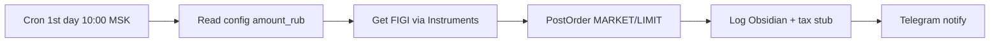
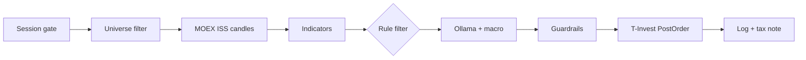

# Securities flow — проектирование

> n8n-workflow для MOEX: сессии, T+1, данные ISS, ордера T-Invest. Режимы: **index_dca** (БПИФ без LLM) и **swing_signals** (акции + LLM).

## Главное

- MOEX ~10:00–18:50 MSK; settlement **T+1** — позиция не сразу доступна для продажи.
- Данные — бесплатный ISS; ордера — T-Invest через Python bridge (gRPC).
- quantity кратно **lot** (SBER = 10); LIMIT предпочтительнее MARKET на swing.
- index_dca: cron 1-го числа, без LLM; swing: session gate + universe + LLM.
- Налоги — отдельный учёт: [[Russia_tax_basics]].

---

## Для новичка

| | Crypto | Securities |
|---|--------|------------|
| Часы | 24/7 | ~10:00–18:50 MSK |
| Settlement | Spot мгновенно | T+1 |
| Данные | Binance | MOEX ISS |
| Ордера | Binance | T-Invest |
| Лоты | Дробные | Кратность лоту |

ISS — котировки без регистрации. T-Invest — заявки через брокерский счёт.

---

## Подтверждённые факты

| # | Факт | Источник |
|---|------|----------|
| 1 | MOEX ISS base URL: `https://iss.moex.com/iss/` — бесплатный HTTP API котировок и свечей. | [MOEX ISS Reference](https://iss.moex.com/iss/reference/) |
| 2 | Свечи акций TQBR: `/iss/engines/stock/markets/shares/boards/TQBR/securities/{SECID}/candles.json`. | [MOEX ISS Reference](https://iss.moex.com/iss/reference/) |
| 3 | T-Invest API: gRPC сервисы `OrdersService`, `MarketDataService`, `OperationsService`, `InstrumentsService`. | [T-Invest API](https://tinkoff.github.io/investAPI/) |
| 4 | T-Invest **Sandbox** — тестовая среда без реальных средств; отдельный токен. | [T-Invest Sandbox](https://tinkoff.github.io/investAPI/sandbox/) |
| 5 | MOEX: расчёты по большинству акций — **T+1** (сделка день N, расчёт день N+1). | [MOEX — Расчёты T+1](https://www.moex.com/s1167) |
| 6 | API T-Invest использует **FIGI** — глобальный идентификатор; маппинг ticker → FIGI через `InstrumentsService`. | [T-Invest Instruments](https://tinkoff.github.io/investAPI/instruments/) |
| 7 | PostOrder: параметр `quantity` должен быть **кратен lot** инструмента. | [T-Invest Orders](https://tinkoff.github.io/investAPI/orders/) |

---

## Подробно: два подрежима

### Режим 1: index_dca (долгосрочный)

**Цель:** ежемесячная покупка БПИФ на индекс (например, TMOS, SBMX) без LLM.



**Cron n8n:** `0 10 1 * *` (10:00 MSK, 1-е число месяца).

**Config (`securities_config.yaml`):**
```yaml
mode: index_dca
dca:
  ticker: TMOS
  amount_rub: 10000
  order_type: MARKET  # или LIMIT с offset
env: sandbox
```

### Режим 2: swing_signals (с LLM)

**Цель:** 1–2 сигнала в день по ликвидным акциям IMOEX top-20.



---

## Подробно: pipeline swing_signals

### 1. Session gate (Code node)

MOEX основная сессия (упрощённо для automation v1):

```javascript
const now = new Date();
const mskHour = parseInt(
  now.toLocaleString('en-US', { timeZone: 'Europe/Moscow', hour: 'numeric', hour12: false })
);
const mskDay = now.toLocaleString('en-US', { timeZone: 'Europe/Moscow', weekday: 'short' });

const isWeekday = !['Sat', 'Sun'].includes(mskDay);
const inSession = mskHour >= 10 && mskHour < 19;

if (!isWeekday || !inSession) {
  return [{ json: { skip: true, reason: 'outside_moex_session' } }];
}
return [{ json: { skip: false } }];
```

**IF node:** `skip === false` → continue.

> Точное расписание сессий — на [moex.com](https://www.moex.com/). Для production добавьте календарь праздников MOEX.

### 2. Universe filter

**Источник:** IMOEX top-20 по ликвидности (обновление раз в неделю вручную или через ISS).

**MOEX ISS — список бумаг TQBR:**
```
GET https://iss.moex.com/iss/engines/stock/markets/shares/boards/TQBR/securities.json
```

**Code node — filter by VALTODAY:**
```javascript
const securities = $input.first().json.securities;
const cols = securities.columns;
const rows = securities.data;
const idx = (name) => cols.indexOf(name);

const parsed = rows.map(r => ({
  secid: r[idx('SECID')],
  valtoday: r[idx('VALTODAY')] || 0,
  numtrades: r[idx('NUMTRADES')] || 0
}));

const whitelist = ['SBER', 'GAZP', 'LKOH', 'YNDX', 'GMKN']; // из config
const filtered = parsed
  .filter(s => whitelist.includes(s.secid))
  .filter(s => s.valtoday > 100000000); // > 100M RUB turnover

return filtered.map(s => ({ json: s }));
```

### 3. Data + indicators (Loop Over Items)

**Для каждого ticker — HTTP Request:**
```
GET https://iss.moex.com/iss/engines/stock/markets/shares/boards/TQBR/securities/{{ $json.secid }}/candles.json?interval=24&from=2025-01-01
```

**interval values (MOEX ISS):** 1, 10, 60 (мин), 24 (день), 7 (неделя), 31 (месяц).

**Parse ISS candles (Code node):**
```javascript
const cols = $json.candles.columns;
const rows = $json.candles.data;
const candles = rows.map(r => Object.fromEntries(cols.map((c, i) => [c, r[i]])));
return [{ json: { secid: $json.secid, candles } }];
```

**Indicators:** RSI(14), volume spike vs 20d avg, distance from MA50. Execute Workflow → `calculate-indicators`.

### 4. LLM + macro context

**Macro data (из Obsidian note или MOEX ISS):**
```
GET https://iss.moex.com/iss/engines/stock/markets/index/securities/IMOEX.json
```

**User prompt:** [[LLM_prompts_trading]] template (MOEX equities).

**Кontext для LLM:**
```json
{
  "ticker": "SBER",
  "imoex_change_pct": -0.8,
  "cb_rate": 21.0,
  "indicators": { "rsi_14": 31, "vs_ma50_pct": -4.2 },
  "rule_name": "rsi_oversold_liquid"
}
```

LLM использует **акционную терминологию**, не crypto slang.

### 5. Risk & order (T-Invest)

**Паттерн интеграции (рекомендуется):**
```
n8n → Python microservice (FastAPI) → gRPC T-Invest
```

**Причина:** gRPC + protobuf сложнее в чистом n8n HTTP node; Python SDK `tinkoff-investments` упрощает PostOrder.

**PostOrder checklist:**
- [ ] Sandbox vs production token
- [ ] `figi` из InstrumentsService
- [ ] `quantity` кратно `lot` (SBER lot = 10)
- [ ] `order_type`: LIMIT для swing (не MARKET на illiquid)
- [ ] `order_id` = UUID для idempotency

**REST/gRPC endpoint (gRPC):**
```
tinkoff.public.invest.api.contract.v1.OrdersService/PostOrder
```

Документация: [T-Invest PostOrder](https://tinkoff.github.io/investAPI/orders/#postorder).

**n8n HTTP Request к Python sidecar:**
```
POST http://localhost:8000/order
Body: {
  "figi": "BBG004730N88",
  "quantity": 10,
  "direction": "ORDER_DIRECTION_BUY",
  "order_type": "ORDER_TYPE_LIMIT",
  "price": 250.50,
  "account_id": "...",
  "request_id": "{{ $uuid }}"
}
```

### 6. Settlement awareness (T+1)

**Не считать позицию доступной для rebalance до T+1 confirm.**

**Code node — settlement check:**
```javascript
const tradeDate = new Date($json.trade_timestamp);
const settlementDate = new Date(tradeDate);
settlementDate.setDate(settlementDate.getDate() + 1);
// Skip weekends/holidays in production — use MOEX calendar

return [{
  json: {
    ...$json,
    settlement_date: settlementDate.toISOString().split('T')[0],
    position_available_for_sell: new Date() >= settlementDate
  }
}];
```

Источник T+1: [MOEX расчёты](https://www.moex.com/s1167).

---

## Примеры

### Пример 1: index_dca — покупка TMOS

| Параметр | Значение |
|----------|----------|
| Дата | 1 июля 2026, 10:00 MSK |
| amount_rub | 10 000 |
| TMOS price | ~6.50 ₽ |
| quantity | 1500 шт (кратно lot) |
| order | MARKET sandbox |
| Log | `trades/securities-2026-07-01.md` + tax stub |

### Пример 2: swing — SBER oversold

| Шаг | Результат |
|-----|-----------|
| Session 14:00 MSK | in session ✓ |
| SBER VALTODAY > 100M | liquid ✓ |
| RSI = 29, above MA200 | rule match |
| LLM approve 0.75 | proceed |
| Lot = 10, risk 1% | qty = 10 акций |
| LIMIT buy 248.00 | order placed |
| T+1 | settlement 2026-07-06 |

### Пример 3: Reject — вне сессии

| Шаг | Результат |
|-----|-----------|
| Trigger 20:30 MSK | session gate → skip |
| Log | «outside_moex_session» |
| No API calls to T-Invest | — |

---

## FAQ

### Почему MOEX ISS для данных, а T-Invest для ордеров?

ISS — **бесплатный** публичный API котировок. T-Invest — **брокерский** API для вашего счёта. Разделение снижает нагрузку на брокера и упрощает бэктest (ISS history).

### Можно ли торговать через ISS?

Нет. ISS — только **informational**. Ордера — только через брокера (T-Invest, другие API).

### Как получить FIGI для SBER?

T-Invest `InstrumentsService/FindInstrument` с query `SBER`. Или статический маппинг в Obsidian `moex_tickers.md`.

### Нужен ли LLM для index_dca?

Нет. DCA — rule-based cron без AI. LLM только для swing_signals (опционально можно отключить).

### Как учитывать ИИС?

Отдельный `account_id` в config. Автоторговля на ИИС — ограничения по закону; оператор обязан соблюдать. См. [[Russia_tax_basics]].

---

## Ключевые понятия

| Термин | Определение |
|--------|-------------|
| TQBR | Режим торгов акций MOEX (T+1) |
| SECID | Тикер на MOEX (SBER, GAZP) |
| FIGI | Financial Instrument Global Identifier |
| T+1 | Расчёт на следующий рабочий день |
| БПИФ | Биржевой паевой инвестиционный фонд |
| Session gate | Проверка торговых часов MOEX |

---

## Проверенные источники

1. **[T-Invest API Documentation](https://tinkoff.github.io/investAPI/)** — gRPC сервисы, PostOrder.
2. **[T-Bank Developer Portal — Invest](https://developer.tbank.ru/invest/intro/intro/)** — актуальный portal.
3. **[T-Invest Sandbox](https://tinkoff.github.io/investAPI/sandbox/)** — тестовая среда.
4. **[T-Invest Orders](https://tinkoff.github.io/investAPI/orders/)** — типы заявок.
5. **[MOEX ISS Reference](https://iss.moex.com/iss/reference/)** — endpoints котировок и свечей.
6. **[MOEX — Расчёты T+1](https://www.moex.com/s1167)** — settlement.
7. **[n8n Documentation](https://docs.n8n.io/)** — workflow orchestration.

---

## Академические источники

См. также: [[Academic_sources]].

| Категория | Что изучать | Почему полезно | URL |
|---|---|---|---|
| ВШЭ (курс) | Behavioral Finance (2024/2025) | Поведенческие ошибки инвестора — полезно для «human override» политики и дисциплины исполнения в securities-flow | https://nes.hse.ru/edu/courses/902185688 |
| MIT / A. Lo (2022) | 15.481x Adaptive Markets: Financial Market Dynamics and Human Behavior (Fall 2022) | Идея «режимов» и адаптации стратегий — полезно для ограничений на торговлю в стресс-режимах | https://ocw.mit.edu/courses/15-481x-adaptive-markets-financial-market-dynamics-and-human-behavior-fall-2022/resources/mit-economist-andrew-w-lo-on-finance-ai-and-human-behavior/ |
| Stanford GSB (курс) | GSBGEN 646 Behavioral Economics and the Psychology of Decision Making | Heuristics/biases и принятие решений — полезно для политики «manual override», чеклистов и процедур контроля | https://explorecourses.stanford.edu/search?view=catalog&filter-coursestatus-Active=on&page=0&catalog=&q=GSBGEN+646%3A+Behavioral+Economics+and+the+Psychology+of+Decision+Making&collapse= |
| IEEE (2025) | Evolving Portfolio Heuristics: A Self-Correcting LLM Framework for Portfolio Optimization | Академический контекст для LLM/оптимизации портфеля (важно при обсуждении «LLM как PM») | https://ieeexplore.ieee.org/document/11200704/ |
| arXiv (2025) | Decision by Supervised Learning with Deep Ensembles (arXiv:2503.13544) | Подход к устойчивости весов портфеля через ансамбли; пригодно как идея «двухконтурной» валидации | https://arxiv.org/abs/2503.13544 |
| ВШЭ (ВКР, 2024) | Hedging Derivatives Under Incomplete Markets with Deep Learning (VKR 929592108) | Пример практической реализации: модель выдаёт веса портфеля → конвертация в ордера (паттерн автоматизации) | https://www.hse.ru/en/edu/vkr/929592108 |

---

## В автоматической системе

### Workflow naming

```
securities-dca-sandbox
securities-swing-sandbox
securities-monitor
shared-moex-fetch
```

### Tax log stub (Obsidian)

```yaml
trade_id: sec-2026-07-05-001
ticker: SBER
figi: BBG004730N88
side: buy
quantity: 10
price: 248.00
fees: 1.24
settlement_date: 2026-07-06
tax_note: "consult broker report — НДФЛ при продаже"
iis: false
```

### Monthly export flow

1. **Schedule:** `0 9 1 * *` — 1-е число, 09:00 MSK.
2. **Code:** aggregate closed trades from Obsidian `trades/securities-*.md`.
3. **Write file:** `exports/tax/2026/securities-trades.csv`.
4. **Telegram:** «Tax export ready: N trades».

### n8n + Python sidecar docker-compose snippet

```yaml
  tinvest-bridge:
    build: ./python/tinvest_bridge
    ports:
      - "8000:8000"
    environment:
      - TINVEST_TOKEN=${TINVEST_SANDBOX_TOKEN}
      - TINVEST_SANDBOX=true
```

---

## Связанные темы

- [[n8n_architecture_overview]]
- [[MOEX_ISS_API]]
- [[Tinkoff_Invest_API]]
- [[MOEX_stocks]]
- [[Russia_tax_basics]]
- [[LLM_prompts_trading]]
- [[Key_indicators_RSI_MACD]]
- [[Stop_loss_take_profit]]

---

## Что изучить дальше

1. [[MOEX_ISS_API]] — детали ISS endpoints.
2. [[Tinkoff_Invest_API]] — PostOrder, sandbox.
3. [[Russia_tax_basics]] — НДФЛ на бумаги.
4. [[LLM_rules_and_guardrails]] — guardrails для securities flow.
