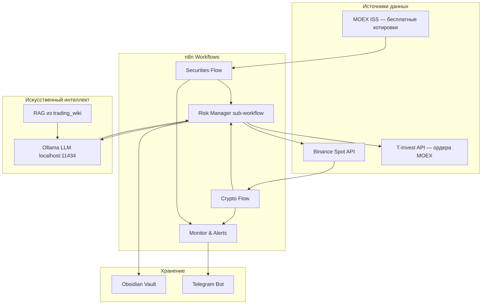

# Архитектура n8n — обзор

> Автоматическая система трейдинга строится на **n8n** (оркестрация workflow), **Ollama** (локальный LLM), **Obsidian** (база знаний, конфиг, журнал) и **Python** (тяжёлые расчёты и бэктест). LLM **не исполняет ордера** — только валидирует сигналы; размер позиции и API-вызовы — код.

---

## Для новичка

Представьте конвейер на фабрике:

```
Данные с биржи → Индикаторы → LLM проверяет сигнал → Риск-менеджмент → Ордер → Запись в журнал
```

**n8n** — визуальный конструктор таких конвейеров (workflows). Каждый «узел» (node) выполняет одно действие: HTTP-запрос, расчёт, условие, отправка в Telegram.

**Ollama** запускает языковую модель **локально** на вашем ПК или сервере — данные не уходят в облако.

**Obsidian** — папка с markdown-файлами: правила риска, промпты для LLM, история сделок, wiki для RAG.

**Python** — опционально, когда в n8n Code node не хватает библиотек (pandas, ta-lib).

---

## Подтверждённые факты

| # | Факт | Источник |
|---|------|----------|
| 1 | **n8n** — open-source платформа автоматизации workflow с self-hosted и cloud вариантами; workflows состоят из nodes, соединённых edges. | [n8n Documentation](https://docs.n8n.io/) |
| 2 | n8n поддерживает **sub-workflows** — переиспользуемые фрагменты, вызываемые из основного flow через node Execute Workflow. | [n8n Sub-workflows](https://docs.n8n.io/flow-logic/subworkflows/) |
| 3 | **HTTP Request node** — стандартный способ вызова REST API (Binance, MOEX ISS, Ollama) из n8n. | [n8n HTTP Request](https://docs.n8n.io/integrations/builtin/core-nodes/n8n-nodes-base.httprequest/) |
| 4 | n8n можно развернуть через **Docker**; официальная документация описывает docker-compose с volume для persistence. | [n8n Docker](https://docs.n8n.io/hosting/installation/docker/) |
| 5 | **Ollama** предоставляет HTTP API на порту **11434** по умолчанию: `/api/generate`, `/api/chat`, `/api/embeddings`. | [Ollama API Reference](https://github.com/ollama/ollama/blob/main/docs/api.md) |
| 6 | Ollama поддерживает параметр `"format": "json"` для structured output — критично для торговых решений approve/reject. | [Ollama API Reference](https://github.com/ollama/ollama/blob/main/docs/api.md) |
| 7 | Разделение **crypto (24/7)** и **securities (сессия MOEX)** — архитектурная необходимость, не косметика: разные API, settlement, риски. | Проектная практика + [MOEX ISS](https://iss.moex.com/iss/reference/) |

---

## Подробно: компоненты системы

### Диаграмма архитектуры



### Принципы проектирования

| Принцип | Обоснование | Реализация |
|---------|-------------|------------|
| **Раздельные flows** | Crypto 24/7 vs MOEX session — разная логика, тайминг, settlement | `Crypto_flow_design`, `Securities_flow_design` |
| **LLM не исполняет ордера** | Галлюцинации, отсутствие ответственности | LLM → JSON approve/reject; quantity — Code node |
| **Paper перед live** | Минимизация потерь при отладке | Binance testnet + T-Invest sandbox |
| **Fail-safe / fail-closed** | Сбой AI ≠ сбой с деньгами | Ollama timeout → reject trade |
| **Obsidian as source of truth** | Версионирование промптов и risk config в git | `prompts/`, `guardrails.yaml` |
| **Idempotency** | Повторный trigger не должен дублировать ордер | UUID `request_id`, проверка open orders |

### Структура репозитория (целевая)

```
PROJECT_Trading/
├── trading_wiki/              # Obsidian vault (RAG + журнал)
│   ├── prompts/
│   ├── config/
│   │   ├── crypto_config.yaml
│   │   ├── securities_config.yaml
│   │   └── guardrails.yaml
│   └── logs/
├── n8n_automation/
│   ├── workflows/             # JSON export из n8n
│   └── credentials/           # НЕ в git — .gitignore
├── python/
│   ├── indicators/
│   └── backtest/
└── docker-compose.yml         # n8n + ollama
```

### Docker-compose (минимальный)

```yaml
services:
  n8n:
    image: n8nio/n8n
    ports:
      - "5678:5678"
    environment:
      - N8N_BASIC_AUTH_ACTIVE=true
      - N8N_BASIC_AUTH_USER=${N8N_USER}
      - N8N_BASIC_AUTH_PASSWORD=${N8N_PASSWORD}
      - GENERIC_TIMEZONE=Europe/Moscow
    volumes:
      - n8n_data:/home/node/.n8n
      - ./trading_wiki:/data/trading_wiki:ro
      - ./n8n_automation:/data/n8n_automation

  ollama:
    image: ollama/ollama
    ports:
      - "11434:11434"
    volumes:
      - ollama_data:/root/.ollama

volumes:
  n8n_data:
  ollama_data:
```

После старта: `docker exec -it ollama ollama pull llama3.2` (или `mistral`, `qwen2.5`).

### Sub-workflows (переиспользуемые)

| ID | Назначение | Вход | Выход |
|----|------------|------|-------|
| `fetch-ohlcv` | Свечи Binance или MOEX ISS | symbol, timeframe, limit | candles[] |
| `calculate-indicators` | RSI, MACD, EMA | candles[] | indicators JSON |
| `llm-validate-signal` | Ollama approve/reject | context + prompt | `{action, confidence}` |
| `risk-check-and-size` | Position sizing, daily limit | signal, portfolio | qty, reject_reason |
| `place-order` | Signed API call | order params | order_id, status |
| `log-to-obsidian` | Append trade log | trade object | file path |
| `enforce-guardrails` | Pre-flight checks | config + signal | pass/fail |

Документация sub-workflows: [n8n Sub-workflows](https://docs.n8n.io/flow-logic/subworkflows/).

### Слои безопасности

1. **Network:** n8n и Ollama в private Docker network; API keys только в n8n Credentials.
2. **Config:** `kill_switch: true` в `guardrails.yaml` → все trading workflows halt.
3. **Env tags:** workflow tags `#env/testnet`, `#env/sandbox`, `#env/live` — live требует manual flag.
4. **Audit:** каждый LLM response → `logs/llm/YYYY-MM-DD/{trade_id}.json`.

---

## Примеры

### Пример 1: Минимальный «hello pipeline» в n8n

**Nodes:**
1. **Schedule Trigger** — `0 */4 * * *` (каждые 4 часа).
2. **HTTP Request** — GET `https://api.binance.com/api/v3/klines?symbol=BTCUSDT&interval=4h&limit=50`.
3. **Code** — parse klines array → `{ candles: [...] }`.
4. **Execute Workflow** → `calculate-indicators`.
5. **IF** — `rsi < 35` → continue, else Stop.

Это **data-only** flow без LLM и ордеров — первый шаг отладки.

### Пример 2: Вызов Ollama из n8n

**HTTP Request node:**
- Method: POST
- URL: `http://ollama:11434/api/chat`
- Body (JSON):

```json
{
  "model": "llama3.2",
  "messages": [
    {"role": "system", "content": "{{ $json.system_prompt }}"},
    {"role": "user", "content": "{{ $json.market_context }}"}
  ],
  "format": "json",
  "stream": false
}
```

**Code node (parse):**
```javascript
const raw = $input.first().json.message.content;
try {
  const decision = JSON.parse(raw);
  if (!['approve', 'reject'].includes(decision.action)) {
    return [{ json: { action: 'reject', reason: 'invalid_action' } }];
  }
  return [{ json: decision }];
} catch (e) {
  return [{ json: { action: 'reject', reason: 'json_parse_error', raw } }];
}
```

### Пример 3: Error workflow (глобальный)

n8n Settings → Error Workflow → workflow `global-error-handler`:
- Получает `{ workflow, execution, error }`.
- Telegram: «Workflow X failed: {error.message}».
- Append to Obsidian `logs/errors/YYYY-MM-DD.md`.

Документация: [n8n Error Handling](https://docs.n8n.io/flow-logic/error-handling/).

### Пример 4: Разделение testnet / live

**Code node — env gate:**
```javascript
const config = $('Read Config').first().json;
const workflowTags = $workflow.tags || [];
const isLive = config.env === 'live';
const hasLiveTag = workflowTags.includes('env/live');
if (isLive && !hasLiveTag) {
  throw new Error('Live env requires workflow tag env/live');
}
return $input.all();
```

---

## FAQ

### Почему n8n, а не чистый Python?

n8n даёт **визуальную оркестрацию**, встроенные triggers, retry, credentials, мониторинг executions. Python остаётся для расчётов, где нужны pandas/ta-lib. Гибрид снижает время итерации для нетехнического оператора.

### Где хранить API-ключи?

Только в **n8n Credentials** (encrypted at rest). Никогда в Obsidian markdown, промптах LLM или git. См. [[LLM_rules_and_guardrails]] правило G7.

### Нужен ли GPU для Ollama?

Не обязательно, но **рекомендуется** для моделей 7B+ при частых вызовах. CPU-режим работает, но latency 30–120 с на запрос — учитывайте в timeout HTTP node (60–120 с).

### Как обновлять workflows между dev и prod?

1. Разработка в n8n UI на testnet.
2. Export JSON → `n8n_automation/workflows/`.
3. Git commit.
4. Import на prod instance; credentials настраиваются отдельно на каждом хосте.

### Что делать при падении Ollama?

**Fail-closed:** все сигналы → reject. Telegram alert «Ollama unreachable». Не fallback на cloud LLM без явного решения оператора (утечка данных, compliance).

---

## Ключевые понятия

| Термин | Определение |
|--------|-------------|
| Workflow | Цепочка nodes в n8n |
| Sub-workflow | Переиспользуемый workflow, вызываемый как функция |
| Fail-closed | При ошибке — не торговать |
| RAG | Retrieval-Augmented Generation — LLM + контекст из wiki |
| Paper trading | Торговля на testnet/sandbox без реальных денег |
| Kill switch | Флаг остановки всех автоматических ордеров |

---

## Проверенные источники

1. **[n8n Documentation](https://docs.n8n.io/)** — основная документация платформы.
2. **[n8n Docker Installation](https://docs.n8n.io/hosting/installation/docker/)** — развёртывание через Docker.
3. **[n8n Sub-workflows](https://docs.n8n.io/flow-logic/subworkflows/)** — переиспользуемые workflow.
4. **[n8n HTTP Request Node](https://docs.n8n.io/integrations/builtin/core-nodes/n8n-nodes-base.httprequest/)** — REST-интеграции.
5. **[n8n Error Handling](https://docs.n8n.io/flow-logic/error-handling/)** — обработка ошибок.
6. **[Ollama API Reference](https://github.com/ollama/ollama/blob/main/docs/api.md)** — `/api/chat`, `/api/generate`.
7. **[Ollama — Local LLM Runtime](https://ollama.com/)** — установка и модели.

---

## В автоматической системе

### Мониторинг workflow

**Schedule workflow `health-check` (каждые 5 мин):**

| Check | Node | Alert if fail |
|-------|------|---------------|
| Ollama alive | GET `http://ollama:11434/api/tags` | Telegram CRITICAL |
| Binance ping | GET `https://api.binance.com/api/v3/ping` | Telegram WARN |
| MOEX ISS | GET `https://iss.moex.com/iss/index.json` | Telegram WARN |
| Open positions без SL | Query Binance `/api/v3/openOrders` | Telegram CRITICAL |
| Daily PnL | Code aggregate from Obsidian logs | Halt if limit hit |

### Naming convention workflows

```
[crypto|securities]-[stage]-[env]
Примеры:
  crypto-signal-testnet
  crypto-execute-testnet
  securities-swing-sandbox
  securities-dca-sandbox
  shared-llm-validate
  shared-risk-manager
  shared-log-obsidian
```

### Execution log в Obsidian

```yaml
execution_id: "n8n-12345"
workflow: "crypto-signal-testnet"
timestamp: "2026-07-05T18:00:00+03:00"
duration_ms: 4520
nodes_executed: 12
result: "signal_rejected"
llm_confidence: 0.55
ollama_model: "llama3.2"
prompt_version: "1.2.0"
```

### Promotion checklist: testnet → live

- [ ] ≥ 4 недели paper trading без critical errors
- [ ] Win rate и max drawdown задокументированы
- [ ] `guardrails.yaml`: `live_requires: manual_approval_flag: true`
- [ ] Отдельные API keys с **Disable Withdrawals** (Binance)
- [ ] Telegram alerts протестированы
- [ ] Kill switch проверен вручную
- [ ] Юридический disclaimer для crypto ([[Crypto_regulation_RU]])

---

## Связанные темы

- [[Crypto_flow_design]]
- [[Securities_flow_design]]
- [[Ollama_integration]]
- [[LLM_rules_and_guardrails]]
- [[Binance_API]]
- [[MOEX_ISS_API]]
- [[Tinkoff_Invest_API]]

---

## Что изучить дальше

1. [[Crypto_flow_design]] — детальный pipeline для криптовалют.
2. [[Securities_flow_design]] — pipeline для MOEX.
3. [[Ollama_integration]] — подключение LLM к n8n.
4. [[LLM_rules_and_guardrails]] — обязательные ограничения.
