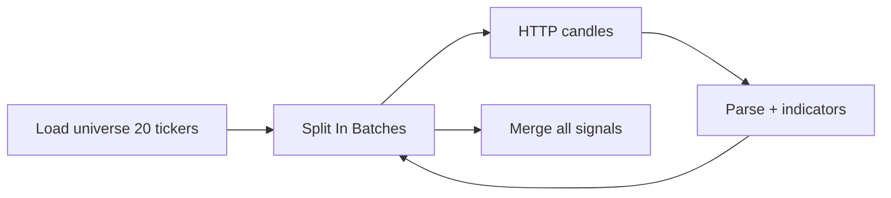

# MOEX ISS API

> **ISS (Informational & Statistical Server)** — бесплатный HTTP API Московской биржи для котировок, свечей, истории и справочников. Основной **источник данных** для securities-flow; ордера — через брокера ([[Tinkoff_Invest_API]]).

---

## Для новичка

ISS позволяет **без регистрации и API key** получать рыночные данные MOEX в форматах JSON, XML, CSV.

**Типичный сценарий в проекте:**
1. ISS → свечи SBER, IMOEX → индикаторы в n8n
2. Сигнал → LLM validation
3. T-Invest API → реальный ордер

ISS **не** позволяет торговать — только читать данные.

**Базовый URL:**
```
https://iss.moex.com/iss/
```

---

## Подтверждённые факты

| # | Факт | Источник |
|---|------|----------|
| 1 | ISS base URL: `https://iss.moex.com/iss/` — REST API без аутентификации для публичных данных. | [MOEX ISS Reference](https://iss.moex.com/iss/reference/) |
| 2 | Формат ответа: JSON (`.json`), XML (`.xml`), CSV (`.csv`) — суффикс к URL path. | [MOEX ISS Reference](https://iss.moex.com/iss/reference/) |
| 3 | Структура JSON: объект с блоками `{ "blockname": { "columns": [...], "data": [[...]] } }`. | [MOEX ISS — Program interface](https://www.moex.com/a2193) |
| 4 | Свечи акций TQBR: `/iss/engines/stock/markets/shares/boards/TQBR/securities/{SECID}/candles.json`. | [MOEX ISS Reference — Candles](https://iss.moex.com/iss/reference/205) |
| 5 | **interval** для candles: 1, 10, 60 (минуты), 24 (день), 7 (неделя), 31 (месяц), 4 (квартал). | [MOEX ISS Candles](https://iss.moex.com/iss/reference/205) |
| 6 | Пагинация через параметр `start` и блок `cursor` в ответе (INDEX, TOTAL, PAGESIZE). | [MOEX ISS Reference](https://iss.moex.com/iss/reference/) |
| 7 | Rate limiting существует; при интенсивных запросах MOEX может throttle — рекомендуется кэширование. | [MOEX ISS FAQ](https://www.moex.com/a8285) |

---

## Подробно: ключевые endpoints

### Справочники и статус

| Endpoint | Описание |
|----------|----------|
| `/iss/index.json` | Индекс доступных ресурсов ISS |
| `/iss/engines.json` | Торговые системы (stock, currency, futures) |
| `/iss/engines/stock/markets/shares/boards.json` | Режимы торгов акций |

### Акции (TQBR — T+1 основной режим)

| Endpoint | Описание |
|----------|----------|
| `/iss/engines/stock/markets/shares/boards/TQBR/securities.json` | Все бумаги режима TQBR |
| `/iss/engines/stock/markets/shares/boards/TQBR/securities/{SECID}.json` | Текущие котировки бумаги |
| `/iss/engines/stock/markets/shares/boards/TQBR/securities/{SECID}/candles.json` | Свечи |
| `/iss/engines/stock/markets/shares/securities/{SECID}.json` | Справочник бумаги (all boards) |

### Индексы

| Endpoint | Описание |
|----------|----------|
| `/iss/engines/stock/markets/index/securities/IMOEX.json` | Индекс IMOEX текущие значения |
| `/iss/engines/stock/markets/index/securities/IMOEX/candles.json` | Свечи IMOEX |
| `/iss/engines/stock/markets/index/securities/RTSI/candles.json` | Свечи RTSI |

### История

| Endpoint | Описание |
|----------|----------|
| `/iss/history/engines/stock/markets/shares/securities/{SECID}.json` | Исторические данные |
| `/iss/history/engines/stock/markets/shares/securities/{SECID}/dates.json` | Доступные даты |

Полный справочник: [iss.moex.com/iss/reference](https://iss.moex.com/iss/reference/).

### Параметры запроса candles

| Parameter | Описание | Пример |
|-----------|----------|--------|
| `from` | Начало периода | `2025-01-01` |
| `till` | Конец периода | `2026-07-01` |
| `interval` | Таймфрейм | `24` (день) |
| `start` | Offset для пагинации | `0`, `500`, `1000` |

**Пример полного URL:**
```
GET https://iss.moex.com/iss/engines/stock/markets/shares/boards/TQBR/securities/SBER/candles.json?interval=24&from=2025-01-01&till=2026-07-01
```

### Колонки candles (typical)

| Column | Описание |
|--------|----------|
| `open` | Цена открытия |
| `close` | Цена закрытия |
| `high` | Максимум |
| `low` | Минимум |
| `volume` | Объём в штуках |
| `begin` | Начало периода свечи |
| `end` | Конец периода свечи |
| `value` | Объём в валюте |

---

## Примеры

### Пример 1: Текущая котировка SBER

```bash
curl "https://iss.moex.com/iss/engines/stock/markets/shares/boards/TQBR/securities/SBER.json"
```

**Блок `marketdata`:**
```
columns: ["SECID", "BID", "OFFER", "LAST", "OPEN", "HIGH", "LOW", "VOLTODAY", "VALTODAY", ...]
```

### Пример 2: Daily candles SBER (parse в JavaScript)

```javascript
const resp = $input.first().json;
const cols = resp.candles.columns;
const rows = resp.candles.data;

const candles = rows.map(row => {
  const obj = {};
  cols.forEach((c, i) => obj[c] = row[i]);
  return obj;
});

return [{ json: { secid: 'SBER', candles } }];
```

### Пример 3: IMOEX для macro context

```bash
curl "https://iss.moex.com/iss/engines/stock/markets/index/securities/IMOEX.json"
```

**Use in LLM prompt:**
```json
{
  "imoex_last": 3250.5,
  "imoex_change_pct": -0.82
}
```

### Пример 4: Пагинация длинной истории

```javascript
// Loop in n8n until cursor.INDEX >= cursor.TOTAL
const cursor = $json.candles.cursor?.[0];
const start = cursor ? cursor[0] + cursor[2] : 0; // INDEX + PAGESIZE
const total = cursor ? cursor[1] : 0;

return [{
  json: {
    hasMore: start < total,
    nextStart: start,
    total
  }
}];
```

**Next request:** append `&start={{ nextStart }}` to URL.

### Пример 5: Universe — top liquid TQBR

```bash
curl "https://iss.moex.com/iss/engines/stock/markets/shares/boards/TQBR/securities.json?iss.meta=off"
```

Sort by `VALTODAY` descending → top-20 для swing universe.

---

## FAQ

### Нужен ли API key для ISS?

**Нет** для публичных market data endpoints.

### ISS vs T-Invest MarketData?

| | ISS | T-Invest |
|---|-----|----------|
| Cost | Free | Included with broker |
| Auth | None | Token required |
| Rate limit | MOEX fair use | Broker limits |
| Best for | Backtest, signals | Live portfolio sync |

Рекомендация проекта: **ISS для data pipeline**.

### Какой board выбрать для акций?

**TQBR** — основной режим T+1 для розничных акций. TQTF — ETF/БПИФ. TQOB — облигации.

### Как часто обновлять данные в n8n?

Swing daily: 1–2× в сессию. Intraday 10m: каждые 10–15 min **в session only**. Кэшируйте — не запрашивайте 100 тикеров каждую минуту.

### Что при пустом candles.data?

Возможные причины: неверный SECID, нерабочий день, ticker не торгуется на TQBR. Log + skip ticker.

---

## Ключевые понятия

| Термин | Определение |
|--------|-------------|
| SECID | Security ID / ticker на MOEX |
| TQBR | Board — режим торгов акций T+1 |
| ISS block | Фрагмент ответа (candles, marketdata, securities) |
| cursor | Метаданные пагинации |
| VALTODAY | Оборот в рублях за сегодня |

---

## Проверенные источники

1. **[MOEX ISS Reference](https://iss.moex.com/iss/reference/)** — полный справочник endpoints.
2. **[MOEX ISS — Program interface (a2193)](https://www.moex.com/a2193)** — описание интерфейса.
3. **[MOEX ISS FAQ (a8285)](https://www.moex.com/a8285)** — частые вопросы.
4. **[MOEX ISS — Candles (ref/205)](https://iss.moex.com/iss/reference/205)** — параметры свечей.
5. **[n8n HTTP Request](https://docs.n8n.io/integrations/builtin/core-nodes/n8n-nodes-base.httprequest/)** — интеграция в n8n.

---

## В автоматической системе

### Sub-workflow: `fetch-moex-candles`

**Input:**
```json
{
  "secid": "SBER",
  "board": "TQBR",
  "interval": 24,
  "from": "2025-01-01"
}
```

**HTTP Request node:**
```
GET https://iss.moex.com/iss/engines/stock/markets/shares/boards/{{ $json.board }}/securities/{{ $json.secid }}/candles.json
Query: interval, from, iss.meta=off
```

**Output:** normalized candles array (совместим с [[Key_indicators_RSI_MACD]] format).

### Sub-workflow: `fetch-moex-universe`

1. GET TQBR securities.json
2. Filter VALTODAY > threshold
3. Intersect with config whitelist
4. Return `[{ secid, valtoday, last }]`

### Caching strategy

| Data | Cache TTL | Storage |
|------|-----------|---------|
| Daily candles | 24h | `python/data/moex/{secid}_d.csv` |
| Intraday 10m | 10m | n8n static data / Redis |
| IMOEX snapshot | 1h | Obsidian macro note |
| Securities list | 1 week | `config/moex_universe.json` |

**Python prefetch script (optional):**
```bash
python python/scripts/fetch_moex_history.py --secid SBER --interval 24 --from 2020-01-01
```

### n8n batch loop pattern



**Wait node:** 200ms between requests — courtesy to MOEX.

### Obsidian: moex_tickers.md

```yaml
tickers:
  - secid: SBER
    figi: BBG004730N88
    board: TQBR
    lot: 10
    sector: financials
  - secid: GAZP
    figi: BBG004730RP0
    board: TQBR
    lot: 10
    sector: energy
```

### Error handling

| Symptom | Action |
|---------|--------|
| HTTP 5xx | Retry 3× backoff |
| Empty data | Skip ticker, log |
| Timeout | Increase n8n timeout to 30s |
| Parse error | Log raw response snippet |

---

## Связанные темы

- [[Securities_flow_design]]
- [[MOEX_stocks]]
- [[IMOEX_RTS]]
- [[Tinkoff_Invest_API]]
- [[Technical_analysis_basics]]
- [[Key_indicators_RSI_MACD]]

---

## Что изучить дальше

1. [[Securities_flow_design]] — использование ISS в pipeline.
2. [[Tinkoff_Invest_API]] — ордера через брокера.
3. [[Key_indicators_RSI_MACD]] — расчёт индикаторов на ISS data.
4. [[IMOEX_RTS]] — индексы MOEX.
