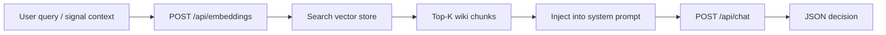

# Интеграция Ollama в n8n

> **Ollama** запускает open-source LLM **локально**. n8n подключается через **HTTP API** (`localhost:11434`) или **LangChain Ollama Chat Model node**. В торговой системе Ollama **валидирует** сигналы (approve/reject), не исполняет ордера.

---

## Для новичка

Вместо отправки торговых данных в облачный ChatGPT вы вызываете модель на своём ПК или сервере:

```
POST http://localhost:11434/api/chat
{
  "model": "llama3.2",
  "messages": [...],
  "format": "json",
  "stream": false
}
```

**Плюсы:** приватность, нет платы за tokens, работа offline.  
**Минусы:** нужен GPU/CPU, качество зависит от модели, latency 5–120 сек.

**Fail-closed правило:** если Ollama недоступен → **не торговать**. См. [[LLM_rules_and_guardrails]].

---

## Подтверждённые факты

| # | Факт | Источник |
|---|------|----------|
| 1 | Ollama REST API default port: **11434**. | [Ollama API Reference](https://github.com/ollama/ollama/blob/main/docs/api.md) |
| 2 | `POST /api/generate` — completion format (prompt string). | [Ollama API — Generate](https://github.com/ollama/ollama/blob/main/docs/api.md#generate-a-completion) |
| 3 | `POST /api/chat` — chat format (messages array with roles). | [Ollama API — Chat](https://github.com/ollama/ollama/blob/main/docs/api.md#generate-a-chat-completion) |
| 4 | `POST /api/embeddings` — vector embeddings для RAG. | [Ollama API — Embeddings](https://github.com/ollama/ollama/blob/main/docs/api.md#generate-embeddings) |
| 5 | Parameter `"format": "json"` — structured JSON output (schema mode). | [Ollama API — JSON mode](https://github.com/ollama/ollama/blob/main/docs/api.md#format) |
| 6 | `GET /api/tags` — список локально установленных моделей. | [Ollama API — List models](https://github.com/ollama/ollama/blob/main/docs/api.md#list-local-models) |
| 7 | n8n имеет built-in **Ollama Chat Model** node (LangChain sub-node). | [n8n Ollama Chat Model](https://docs.n8n.io/integrations/builtin/cluster-nodes/sub-nodes/n8n-nodes-langchain.lmchatollama/) |
| 8 | `"stream": false` — ждать полный ответ (рекомендуется для n8n HTTP node). | [Ollama API](https://github.com/ollama/ollama/blob/main/docs/api.md) |

---

## Подробно: API endpoints

### POST /api/chat (рекомендуется для trading)

**Request:**
```json
{
  "model": "llama3.2",
  "messages": [
    {"role": "system", "content": "You are a trading signal validator..."},
    {"role": "user", "content": "Symbol: BTCUSDT, RSI: 28..."}
  ],
  "format": "json",
  "stream": false,
  "options": {
    "temperature": 0.1,
    "num_ctx": 4096
  }
}
```

**Response:**
```json
{
  "model": "llama3.2",
  "message": {
    "role": "assistant",
    "content": "{\"action\":\"approve\",\"confidence\":0.78,...}"
  },
  "done": true
}
```

### POST /api/generate (legacy/alternative)

```json
{
  "model": "llama3.2",
  "prompt": "Validate this trade signal: ...",
  "format": "json",
  "stream": false
}
```

Response: `{ "response": "{...json...}" }` — поле `response`, не `message.content`.

### POST /api/embeddings (RAG)

```json
{
  "model": "nomic-embed-text",
  "prompt": "Position sizing rules for 1% risk per trade"
}
```

Response: `{ "embedding": [0.123, -0.456, ...] }`

### GET /api/tags (health check)

```bash
curl http://localhost:11434/api/tags
```

Используется в n8n health-check workflow ([[n8n_architecture_overview]]).

### Model management (CLI)

```bash
ollama pull llama3.2
ollama pull mistral
ollama pull qwen2.5:7b
ollama list
```

Документация моделей: [ollama.com/library](https://ollama.com/library).

---

## Подробно: n8n подключение

### Вариант A: HTTP Request node (рекомендуется v1)

**Pros:** полный контроль, простой debug, работает без LangChain.  
**Cons:** manual JSON parse.

**HTTP Request settings:**
| Field | Value |
|-------|-------|
| Method | POST |
| URL | `http://ollama:11434/api/chat` |
| Body Content Type | JSON |
| Timeout | 120000 ms |

**Body (expressions):**
```json
{
  "model": "{{ $('Read Config').first().json.ollama_model }}",
  "messages": [
    {"role": "system", "content": "{{ $json.system_prompt }}"},
    {"role": "user", "content": "{{ $json.user_prompt }}"}
  ],
  "format": "json",
  "stream": false,
  "options": { "temperature": 0.1 }
}
```

### Вариант B: LangChain Ollama Chat Model

n8n AI Agent / Chain nodes → **Ollama Chat Model** sub-node.

**Credential:** Base URL `http://ollama:11434`, Model `llama3.2`.

**Pros:** structured chains, memory.  
**Cons:** сложнее debug; JSON schema требует Output Parser node.

Документация: [n8n Ollama Chat Model](https://docs.n8n.io/integrations/builtin/cluster-nodes/sub-nodes/n8n-nodes-langchain.lmchatollama/).

### Вариант C: Execute Command (не рекомендуется)

`ollama run llama3.2 "prompt"` — сложный parse, нет JSON mode guarantee.

---

## RAG с Obsidian wiki



**Steps:**
1. Index `trading_wiki/` → embeddings (`nomic-embed-text` or `mxbai-embed-large`).
2. Store in ChromaDB / local JSON (Python script).
3. On signal: retrieve [[Position_sizing]], [[Stop_loss_take_profit]] chunks.
4. Append to system prompt: «Relevant rules: ...»

**n8n integration:** Python microservice `/rag/query` or pre-built index refreshed daily.

---

## Примеры

### Пример 1: Полный n8n Code node — build + parse

**Build prompts:**
```javascript
const fs = require('fs'); // or read from HTTP / Obsidian sync path
const systemPrompt = $json.system_prompt; // from Obsidian sync
const userPrompt = `
## Market context
Symbol: ${$json.symbol}
Timeframe: ${$json.timeframe}
Regime: ${$json.trend}

## Indicators
${JSON.stringify($json.indicators, null, 2)}

## Rule signal
Pre-filter: ${$json.rule_name}

Validate. Output JSON only.
`;
return [{ json: { system_prompt: systemPrompt, user_prompt: userPrompt } }];
```

**Parse response:**
```javascript
const content = $input.first().json.message?.content || $input.first().json.response;
let decision;
try {
  decision = JSON.parse(content);
} catch (e) {
  return [{ json: { action: 'reject', reason: 'json_parse_error', raw: content } }];
}
const required = ['action', 'confidence', 'direction', 'reason'];
for (const field of required) {
  if (!(field in decision)) {
    return [{ json: { action: 'reject', reason: `missing_${field}` } }];
  }
}
if (decision.confidence < 0.7) decision.action = 'reject';
return [{ json: decision }];
```

### Пример 2: Health check workflow

**Schedule 5 min → HTTP GET `/api/tags`**

```javascript
const models = $json.models || [];
const required = 'llama3.2';
const hasModel = models.some(m => m.name.includes(required));
if (!hasModel) {
  // Telegram CRITICAL: model not pulled
}
return [{ json: { healthy: hasModel, models: models.map(m => m.name) } }];
```

### Пример 3: Model comparison (offline eval)

Run same prompt through `llama3.2`, `mistral`, `qwen2.5:7b`; log confidence distribution; pick best for production.

### Пример 4: Docker networking

```yaml
# docker-compose.yml
services:
  n8n:
    ...
  ollama:
    image: ollama/ollama
    ports:
      - "11434:11434"
```

n8n → `http://ollama:11434` (service name as hostname).

---

## FAQ

### Какую модель выбрать?

| Model | Size | Notes |
|-------|------|-------|
| llama3.2 | 3B/1B | Fast, good JSON on 3B |
| mistral | 7B | Better reasoning, slower |
| qwen2.5:7b | 7B | Strong structured output |

Start with **llama3.2** for latency; upgrade if too many false approvals.

### temperature для trading?

**0.0–0.2** — deterministic, less creative hallucination. Не используйте 0.7+ для financial decisions.

### stream: true или false?

**false** для n8n — проще parse single JSON response. Streaming — для UI chat only.

### Ollama на CPU — достаточно?

Для 3B models — да, 30–60s latency. Для 7B+ — GPU strongly recommended при частых calls.

### LLM может ли выставить ордер?

**Нет.** Только approve/reject JSON. Orders — Binance/T-Invest API from Code node. [[LLM_rules_and_guardrails]].

---

## Ключевые понятия

| Термин | Определение |
|--------|-------------|
| num_ctx | Context window size (tokens) |
| format: json | Ollama structured output mode |
| RAG | Retrieval-Augmented Generation |
| Fail-closed | Ollama down → no trade |
| System prompt | Instructions + schema for LLM |
| Pre-filter | Rules before LLM call |

---

## Проверенные источники

1. **[Ollama API Reference](https://github.com/ollama/ollama/blob/main/docs/api.md)** — /api/chat, /api/generate, /api/embeddings.
2. **[Ollama — Local LLM Runtime](https://ollama.com/)** — install, models.
3. **[n8n Ollama Chat Model](https://docs.n8n.io/integrations/builtin/cluster-nodes/sub-nodes/n8n-nodes-langchain.lmchatollama/)** — LangChain integration.
4. **[n8n HTTP Request](https://docs.n8n.io/integrations/builtin/core-nodes/n8n-nodes-base.httprequest/)** — REST calls to Ollama.
5. **[n8n Docker](https://docs.n8n.io/hosting/installation/docker/)** — co-deploy with Ollama.

---

## В автоматической системе

### Sub-workflow: `llm-validate-signal`

**Input:**
```json
{
  "symbol": "BTCUSDT",
  "market_type": "crypto",
  "indicators": {...},
  "rule_name": "rsi_oversold",
  "prompt_version": "1.2.0"
}
```

**Nodes:**
1. **Read System Prompt** — from `/data/trading_wiki/prompts/trading_validator_system.md`
2. **Build User Prompt** — Code node with template [[LLM_prompts_trading]]
3. **HTTP POST** — `/api/chat`
4. **Parse JSON** — Code node with validation
5. **Log LLM Response** — write `logs/llm/{date}/{trade_id}.json`

**Output:**
```json
{
  "action": "approve",
  "confidence": 0.78,
  "direction": "long",
  "counter_thesis": "...",
  "biases_detected": ["recency"],
  "reason": "...",
  "prompt_version": "1.2.0",
  "model": "llama3.2",
  "latency_ms": 12500
}
```

### Performance optimization

| Technique | Savings |
|-----------|---------|
| Rule pre-filter before LLM | 70–90% fewer calls |
| Batch macro summary weekly, not per signal | GPU time |
| num_ctx 4096 (not 8192+) | Memory + speed |
| Cache system prompt in memory | Minor |
| Smaller model for pre-screen | Optional tier-2 |

### Audit log schema

```yaml
timestamp: "2026-07-05T18:00:00+03:00"
trade_id: crypto-2026-07-05-001
model: llama3.2
prompt_version: 1.2.0
input_hash: sha256:abc123...
raw_response: |
  {"action":"approve",...}
parsed_action: approve
confidence: 0.78
latency_ms: 12500
```

### Fallback matrix

| Event | n8n action |
|-------|------------|
| Timeout 120s | reject + Telegram WARN |
| Invalid JSON | reject + log raw |
| Ollama 500 | reject + retry once |
| Model not found | halt workflow + CRITICAL |
| confidence < 0.7 | reject (IF node) |

---

## Связанные темы

- [[LLM_prompts_trading]]
- [[LLM_rules_and_guardrails]]
- [[n8n_architecture_overview]]
- [[Crypto_flow_design]]
- [[Securities_flow_design]]
- [[Key_indicators_RSI_MACD]]

---

## Что изучить дальше

1. [[LLM_prompts_trading]] — готовые prompt templates.
2. [[LLM_rules_and_guardrails]] — enforce rules in code.
3. [[Crypto_flow_design]] — где вызывается LLM в pipeline.
4. [[n8n_architecture_overview]] — общая архитектура.
