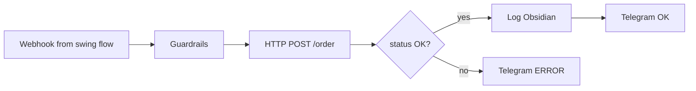

# T-Invest API (T-Bank)

> **T-Invest API** — официальный gRPC/REST API брокера **T-Bank** (бывш. Tinkoff Invest) для торговли ценными бумагами на MOEX, получения портфеля и рыночных данных. В проекте — **исполнение ордеров** для securities-flow; котировки — преимущественно из MOEX ISS.

---

## Для новичка

После открытия **брокерского счёта** T-Bank вы создаёте **API token** в личном кабинете (Настройки → API). Токен даёт программный доступ к:

- портфелю и позициям;
- выставлению и отмене заявок;
- рыночным данным (свечи, стакан, last price);
- справочнику инструментов (FIGI, lot, ticker).

> **Торговля через API = реальные деньги** (в production). Начинайте с **Sandbox** (песочница) — виртуальный счёт без риска.

**FIGI** — глобальный идентификатор инструмента (например, SBER = `BBG004730N88`). API часто требует FIGI, а не ticker.

---

## Подтверждённые факты

| # | Факт | Источник |
|---|------|----------|
| 1 | T-Invest API — gRPC протокол; protobuf контракты в репозитории `investAPI`. | [T-Invest API](https://tinkoff.github.io/investAPI/) |
| 2 | **Sandbox** — отдельная среда для тестирования; методы `SandboxService` для пополнения виртуального счёта. | [T-Invest Sandbox](https://tinkoff.github.io/investAPI/sandbox/) |
| 3 | `OrdersService/PostOrder` — выставление заявки; параметры: `figi`, `quantity`, `price`, `direction`, `order_type`, `account_id`. | [T-Invest Orders — PostOrder](https://tinkoff.github.io/investAPI/orders/#postorder) |
| 4 | `OrdersService/CancelOrder` — отмена заявки по `order_id`. | [T-Invest Orders — CancelOrder](https://tinkoff.github.io/investAPI/orders/#cancelorder) |
| 5 | `InstrumentsService/FindInstrument` — поиск инструмента по ticker/name → FIGI. | [T-Invest Instruments](https://tinkoff.github.io/investAPI/instruments/) |
| 6 | `MarketDataService/GetCandles` — исторические свечи (альтернатива MOEX ISS). | [T-Invest MarketData](https://tinkoff.github.io/investAPI/marketdata/) |
| 7 | `OperationsService/GetPortfolio` — текущий портфель и позиции. | [T-Invest Operations](https://tinkoff.github.io/investAPI/operations/) |
| 8 | Production gRPC endpoint: `invest-public-api.tinkoff.ru:443`. Sandbox: `sandbox-invest-public-api.tinkoff.ru:443`. | [T-Invest Protocol](https://tinkoff.github.io/investAPI/#protocol) |

---

## Подробно: окружения

| Среда | gRPC endpoint | Назначение |
|-------|---------------|------------|
| **Production** | `invest-public-api.tinkoff.ru:443` | Live торговля |
| **Sandbox** | `sandbox-invest-public-api.tinkoff.ru:443` | Тест без реальных средств |

**Токены разные** для sandbox и production. Не смешивать.

### Основные gRPC сервисы

| Сервис | Методы | Назначение |
|--------|--------|------------|
| `UsersService` | `GetAccounts`, `GetInfo` | Список счетов, тарифы |
| `InstrumentsService` | `FindInstrument`, `GetInstrumentBy` | FIGI, lot, min price increment |
| `MarketDataService` | `GetCandles`, `GetLastPrices`, `GetOrderBook` | Рыночные данные |
| `OrdersService` | `PostOrder`, `CancelOrder`, `GetOrders`, `PostStopOrder` | Заявки |
| `OperationsService` | `GetPortfolio`, `GetOperations` | Портфель, история |
| `SandboxService` | `OpenSandboxAccount`, `SandboxPayIn` | Sandbox setup |

Полный список: [T-Invest API Reference](https://tinkoff.github.io/investAPI/).

### FIGI vs Ticker

| Ticker | FIGI (пример) | Lot |
|--------|---------------|-----|
| SBER | BBG004730N88 | 10 |
| GAZP | BBG004730RP0 | 10 |
| LKOH | BBG004731032 | 1 |

> FIGI может меняться при корпоративных действиях — обновляйте через `FindInstrument`.

### Типы заявок (OrderType)

| Enum | Описание |
|------|----------|
| `ORDER_TYPE_LIMIT` | Лимитная |
| `ORDER_TYPE_MARKET` | Рыночная |
| `ORDER_TYPE_BESTPRICE` | Лучшая цена в стакане |

### Направление (OrderDirection)

| Enum | Описание |
|------|----------|
| `ORDER_DIRECTION_BUY` | Покупка |
| `ORDER_DIRECTION_SELL` | Продажа |

### Stop-заявки

`OrdersService/PostStopOrder` — стоп-loss, take-profit. См. [[Stop_loss_take_profit]].

Документация: [PostStopOrder](https://tinkoff.github.io/investAPI/orders/#poststoporder).

---

## Примеры

### Пример 1: FindInstrument (Python SDK)

```python
from tinkoff.invest import Client

TOKEN = "sandbox_token_here"

with Client(TOKEN, target="sandbox") as client:
    result = client.instruments.find_instrument(query="SBER")
    for inst in result.instruments:
        print(inst.ticker, inst.figi, inst.lot)
```

### Пример 2: PostOrder LIMIT buy (концептуально)

**gRPC request fields:**
```json
{
  "figi": "BBG004730N88",
  "quantity": 10,
  "price": { "units": 250, "nano": 500000000 },
  "direction": "ORDER_DIRECTION_BUY",
  "account_id": "xxxxxxxx",
  "order_type": "ORDER_TYPE_LIMIT",
  "order_id": "550e8400-e29b-41d4-a716-446655440000"
}
```

`order_id` — UUID для **idempotency** (повторный запрос с тем же ID не создаст дубль).

`price`: Quotation format — `units` + `nano` (250.50 = units:250, nano:500000000).

### Пример 3: GetPortfolio

```python
with Client(TOKEN) as client:
    accounts = client.users.get_accounts()
    account_id = accounts.accounts[0].id
    portfolio = client.operations.get_portfolio(account_id=account_id)
    for pos in portfolio.positions:
        print(pos.figi, pos.quantity)
```

### Пример 4: Sandbox setup flow

1. `SandboxService/OpenSandboxAccount` → account_id
2. `SandboxService/SandboxPayIn` → virtual 1 000 000 RUB
3. PostOrder на sandbox endpoint
4. Verify через GetOrders

Документация: [Sandbox](https://tinkoff.github.io/investAPI/sandbox/).

---

## FAQ

### REST или gRPC?

Официальный API — **gRPC**. REST-обёртки существуют в community SDK. Рекомендуется Python SDK `tinkoff-investments` или gRPC напрямую.

### Как интегрировать с n8n?

**Паттерн:** n8n → HTTP → Python FastAPI bridge → gRPC T-Invest.

Причина: n8n не имеет native gRPC node; protobuf в Code node — хрупко.

### quantity — акции или лоты?

**Лоты.** `quantity: 10` для SBER = 10 лотов × 10 акций = 100 акций? 

> **Проверяйте документацию:** в T-Invest API `quantity` — количество **штук (акций)**, но должно быть **кратно lot**. Для SBER (lot=10): quantity = 10, 20, 30...

Актуальное поведение — [PostOrder docs](https://tinkoff.github.io/investAPI/orders/#postorder).

### Можно ли использовать T-Invest для данных вместо ISS?

Да, `GetCandles` — но ISS бесплатен без token и без rate limit брокера. Рекомендация: **ISS для data**, **T-Invest для orders**.

### Как хранить token?

n8n Credentials или env variable. **Никогда** в Obsidian wiki или LLM prompts. См. [[LLM_rules_and_guardrails]] G7.

---

## Ключевые понятия

| Термин | Определение |
|--------|-------------|
| FIGI | Financial Instrument Global Identifier |
| gRPC | RPC framework over HTTP/2 |
| Quotation | Формат цены: units + nano |
| Idempotency | Повтор PostOrder с тем же order_id безопасен |
| Sandbox | Тестовая среда T-Invest |
| Lot | Минимальная торгуемая кратность |

---

## Проверенные источники

1. **[T-Invest API Documentation](https://tinkoff.github.io/investAPI/)** — главная документация.
2. **[T-Bank Developer Portal — Invest](https://developer.tbank.ru/invest/intro/intro/)** — portal и onboarding.
3. **[T-Invest Orders](https://tinkoff.github.io/investAPI/orders/)** — PostOrder, CancelOrder, PostStopOrder.
4. **[T-Invest Sandbox](https://tinkoff.github.io/investAPI/sandbox/)** — тестовая среда.
5. **[T-Invest Instruments](https://tinkoff.github.io/investAPI/instruments/)** — FindInstrument, FIGI.
6. **[T-Invest MarketData](https://tinkoff.github.io/investAPI/marketdata/)** — GetCandles, GetLastPrices.
7. **[T-Invest Operations](https://tinkoff.github.io/investAPI/operations/)** — GetPortfolio.

---

## В автоматической системе

### Python bridge (FastAPI) — структура

```
python/tinvest_bridge/
├── main.py          # FastAPI endpoints
├── client.py        # T-Invest gRPC wrapper
├── requirements.txt # tinkoff-investments
└── Dockerfile
```

**Endpoints:**

| Method | Path | Maps to |
|--------|------|---------|
| GET | `/health` | ping |
| GET | `/accounts` | UsersService/GetAccounts |
| GET | `/instrument/{ticker}` | FindInstrument |
| POST | `/order` | PostOrder |
| DELETE | `/order/{id}` | CancelOrder |
| GET | `/portfolio` | GetPortfolio |

### n8n HTTP Request → POST /order

**Body (JSON):**
```json
{
  "ticker": "SBER",
  "quantity": 10,
  "price": 250.50,
  "direction": "BUY",
  "order_type": "LIMIT",
  "request_id": "{{ $uuid }}"
}
```

**Bridge logic:**
1. Resolve ticker → FIGI
2. Validate quantity % lot === 0
3. Convert price to Quotation
4. PostOrder with idempotent order_id = request_id
5. Return `{ order_id, status, message }`

### n8n workflow: securities-execute



### PostOrder checklist (automation)

- [ ] Token: sandbox vs production from config
- [ ] `account_id` matches IIS flag if applicable
- [ ] Session gate passed ([[Securities_flow_design]])
- [ ] quantity кратно lot
- [ ] LIMIT price within ±2% of last (avoid accidental fat finger)
- [ ] request_id UUID logged
- [ ] PostStopOrder after fill (SL/TP)

### Obsidian trade log

```yaml
trade_id: sec-2026-07-05-001
broker: tbank
api: tinvest
figi: BBG004730N88
ticker: SBER
order_id: "550e8400-e29b-41d4-a716-446655440000"
side: buy
quantity: 10
price: 250.50
order_type: LIMIT
env: sandbox
settlement: T+1
```

### Error handling

| gRPC code | Action |
|-----------|--------|
| UNAVAILABLE | Retry 3×, then halt |
| INVALID_ARGUMENT | Log + reject (bad qty/price) |
| NOT_FOUND | Refresh FIGI mapping |
| RESOURCE_EXHAUSTED | Rate limit — backoff |

---

## Связанные темы

- [[Securities_flow_design]]
- [[MOEX_ISS_API]]
- [[MOEX_stocks]]
- [[Order_types]]
- [[Stop_loss_take_profit]]
- [[Russia_tax_basics]]
- [[LLM_rules_and_guardrails]]

---

## Что изучить дальше

1. [[Securities_flow_design]] — pipeline с T-Invest.
2. [[MOEX_ISS_API]] — бесплатные котировки.
3. [[Stop_loss_take_profit]] — PostStopOrder.
4. [[Russia_tax_basics]] — налоговый учёт сделок.
