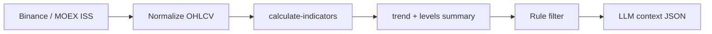

# Основы технического анализа

> **ТА** — анализ исторических цен и объёмов для паттернов и трендов. Не предсказывает будущее; работает с риск-менеджментом.

## Главное

- Фундаментальный анализ: «сколько стоит?» ТА: «куда движется цена?»
- FINRA/SEC: прошлые результаты не гарантируют будущих.
- OHLCV — стандарт свечи; Binance и MOEX ISS отдают одинаковую логику.
- В automation: структурированные данные для rule filter + LLM, не ручные линии.
- Старший TF — тренд, младший — вход (практика ТА, не регуляторное правило).

---

## Для новичка

**Фундаментальный** — отчётность, дивиденды, сектор.

**Технический** — куда движется цена, где спрос/предложение.

В системе ТА — OHLCV + индикаторы для фильтров и LLM validation.

---

## Подтверждённые факты

| # | Факт | Источник |
|---|------|----------|
| 1 | Technical analysis использует исторические market data (price, volume) для выявления паттернов и трендов. | [Investopedia: Technical Analysis](https://www.investopedia.com/terms/t/technicalanalysis.asp) |
| 2 | SEC: technical analysis — один из подходов; не существует гарантированного метода предсказания цен. | [SEC: Technical Analysis](https://www.sec.gov/answers/technical.htm) |
| 3 | FINRA: все инвестиции несут риск; прошлая доходность не гарантирует будущую. | [FINRA Investing Basics](https://www.finra.org/investors/investing/investing-basics) |
| 4 | **OHLCV** — стандартный формат свечи: Open, High, Low, Close, Volume за период. | [Binance Klines](https://developers.binance.com/docs/binance-spot-api-docs/rest-api#klinecandlestick-data), [MOEX ISS Candles](https://iss.moex.com/iss/reference/205) |
| 5 | Binance klines: массив `[open_time, open, high, low, close, volume, close_time, ...]`. | [Binance Klines](https://developers.binance.com/docs/binance-spot-api-docs/rest-api#klinecandlestick-data) |
| 6 | MOEX ISS candles: колонки `open`, `high`, `low`, `close`, `volume`, `begin`, `end`. | [MOEX ISS Candles](https://iss.moex.com/iss/reference/205) |
| 7 | Multi-timeframe analysis: старший TF определяет тренд, младший — точку входа — общепринятая практика ТА (не регуляторное правило). | [Investopedia: Technical Analysis](https://www.investopedia.com/terms/t/technicalanalysis.asp) |

---

## Подробно: японские свечи (OHLC)

### Анатомия свечи

```
        |  ← High (верхняя тень)
      ███
      ███  ← Body (Open — Close)
      ███
        |  ← Low (нижняя тень)
```

| Элемент | Описание |
|---------|----------|
| **Open** | Цена первой сделки периода |
| **High** | Максимальная цена периода |
| **Low** | Минимальная цена периода |
| **Close** | Цена последней сделки периода |
| **Volume** | Суммарный объём торгов за период |

**Бычья свеча (зелёная):** Close > Open — покупатели доминировали.  
**Медвежья свеча (красная):** Close < Open — продавцы доминировали.

### Период (timeframe)

| TF | Код Binance | Код MOEX ISS | Типичное use |
|----|-------------|--------------|--------------|
| 1 час | `1h` | `60` | Intraday |
| 4 часа | `4h` | — | Swing crypto |
| 1 день | `1d` | `24` | Swing stocks |
| 1 неделя | `1w` | `7` | Trend filter |

---

## Подробно: тренд и уровни

### Типы тренда

| Тренд | Описание | Визуально |
|-------|----------|-----------|
| **Uptrend** | Серия higher highs (HH) и higher lows (HL) | Цена «лестницей» вверх |
| **Downtrend** | Lower highs (LH) и lower lows (LL) | Цена «лестницей» вниз |
| **Range (боковик)** | Цена между support и resistance | Горизонтальный канал |

### Support и Resistance

- **Support** — уровень, где historically цена **отскакивала вверх** (спрос).
- **Resistance** — уровень, где цена **разворачивалась вниз** (предложение).

> Уровни — **зоны**, не точные линии. В automation используйте % band (например, ±0.5%).

### Правило multi-timeframe

```
Weekly/Daily → trend direction (filter)
4H/1H        → entry timing
```

**Пример:** Daily uptrend (Close > EMA200) + 4H RSI oversold → candidate long. LLM validates context.

---

## Подробно: объём

**Volume** подтверждает или опровергает движение цены:

| Паттерн | Интерпретация (упрощённо) |
|---------|---------------------------|
| Price ↑ + Volume ↑ | Сильное движение (confirmation) |
| Price ↑ + Volume ↓ | Слабое движение (caution) |
| Price ↓ + Volume ↑ | Сильное падение |
| Breakout + Volume spike | Потенциально значимый пробой |

В n8n: `volume_ratio = today_volume / avg_volume_20d`.

---

## Подробно: chart patterns (обзор)

| Pattern | Описание | Automation note |
|---------|----------|-----------------|
| Double top/bottom | Два пика/дна на одном уровне | Hard to detect in code v1 |
| Head & shoulders | Разворотный паттерн | LLM may mention; code doesn't rely |
| Triangle | Сжатие range | Volatility contraction metric |
| Gap | Разрыв между close и next open | Detectable: `open > prev_close * 1.01` |

> Для v1 automation фокус на **индикаторах** ([[Key_indicators_RSI_MACD]]), не на visual patterns.

---

## Примеры

### Пример 1: Normalized candle JSON (project standard)

```json
{
  "symbol": "BTCUSDT",
  "timeframe": "4h",
  "candles": [
    {"t": 1710000000000, "o": 60000, "h": 60500, "l": 59800, "c": 60200, "v": 1234.5},
    {"t": 1710014400000, "o": 60200, "h": 60800, "l": 60100, "c": 60700, "v": 1456.2}
  ]
}
```

### Пример 2: Trend detection (Code node)

```javascript
const candles = $json.candles;
const closes = candles.map(c => c.c);
const ema50 = calcEMA(closes, 50);
const ema200 = calcEMA(closes, 200);
const trend = ema50.at(-1) > ema200.at(-1) ? 'up' : 'down';
const lastClose = closes.at(-1);
const vsEma50 = ((lastClose / ema50.at(-1)) - 1) * 100;

return [{ json: { trend, lastClose, vsEma50_pct: vsEma50.toFixed(2) } }];
```

### Пример 3: SBER daily from MOEX ISS

```
GET .../securities/SBER/candles.json?interval=24&from=2025-06-01
```

Last candle: Close = 252.30, Volume = 45M shares → above 20d avg → volume confirmation.

### Пример 4: Multi-TF filter

| Layer | Check | Result |
|-------|-------|--------|
| Daily | Close > EMA200 | uptrend ✓ |
| 4H | RSI < 35 | oversold ✓ |
| 1H | MACD histogram turning positive | momentum shift ✓ |
| → | Rule filter proceed to LLM | yes |

---

## FAQ

### ТА работает на крипте и акциях?

Да, **OHLCV универсален**. Но crypto — 24/7 и выше volatility; MOEX — session-bound и lot constraints. Разные flows: [[Crypto_flow_design]], [[Securities_flow_design]].

### Можно ли торговать только по ТА?

Можно, но FINRA/SEC подчёркивают **риски** любой стратегии. В проекте ТА + risk management + LLM sanity check.

### Сколько свечей нужно для индикаторов?

Minimum: 200+ для EMA200; 100 для MACD(26). Binance `limit=500`; MOEX ISS paginate history.

### LLM должен видеть все 500 свечей?

**Нет.** Summary: last 10 candles OHLC + trend + indicators + key levels. Raw data → Code node; LLM → structured JSON.

### ТА vs фундаментальный анализ?

Не mutually exclusive. Securities swing может включать macro (ставка ЦБ, IMOEX) в LLM prompt alongside TA.

---

## Частые ошибки новичков

1. **Overfitting** — паттерн работал на истории, не на live.
2. **Игнор volume** — цена без объёма misleading.
3. **Один TF** — вход на 5m против daily downtrend.
4. **Без stop-loss** — ТА не заменяет [[Stop_loss_take_profit]].
5. **Curve fitting** — 50 индикаторов до «идеального» backtest.
6. **Confirmation bias** — видеть только bullish signals ([[Cognitive_biases]]).

---

## Ключевые понятия

| Термин | Определение |
|--------|-------------|
| OHLCV | Open, High, Low, Close, Volume |
| Timeframe | Период одной свечи |
| Uptrend | Higher highs + higher lows |
| Support | Зона потенциального спроса |
| Resistance | Зона потенциального предложения |
| Breakout | Пробой уровня с объёмом |

---

## Проверенные источники

1. **[Investopedia: Technical Analysis](https://www.investopedia.com/terms/t/technicalanalysis.asp)** — определение и методы.
2. **[FINRA Investing Basics](https://www.finra.org/investors/investing/investing-basics)** — риски инвестирования.
3. **[Investor.gov — Investing Basics](https://www.investor.gov/introduction-investing/investing-basics)** — SEC/OIEA education.
4. **[SEC: Technical Analysis](https://www.sec.gov/answers/technical.htm)** — официальная позиция SEC.
5. **[Binance Klines API](https://developers.binance.com/docs/binance-spot-api-docs/rest-api#klinecandlestick-data)** — формат OHLCV crypto.
6. **[MOEX ISS Candles](https://iss.moex.com/iss/reference/205)** — формат OHLCV MOEX.

---

## Академические источники

См. также: [[Academic_sources]].

| Категория | Ресурс | Что подтверждает | URL |
|---|---|---|---|
| Lopez-Lira & Tang (2024) | Anderson PDF | ChatGPT-сентимент предсказывает дневные доходности OOS | https://www.anderson.ucla.edu/sites/default/files/document/2024-04/4.19.24%20Alejandro%20Lopez%20Lira%20ChatGPT_V3.pdf |
| Digital Finance | StockTwits events (2024) | События в соцсетях → краткосрочные ценовые эффекты | https://doi.org/10.1007/s42521-024-00105-2 |
| Chaos Solitons & Fractals | Ketenci et al. (2024) | On-chain ribbons как TA-подобные сигналы для BTC | https://doi.org/10.1016/j.chaos.2023.114305 |
| MIT / A. Lo (2022) | 15.481x | Режимность рынков — anti-overfit для TA | https://ocw.mit.edu/courses/15-481x-adaptive-markets-financial-market-dynamics-and-human-behavior-fall-2022/ |

---

## В автоматической системе

### Data pipeline



### Standard schema (n8n static type)

```typescript
interface Candle {
  t: number;   // timestamp ms
  o: number;
  h: number;
  l: number;
  c: number;
  v: number;
}

interface TASummary {
  symbol: string;
  timeframe: string;
  trend: 'up' | 'down' | 'range';
  last_close: number;
  ema50: number;
  ema200: number;
  vs_ema50_pct: number;
  support_zone: [number, number];
  resistance_zone: [number, number];
  volume_ratio: number;
  last_10_candles: Candle[];
}
```

### Code node — support/resistance (simple)

```javascript
const candles = $json.candles.slice(-50);
const lows = candles.map(c => c.l);
const highs = candles.map(c => c.h);
const support = Math.min(...lows.slice(-20));
const resistance = Math.max(...highs.slice(-20));
const band = 0.005; // 0.5%

return [{
  json: {
    support_zone: [support * (1 - band), support * (1 + band)],
    resistance_zone: [resistance * (1 - band), resistance * (1 + band)]
  }
}];
```

### LLM context (what to send)

```json
{
  "trend": "up",
  "last_close": 60200,
  "vs_ema50_pct": 1.2,
  "volume_ratio": 1.35,
  "support_zone": [58500, 59000],
  "resistance_zone": [61500, 62000],
  "last_3_candles_summary": "3 green candles, increasing volume"
}
```

**Not sent:** 500 raw candles, tick data, order book (unless strategy requires).

### Obsidian journal entry

```yaml
analysis_date: 2026-07-05
symbol: BTCUSDT
timeframe: 4h
trend: up
ta_summary: "Uptrend, RSI oversold pullback to EMA50 support"
data_source: binance_klines
candles_count: 200
```

---

## Связанные темы

- [[Key_indicators_RSI_MACD]]
- [[Crypto_indicators]]
- [[Crypto_flow_design]]
- [[Securities_flow_design]]
- [[LLM_prompts_trading]]
- [[Stop_loss_take_profit]]
- [[Order_types]]

---

## Что изучить дальше

1. [[Key_indicators_RSI_MACD]] — RSI, MACD, EMA в automation.
2. [[Stop_loss_take_profit]] — выходы из позиций.
3. [[Position_sizing]] — размер позиции и риск.
4. [[LLM_prompts_trading]] — как передать TA context в LLM.
