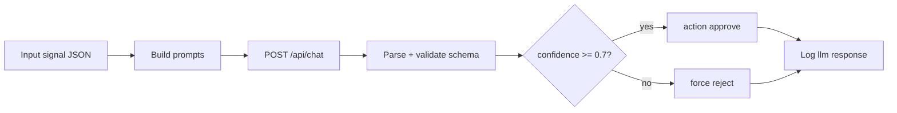

# LLM промпты для трейдинга

> Готовые шаблоны промптов для **Ollama** в n8n-flows. LLM **валидирует** rule-based сигналы (approve/reject), **не** подменяет риск-менеджмент и **не** выставляет ордера. Все промпты хранятся в Obsidian `prompts/` и версионируются git.

---

## Для новичка

**Prompt (промпт)** — текстовая инструкция для LLM. В торговой системе промпт говорит модели:

- «Ты — валидатор сигналов, не финансовый советник»
- «Ответь только JSON по схеме»
- «Если данных мало — reject»

**System prompt** — постоянные правила (роль, schema, ограничения).  
**User prompt** — конкретная ситуация (тикер, индикаторы, macro).

LLM **не знает** ваш баланс и **не должен** знать API keys. Quantity и ордера — Code node.

---

## Подтверждённые факты

| # | Факт | Источник |
|---|------|----------|
| 1 | Ollama `"format": "json"` обеспечивает structured JSON output для парсинга в n8n. | [Ollama API — format](https://github.com/ollama/ollama/blob/main/docs/api.md#format) |
| 2 | Ollama `/api/chat` принимает `messages[]` с roles: `system`, `user`, `assistant`. | [Ollama API — Chat](https://github.com/ollama/ollama/blob/main/docs/api.md#generate-a-chat-completion) |
| 3 | SEC/FINRA: инвестирование несёт риск; automated systems не снимают ответственность оператора. | [Investor.gov](https://www.investor.gov/introduction-investing), [FINRA](https://www.finra.org/investors/investors-need-know) |
| 4 | LLM может **галлюцинировать** — structured output + schema validation обязательны. | Best practice + [[LLM_rules_and_guardrails]] |
| 5 | Temperature 0.0–0.2 снижает креативность и повышает детерминизм для financial validation. | [Ollama API — options](https://github.com/ollama/ollama/blob/main/docs/api.md) |
| 6 | Prompt versioning (`prompt_version`) необходим для audit trail сделок. | Проектная практика |

---

## Подробно: system prompt (validator)

**Файл:** `trading_wiki/prompts/trading_validator_system.md`

```markdown
You are a trading signal validator for an automated system.
You are NOT a financial advisor. You do NOT give buy/sell recommendations to humans.

Rules:
1. Output ONLY valid JSON matching the schema below. No markdown, no explanation outside JSON.
2. Never recommend position size, leverage, or specific quantity.
3. If data is insufficient or contradictory, action MUST be "reject".
4. Always include counter_thesis — the strongest argument AGAINST the trade.
5. List biases_detected from: recency, confirmation, loss_aversion, overconfidence, hype.
6. confidence: 0.0-1.0 — your certainty in the APPROVAL (not market direction).
7. Reject if: no clear trend context, extreme macro risk, illiquid asset, conflicting indicators.
8. Refer to risk rules: max 1% risk per trade; stop-loss required conceptually.
9. Never mention API keys, account balances, or specific broker instructions.

Schema:
{
  "action": "approve" | "reject",
  "confidence": number,
  "direction": "long" | "short" | "none",
  "counter_thesis": "string",
  "biases_detected": ["string"],
  "reason": "string"
}
```

### Вариант для MOEX (securities overlay)

Добавить в system prompt:

```markdown
10. Use equities terminology (ticker, lot, session) — not crypto slang.
11. Reject concentrated single-stock bets without diversification context.
12. Consider MOEX session — no urgency for after-hours action.
```

---

## Подробно: user prompt templates

### Crypto template

**Файл:** `prompts/user_crypto.md`

```markdown
## Market context
Symbol: {{symbol}}
Timeframe: {{timeframe}}
Regime: {{trend}}
Last close: {{last_close}}

## Indicators
{{indicators_json}}

## Technical summary
Support zone: {{support_zone}}
Resistance zone: {{resistance_zone}}
Volume ratio (vs 20d avg): {{volume_ratio}}

## Rule signal
Pre-filter triggered: {{rule_name}}

## Macro context
BTC dominance: {{btc_dominance}}%
Risk-on flag: {{risk_on}}
Fear & Greed index: {{fear_greed}} (if available)

## Task
Validate this candidate LONG/SHORT trade.
Reject if confidence would be below 0.7 or counter_thesis is strong.
Output JSON only.
```

### MOEX equities template

**Файл:** `prompts/user_moex.md`

```markdown
## Market context
Ticker: {{ticker}} (MOEX, board TQBR)
Session: regular
IMOEX day change: {{imoex_change}}%
CB key rate: {{cb_rate}}%

## Indicators
{{indicators_json}}

## Liquidity
VALTODAY: {{valtoday}} RUB
In IMOEX top-20: {{in_index_top20}}

## Fundamentals note (from wiki RAG, if any)
{{wiki_excerpt}}

## Rule signal
Pre-filter: {{rule_name}}

## Task
Validate candidate trade. Consider single-stock risk and T+1 settlement.
Reject illiquid or macro-hostile setups.
Output JSON only.
```

### Macro summary template (weekly, no trade validation)

**Файл:** `prompts/macro_weekly.md`

```markdown
Summarize for a trading journal (200 words max, Russian language):
- IMOEX weekly performance (%)
- Key Central Bank of Russia rate news
- BTC weekly performance (%)
- Top 3 risk events next week (dates if known)

Tone: neutral, factual.
Do NOT include buy/sell recommendations.
Output: markdown with headers ## Рынок акций, ## Крипто, ## Риски
```

---

## Подробно: n8n prompt assembly

### Code node — build prompts

```javascript
const config = $('Read Config').first().json;
const data = $input.first().json;

// Read system prompt from synced vault path
const systemPrompt = $env.TRADING_WIKI_PATH + '/prompts/trading_validator_system.md';
// In n8n: use Read Binary File or pre-loaded static data

const userTemplate = data.market_type === 'crypto'
  ? USER_CRYPTO_TEMPLATE
  : USER_MOEX_TEMPLATE;

const userPrompt = userTemplate
  .replace(/\{\{symbol\}\}/g, data.symbol || data.ticker)
  .replace(/\{\{timeframe\}\}/g, data.timeframe)
  .replace(/\{\{trend\}\}/g, data.trend)
  .replace(/\{\{indicators_json\}\}/g, JSON.stringify(data.indicators, null, 2))
  .replace(/\{\{rule_name\}\}/g, data.rule_name)
  .replace(/\{\{imoex_change\}\}/g, data.imoex_change ?? 'N/A')
  .replace(/\{\{support_zone\}\}/g, JSON.stringify(data.support_zone))
  .replace(/\{\{resistance_zone\}\}/g, JSON.stringify(data.resistance_zone))
  .replace(/\{\{volume_ratio\}\}/g, data.volume_ratio ?? 'N/A');

return [{
  json: {
    system_prompt: data.system_prompt,
    user_prompt: userPrompt,
    prompt_version: config.prompt_version || '1.2.0'
  }
}];
```

### HTTP Request → Ollama

```json
{
  "model": "llama3.2",
  "messages": [
    {"role": "system", "content": "{{ $json.system_prompt }}"},
    {"role": "user", "content": "{{ $json.user_prompt }}"}
  ],
  "format": "json",
  "stream": false,
  "options": { "temperature": 0.1, "num_ctx": 4096 }
}
```

---

## Примеры

### Пример 1: Approve response

**Input:** BTCUSDT, RSI=28, trend=up, rule=rsi_oversold

**LLM output:**
```json
{
  "action": "approve",
  "confidence": 0.78,
  "direction": "long",
  "counter_thesis": "BTC dominance falling; alt season may weaken BTC bounces",
  "biases_detected": ["recency"],
  "reason": "Oversold RSI within established uptrend; MACD histogram turning positive"
}
```

### Пример 2: Reject — conflicting signals

**Input:** SBER, RSI=29, trend=down (below EMA200)

**LLM output:**
```json
{
  "action": "reject",
  "confidence": 0.35,
  "direction": "none",
  "counter_thesis": "Oversold in downtrend often leads to further decline",
  "biases_detected": ["confirmation"],
  "reason": "RSI oversold but primary trend down; catching falling knife"
}
```

### Пример 3: Reject — insufficient data

**Input:** indicators = `{ "rsi_14": null }`

**LLM output:**
```json
{
  "action": "reject",
  "confidence": 0.0,
  "direction": "none",
  "counter_thesis": "Cannot validate without complete indicator set",
  "biases_detected": [],
  "reason": "Missing RSI and MACD values"
}
```

### Пример 4: Macro weekly (non-trading)

**Output (markdown excerpt):**
```markdown
## Рынок акций
IMOEX −1.2% за неделю на фоне сохранения ключевой ставки 21%.

## Крипто
BTC +3.5% за неделю, доминирование 58%.

## Риски
- Заседание ЦБ 25 июля
- Отчётность Газпрома
```

---

## FAQ

### Промпт на русском или английском?

**System prompt:** English (лучше JSON compliance у большинства моделей).  
**User data:** можно русский в macro summary output.  
**reason/counter_thesis:** English для consistency в logs; или Russian по config.

### Как обновлять промпт без breaking live?

1. Новая версия `prompt_version: 1.3.0` в git.
2. Test на historical signals offline.
3. Deploy; log version per trade.
4. Compare approval rate week-over-week.

### LLM может указать quantity?

**Запрещено** system prompt. IF node reject если JSON contains `quantity`, `size`, `leverage`.

### Нужен ли RAG в каждом prompt?

Опционально. Для MOEX — wiki excerpt о секторе. Для crypto — [[Position_sizing]] rules chunk. Не перегружать context.

### Что если LLM returns markdown wrapper?

```json
```json\n{...}\n``` 
```

Code node strip:
```javascript
const raw = content.replace(/```json\n?/g, '').replace(/```/g, '').trim();
```

---

## Ключевые понятия

| Термин | Определение |
|--------|-------------|
| System prompt | Роль и правила LLM |
| User prompt | Конкретный market context |
| Schema | JSON structure для output |
| counter_thesis | Аргумент против сделки |
| prompt_version | Версия для audit |
| temperature | Креативность модели (0.1 для trading) |

---

## Проверенные источники

1. **[Ollama API — JSON format](https://github.com/ollama/ollama/blob/main/docs/api.md#format)** — structured output.
2. **[Ollama API — Chat](https://github.com/ollama/ollama/blob/main/docs/api.md#generate-a-chat-completion)** — messages format.
3. **[n8n HTTP Request](https://docs.n8n.io/integrations/builtin/core-nodes/n8n-nodes-base.httprequest/)** — POST to Ollama.
4. **[Investor.gov — Introduction to Investing](https://www.investor.gov/introduction-investing)** — risk disclosure context.
5. **[FINRA — Investors Need to Know](https://www.finra.org/investors/investors-need-know)** — investor responsibilities.

---

## В автоматической системе

### Prompt file structure in Obsidian

```
trading_wiki/prompts/
├── trading_validator_system.md    # v1.2.0
├── user_crypto.md                   # template with {{placeholders}}
├── user_moex.md
├── macro_weekly.md
└── CHANGELOG.md
```

### Sub-workflow: `llm-validate-signal`



### Validation Code node

```javascript
const SCHEMA = {
  action: ['approve', 'reject'],
  direction: ['long', 'short', 'none'],
  required: ['action', 'confidence', 'direction', 'counter_thesis', 'biases_detected', 'reason']
};

let d;
try { d = JSON.parse($json.raw_content); } catch (e) {
  return [{ json: { action: 'reject', reason: 'parse_error' } }];
}

for (const field of SCHEMA.required) {
  if (!(field in d)) return [{ json: { action: 'reject', reason: `missing_${field}` } }];
}
if (!SCHEMA.action.includes(d.action)) d.action = 'reject';
if (d.confidence < 0.7) d.action = 'reject';
if (!d.counter_thesis || d.counter_thesis.length < 10) d.action = 'reject';

return [{ json: { ...d, prompt_version: $json.prompt_version } }];
```

### Trade log integration

```yaml
trade_id: crypto-2026-07-05-001
llm:
  action: approve
  confidence: 0.78
  direction: long
  counter_thesis: "BTC dominance falling"
  prompt_version: 1.2.0
  model: llama3.2
  latency_ms: 11200
```

### Offline eval script (Python)

```bash
python python/scripts/eval_prompts.py \
  --prompt-version 1.2.0 \
  --fixtures tests/fixtures/signals.json \
  --model llama3.2
```

Output: approval rate, avg confidence, parse error rate.

---

## Связанные темы

- [[LLM_rules_and_guardrails]]
- [[Ollama_integration]]
- [[Cognitive_biases]]
- [[Crypto_flow_design]]
- [[Securities_flow_design]]
- [[Key_indicators_RSI_MACD]]
- [[Trader_psychology]]

---

## Что изучить дальше

1. [[LLM_rules_and_guardrails]] — enforce rules in code.
2. [[Ollama_integration]] — API setup in n8n.
3. [[Cognitive_biases]] — biases_detected reference.
4. [[Position_sizing]] — what LLM must NOT decide.
