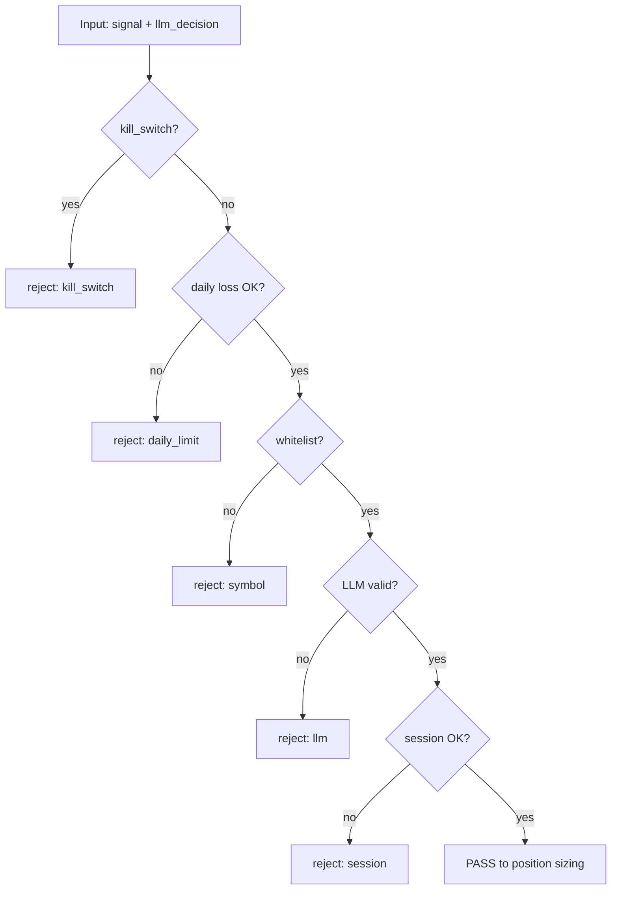

# Правила и guardrails для LLM

> **Guardrails** — жёсткие ограничения, которые **код enforce'ит** независимо от ответа LLM. LLM может галлюцинировать, поддаваться hype и не нести ответственности за убытки. Guardrails — **детерминированный** слой безопасности между AI и реальными деньгами.

---

## Для новичка

Представьте LLM как **стажёра-аналитика**:
- Может дать полезное мнение (approve/reject)
- Может ошибиться, «придумать» данные, переоценить сигнал
- **Не имеет права** нажимать кнопку «Купить»

Поэтому в системе:

1. LLM только **approve/reject** + confidence + counter_thesis.
2. **Размер позиции** считает Code node ([[Position_sizing]]).
3. **Ордера** выставляет n8n → Binance / T-Invest API.
4. При сбое LLM → **no trade** (fail-closed).

SEC/FINRA: инвестируйте осознанно, понимайте риски ([Investor.gov](https://www.investor.gov/introduction-investing)). Автоматизация **не снимает** ответственность оператора.

---

## Подтверждённые факты

| # | Факт | Источник |
|---|------|----------|
| 1 | LLM могут генерировать **plausible but false** information (hallucinations). | Industry consensus; mitigated by schema validation |
| 2 | FINRA: все securities investments involve risk; past performance ≠ future results. | [FINRA Investors Need to Know](https://www.finra.org/investors/investors-need-know) |
| 3 | Investor.gov: understand risks before investing; automated tools don't eliminate risk. | [Investor.gov](https://www.investor.gov/introduction-investing) |
| 4 | Binance API keys: **Disable Withdrawals** recommended for trading bots. | [Binance Endpoint Security](https://developers.binance.com/docs/binance-spot-api-docs/rest-api#endpoint-security-type) |
| 5 | Ollama fail → system should not default to «approve» (fail-closed design). | [[Ollama_integration]], best practice |
| 6 | n8n supports **Error Workflows** for global failure handling. | [n8n Error Handling](https://docs.n8n.io/flow-logic/error-handling/) |
| 7 | Idempotency keys prevent duplicate orders on workflow retry. | [T-Invest PostOrder](https://tinkoff.github.io/investAPI/orders/#postorder), [Binance order docs](https://developers.binance.com/docs/binance-spot-api-docs/rest-api#new-order-trade) |

---

## Подробно: обязательные правила (G1–G12)

| # | Правило | Enforcer | Reject reason code |
|---|---------|----------|-------------------|
| G1 | LLM output must be valid JSON matching schema | Code node | `invalid_json` |
| G2 | `confidence >= 0.7` для approve | IF node | `low_confidence` |
| G3 | `counter_thesis` min 10 chars | Code node | `missing_counter_thesis` |
| G4 | No `quantity`, `leverage`, `size` in LLM output | Code node | `llm_overreach` |
| G5 | Whitelist symbols only | Config + IF | `symbol_not_whitelisted` |
| G6 | Daily loss limit → halt all trading | Code + workflow disable | `daily_loss_limit` |
| G7 | API keys never in prompts, wiki, logs | Architecture review | N/A (preventive) |
| G8 | Human-readable disclaimer in Telegram alerts | Template | N/A |
| G9 | LLM cannot override stop distance below config minimum | Code node | `stop_too_tight` |
| G10 | No trade outside MOEX session (securities) | Session gate | `outside_session` |
| G11 | Max order notional cap (e.g. 5% equity) | Code node | `notional_cap` |
| G12 | `kill_switch: true` in config → halt | IF node first | `kill_switch_active` |

---

## Подробно: запрещённые действия LLM

| Запрещено | Почему | Enforcer |
|-----------|--------|----------|
| Выбор leverage / margin | Extreme risk | Config flag only, not LLM |
| «All in» / 100% portfolio | Ruin risk | Notional cap G11 |
| Override stop-loss | Unlimited loss | G9, Code calculates SL |
| Торговля unknown tickers | Scam/illiquid | G5 whitelist |
| Гарантии доходности | Misleading / illegal tone | System prompt |
| Access API keys | Security breach | G7 |
| Fiat off-ramp instructions | Compliance | Not in scope v1 |

---

## Подробно: fail-closed matrix

| Событие | Действие n8n | Alert level |
|---------|--------------|-------------|
| Ollama timeout (>120s) | reject trade | WARN |
| Ollama HTTP 500 | reject + retry 1× | WARN |
| Invalid JSON from LLM | reject + log raw | INFO |
| JSON missing required field | reject | INFO |
| confidence < 0.7 | reject (even if action=approve) | INFO |
| Binance HTTP 429 | retry 3× exponential backoff | WARN |
| Binance HTTP 418 (ban) | halt crypto workflows | CRITICAL |
| T-Invest UNAVAILABLE | retry 3×, then skip | WARN |
| Daily loss limit hit | disable trading workflows | CRITICAL |
| `kill_switch: true` | halt all before LLM call | CRITICAL |
| Open position without SL | alert every 15m | CRITICAL |
| Manual `live_requires` flag false | block live orders | CRITICAL |

---

## Подробно: guardrails.yaml

**Файл:** `trading_wiki/config/guardrails.yaml`

```yaml
llm:
  min_confidence: 0.7
  max_tokens: 1024
  require_counter_thesis: true
  timeout_ms: 120000
  temperature: 0.1
  allowed_actions: [approve, reject]
  forbidden_output_fields: [quantity, leverage, size, api_key]

trading:
  kill_switch: false
  allowed_envs: [testnet, sandbox]
  live_requires_manual_flag: true
  max_open_positions_crypto: 2
  max_open_positions_securities: 3
  daily_loss_limit_pct: 0.03
  risk_per_trade_pct: 0.01
  max_notional_pct_equity: 0.05
  min_stop_distance_pct: 0.015

symbols:
  crypto_whitelist: [BTCUSDT, ETHUSDT]
  moex_whitelist: [SBER, GAZP, LKOH, GMKN, YNDX]

session:
  moex_start_hour: 10
  moex_end_hour: 19
  timezone: Europe/Moscow

alerts:
  telegram_enabled: true
  disclaimer: "Automated signal. Not financial advice. Operator responsibility."
```

---

## Примеры

### Пример 1: enforce-guardrails sub-workflow



### Пример 2: Code node — daily loss check

```javascript
const config = $('Read guardrails.yaml').first().json;
const today = new Date().toISOString().split('T')[0];
const trades = $('Load Today Trades').all();
const dailyPnl = trades.reduce((sum, t) => sum + (t.json.pnl || 0), 0);
const equity = $('Get Equity').first().json.equity;
const dailyPnlPct = dailyPnl / equity;

if (dailyPnlPct <= -config.trading.daily_loss_limit_pct) {
  return [{ json: { pass: false, reason: 'daily_loss_limit', dailyPnlPct } }];
}
return [{ json: { pass: true, dailyPnlPct } }];
```

### Пример 3: LLM overreach detection

```javascript
const forbidden = ['quantity', 'leverage', 'size', 'api_key', 'order_type'];
const llm = $json.llm_decision;
for (const field of forbidden) {
  if (field in llm) {
    return [{ json: { pass: false, reason: 'llm_overreach', field } }];
  }
}
// Also scan reason string for "buy 100%" patterns
if (/100\s*%|all\s*in/i.test(llm.reason)) {
  return [{ json: { pass: false, reason: 'llm_overreach_language' } }];
}
return [{ json: { pass: true } }];
```

### Пример 4: Telegram alert with disclaimer

```
✅ SIGNAL APPROVED [testnet]
BTCUSDT LONG | confidence 0.78
Rule: rsi_oversold+macd_turn
SL: 58394 | TP: 63812

⚠️ Automated signal. Not financial advice. Operator responsibility.
```

---

## FAQ

### Fail-closed vs fail-open?

**Always fail-closed** for trading. Fail-open (trade when LLM down) = unacceptable risk.

### Кто отвечает за убытки?

**Оператор системы** (вы). LLM vendor (Ollama/local) и биржа не несут ответственности за ваши торговые решения.

### Можно ли override guardrail вручную?

Только через **explicit config change** (git commit + review), не через LLM chat.

### Guardrails для paper vs live?

Same rules. Live adds: `live_requires_manual_flag`, separate API credentials, stricter notional caps.

### Как тестировать guardrails?

Unit tests with fixture JSON: `{ llm_decision, config } → expected pass/fail`. Integration test: kill_switch=true → zero orders placed.

---

## Regulatory awareness

| Topic | Note | Source |
|-------|------|--------|
| US retail education | Understand order types, risks | [Investor.gov](https://www.investor.gov/introduction-investing) |
| FINRA broker-dealer rules | If operating for others — licensing | [FINRA](https://www.finra.org/investors/investors-need-know) |
| Russia crypto | Limited legal framework | [[Crypto_regulation_RU]] |
| Russia securities tax | НДФЛ on gains | [[Russia_tax_basics]] |

Wiki **не** юридическая консультация.

---

## Ключевые понятия

| Термин | Определение |
|--------|-------------|
| Guardrail | Hard limit enforced by code |
| Fail-closed | Error → no trade |
| Kill switch | Emergency halt flag |
| Whitelist | Allowed symbols only |
| Idempotency | Safe retry without duplicate orders |
| Audit log | Immutable record of LLM decisions |

---

## Проверенные источники

1. **[Investor.gov — Introduction to Investing](https://www.investor.gov/introduction-investing)** — SEC/OIEA investor education.
2. **[FINRA — Investors Need to Know](https://www.finra.org/investors/investors-need-know)** — investor responsibilities.
3. **[n8n Error Handling](https://docs.n8n.io/flow-logic/error-handling/)** — global error workflows.
4. **[Ollama API](https://github.com/ollama/ollama/blob/main/docs/api.md)** — timeout, JSON mode.
5. **[Binance API Security](https://developers.binance.com/docs/binance-spot-api-docs/rest-api#endpoint-security-type)** — key permissions.

---

## В автоматической системе

### Sub-workflow: `enforce-guardrails`

**Called before:** every `place-order` execution.  
**Input:** `{ market_type, symbol, llm_decision, env }`  
**Output:** `{ pass: boolean, reason?: string }`

**n8n implementation:**
1. Read `guardrails.yaml` from vault (cached 5 min)
2. Run checks G1–G12 in sequence
3. First fail → return reject + log
4. All pass → forward to `risk-check-and-size`

### Audit log (mandatory)

**Path:** `trading_wiki/logs/llm/YYYY-MM-DD/{trade_id}.json`

```json
{
  "trade_id": "crypto-2026-07-05-001",
  "timestamp": "2026-07-05T18:00:00+03:00",
  "guardrails_version": "1.0.0",
  "checks": [
    {"rule": "G12", "pass": true},
    {"rule": "G6", "pass": true, "dailyPnlPct": -0.01},
    {"rule": "G2", "pass": true, "confidence": 0.78},
    {"rule": "G5", "pass": true, "symbol": "BTCUSDT"}
  ],
  "final": "pass",
  "llm_raw": "{...}"
}
```

### Global error workflow

**Trigger:** any unhandled n8n error in trading workflows.

**Actions:**
1. Log to Obsidian `logs/errors/`
2. Telegram CRITICAL with workflow name
3. IF error in `place-order` → check open orders, alert operator
4. Do NOT auto-retry order placement without idempotency check

### Promotion to live checklist

- [ ] All G1–G12 tested with fixtures
- [ ] kill_switch tested manually
- [ ] daily_loss_limit tested with simulated PnL
- [ ] Audit logs writing correctly
- [ ] Telegram disclaimer present
- [ ] API keys: withdrawals disabled
- [ ] `live_requires_manual_flag: true` set in config
- [ ] Legal review [[Crypto_regulation_RU]] if crypto live

### n8n workflow tags

| Tag | Meaning |
|-----|---------|
| `#env/testnet` | Binance testnet only |
| `#env/sandbox` | T-Invest sandbox |
| `#env/live` | Production — requires manual enable |
| `#halted` | Temporarily disabled |

---

## Связанные темы

- [[LLM_prompts_trading]]
- [[Position_sizing]]
- [[Ollama_integration]]
- [[Trader_psychology]]
- [[Cognitive_biases]]
- [[Crypto_regulation_RU]]
- [[Russia_tax_basics]]
- [[Stop_loss_take_profit]]

---

## Что изучить дальше

1. [[LLM_prompts_trading]] — prompt design for safe LLM output.
2. [[Position_sizing]] — code-side risk calculation.
3. [[Ollama_integration]] — fail-closed on Ollama errors.
4. [[n8n_architecture_overview]] — system-wide safety architecture.
