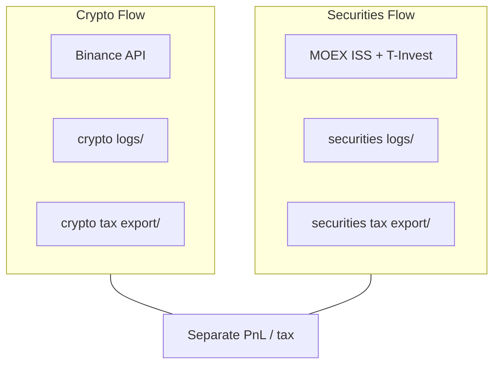

# Регулирование криптовалют в РФ

> Статус crypto в России **ограничен**. Crypto — не законное платёжное средство. Wiki — обзор, не юридическая консультация.

## Главное

- **259-ФЗ** — ЦФА и цифровая валюта с 2021 г.; crypto ≠ рубль как платёж.
- ЦБ предупреждает о рисках ([cbr.ru/finmarkets/digital](https://www.cbr.ru/finmarkets/digital/)).
- Доход от crypto может облагаться НДФЛ — отдельный PnL ledger от MOEX.
- Automation v1: **no fiat off-ramp**; API key без withdrawals; compliance flags перед live.
- Закон меняется — проверяйте актуальную редакцию и консультируйтесь с юристом.

---

## Для новичка

В России crypto нельзя использовать как официальные деньги. Владеть и торговать на биржах — в определённых рамках, правила ужесточаются.

Для Binance API: валютный контроль, KYC, налоги, санкции — ответственность оператора.

---

## Подтверждённые факты

| # | Факт | Источник |
|---|------|----------|
| 1 | **ФЗ № 259-ФЗ** «О цифровых финансовых активах, цифровой валюте и о внесении изменений в отдельные законодательные акты РФ» — с 2021 года регулирует ЦФА и цифровую валюту. | [КонсультантПлюс: 259-ФЗ](https://www.consultant.ru/document/cons_doc_LAW_487488/) |
| 2 | **Цифровая валюта** (криптовалюта) по 259-ФЗ — совокупность электронных данных в IT-системе; **не** является legal tender в РФ. | [259-ФЗ](https://www.consultant.ru/document/cons_doc_LAW_487488/) |
| 3 | **ЦБ РФ** ведёт раздел «Цифровые финансовые активы» с предупреждениями о рисках crypto для граждан. | [Банк России — Digital](https://www.cbr.ru/finmarkets/digital/) |
| 4 | Операции с цифровой валютой могут подпадать под **валютное законодательство** и требования идентификации — детали в 259-ФЗ и подзаконных актах. | [259-ФЗ](https://www.consultant.ru/document/cons_doc_LAW_487488/) |
| 5 | **НДФЛ:** доходы физических лиц от продажи имущества, включая crypto, могут облагаться налогом — см. разделы ФНС об инвестиционных доходах. | [ФНС — Налогообложение](https://www.nalog.gov.ru/rn77/fl/interest/taxation/investment/) |
| 6 | SEC (США) Investor.gov предупреждает: crypto assets — **highly speculative**, fraud risk, volatility. | [Investor.gov — Crypto Assets](https://www.investor.gov/introduction-investing/crypto-assets) |
| 7 | Зарубежные crypto-биржи (Binance и др.) требуют **KYC/AML** — верификация личности. | [Binance Terms](https://www.binance.com/en/terms) (general) |

---

## Подробно: ФЗ № 259-ФЗ (ключевые положения)

| Тема | Содержание (упрощённо) |
|------|------------------------|
| **ЦФА** | Цифровые финансовые активы — права, закреплённые в blockchain (не все crypto = ЦФА) |
| **Цифровая валюта** | Определение Bitcoin-like активов; ограничения на использование как платёж |
| **Операторы обмена** | Лицензирование / реестр (развитие регулирования) |
| **Майнинг** | Специальное регулирование (законодательство дополняется) |
| **Ответственность** | Административная/уголовная за нарушения (зависит от деяния) |

Полный текст: [consultant.ru — 259-FZ](https://www.consultant.ru/document/cons_doc_LAW_487488/).

> Закон **изменяется**. Проверяйте актуальную редакцию и разъяснения ЦБ/ФНС перед live trading.

---

## Подробно: позиция ЦБ РФ

Банк России ([cbr.ru/finmarkets/digital](https://www.cbr.ru/finmarkets/digital/)):

- Предупреждает о **волатильности** и **мошенничестве** на crypto-рынке.
- Не поддерживает crypto как **средство платежа** внутри РФ.
- Развивает инфраструктуру **ЦФА** (цифровые финансовые активы) как **регулируемую** альтернативу.

**Для automation operator:** мониторинг пресс-релизов ЦБ — изменения могут повлиять на доступность бирж и банковских сервисов.

---

## Подробно: риски для автоматизированной торговли

| Риск | Описание | Mitigation в проекте |
|------|----------|---------------------|
| **Блокировка переводов** | Банки могут блокировать P2P/crypto-related операции | Отдельный учёт; no auto fiat off-ramp |
| **KYC/AML** | Биржа требует верификацию; freeze при подозрениях | Legal account only |
| **Санкционные ограничения** | Доступ к некоторым биржам/сервисам ограничен | `geo_restrictions` flag |
| **Налоги** | Доход от crypto → потенциальный НДФЛ | Trade log + tax export |
| **API ban / IP block** | Биржа блокирует регион | VPN не рекомендуется — compliance risk |
| **Volatility** | Резкие движения, ликвидация | [[Stop_loss_take_profit]], daily limit |
| **Exchange hack** | Counterparty risk | Не хранить на бирже больше необходимого |

---

## Подробно: налогообложение crypto (ориентир)

| Событие | Tax implication (ориентир) |
|---------|------------------------------|
| Продажа BTC за USDT с прибылью | Потенциальный НДФЛ на доход |
| Обмен altcoin → BTC | Может быть taxable event |
| Holding без продажи | Обычно нет tax event |
| Mining income | Отдельный порядок (уточняйте ФНС) |

**ФНС:** [nalog.gov.ru — investment taxation](https://www.nalog.gov.ru/rn77/fl/interest/taxation/investment/).

**Automation v1:** собирать данные, **не** auto-file. См. [[Russia_tax_basics]] для securities; crypto — **отдельный** PnL ledger.

---

## Примеры

### Пример 1: Compliance checklist перед live crypto-flow

```yaml
checklist:
  - item: "Юридическая оценка для физлица/ИП/юрлица"
    status: pending
  - item: "Учёт crypto PnL отдельно от MOEX"
    status: done
  - item: "Binance account KYC completed"
    status: done
  - item: "API key: withdrawals DISABLED"
    status: done
  - item: "Tax export workflow configured"
    status: done
  - item: "geo_restrictions reviewed"
    status: pending
  - item: "Legal counsel consulted"
    status: pending
```

### Пример 2: Trade log (crypto, tax-ready)

```yaml
trade_id: crypto-2026-07-05-001
symbol: BTCUSDT
side: sell
quantity: 0.001
buy_price_usdt: 58000
sell_price_usdt: 62000
gross_pnl_usdt: 4.00
fees_usdt: 0.10
buy_date: 2026-06-01
sell_date: 2026-07-05
exchange: binance
env: testnet  # live: update for real tax
tax_note: "consult ФНС — crypto separate from MOEX"
legal_notice: "Operator responsibility"
```

### Пример 3: geo_restrictions config

```yaml
# crypto_config.yaml
geo_restrictions:
  operator_residency: RU
  exchange_access_confirmed: true  # manual legal review
  blocked_jurisdictions_check: true
  note: "Verify Binance ToS for your region before live"
```

### Пример 4: n8n — no fiat off-ramp

Workflow `crypto-flow` **explicitly excludes:**
- P2P sell to RUB
- Bank withdrawal automation
- Card top-up automation

Only: spot trade on whitelisted pairs. Fiat — **manual** by operator.

---

## FAQ

### Легально ли торговать crypto в России в 2026?

Правовая среда **сложная и меняющаяся**. 259-ФЗ определяет рамки; практика enforcement развивается. **Консультируйтесь с юристом** для вашей ситуации (физлицо, резидентство, объёмы).

### Можно ли использовать Binance из РФ?

Доступность и ToS **меняются**; санкционные и compliance ограничения. Operator must verify **current** Binance terms and local law. Wiki не даёт legal opinion.

### Нужно ли декларировать crypto-доход?

При наличии **налогооблагаемого дохода** — обязанности по НК РФ. Детали — [ФНС](https://www.nalog.gov.ru/rn77/fl/interest/taxation/investment/). Automation собирает данные; декларирование — operator.

### LLM может давать legal advice по crypto?

**Нет.** System prompt запрещает. Legal — только qualified lawyer.

### Testnet нужен для compliance?

Testnet — для **technical** testing без real money. Compliance review нужен **перед live**, не testnet.

---

## Частые ошибки операторов

1. **Игнорировать 259-ФЗ** — «crypto в серой зоне, не моя проблема».
2. **Смешивать MOEX и crypto PnL** в одном tax export.
3. **Auto fiat withdrawal** — банковские блокировки.
4. **API key с withdrawals enabled** — security risk.
5. **VPN для обхода geo-block** — compliance violation risk.
6. **Доверять LLM** по legal questions.

---

## Ключевые понятия

| Термин | Определение |
|--------|-------------|
| 259-ФЗ | Закон о ЦФА и цифровой валюте |
| ЦФА | Цифровые финансовые активы |
| Цифровая валюта | Crypto по определению закона |
| KYC | Know Your Customer — идентификация |
| AML | Anti-Money Laundering |
| Legal tender | Законное платёжное средство (рубль в РФ) |

---

## Проверенные источники

1. **[Банк России — Цифровые финансовые активы](https://www.cbr.ru/finmarkets/digital/)** — позиция ЦБ, предупреждения.
2. **[КонсультантПлюс: ФЗ № 259-ФЗ](https://www.consultant.ru/document/cons_doc_LAW_487488/)** — полный текст закона.
3. **[КонсультантПлюс: НК РФ](https://www.consultant.ru/document/cons_doc_LAW_28165/)** — налоговые нормы.
4. **[ФНС — Налогообложение инвестиций](https://www.nalog.gov.ru/rn77/fl/interest/taxation/investment/)** — НДФЛ context.
5. **[Investor.gov — Crypto Assets](https://www.investor.gov/introduction-investing/crypto-assets)** — SEC/OIEA risk education (general).

---

## Академические источники

См. также: [[Academic_sources]].

| Категория | Что изучать | Почему полезно | URL |
|---|---|---|---|
| BIS (крипто, 2023) | The crypto ecosystem: key elements and risks | Структурные риски крипто/DeFi и варианты политики — полезно для обоснования «консервативных» ограничений в crypto-flow | https://www.bis.org/publ/othp72.pdf |
| ESRB (крипто, 2025) | Crypto-assets and decentralised finance | Системные риски stablecoins/CIPs/MFGs — релевантно для комплаенс флагов и мониторинга интеграции с TradFi | https://www.esrb.europa.eu/pub/pdf/reports/esrb.report202510_cryptoassets.en.pdf |
| MIT / A. Lo (2022) | 15.481x Adaptive Markets: Financial Market Dynamics and Human Behavior (Fall 2022) | Контекст AI/поведения/риска — полезно при формулировке guardrails и ответственности оператора | https://ocw.mit.edu/courses/15-481x-adaptive-markets-financial-market-dynamics-and-human-behavior-fall-2022/resources/mit-economist-andrew-w-lo-on-finance-ai-and-human-behavior/ |
| IEEE (2025) | Evolving Portfolio Heuristics: A Self-Correcting LLM Framework for Portfolio Optimization | Академический пример использования LLM в финансовых решениях — полезно как фон, но не как «разрешение» на live trading | https://ieeexplore.ieee.org/document/11200704/ |
| arXiv (2025) | Decision by Supervised Learning with Deep Ensembles (arXiv:2503.13544) | Устойчивость решений через ансамбли — актуально для контроля рисков и снижения нестабильности | https://arxiv.org/abs/2503.13544 |

---

## В автоматической системе

### crypto_config.yaml — legal section

```yaml
env: testnet
legal_notice: "Automated trading is operator responsibility. Not legal/tax advice."
compliance:
  geo_restrictions_reviewed: false
  legal_counsel_consulted: false
  kyc_completed: false
  separate_crypto_ledger: true
  fiat_offramp_automation: false  # MUST stay false in v1
  tax_export_enabled: true
pairs:
  - BTCUSDT
  - ETHUSDT
```

### n8n guardrails (crypto-specific)

| Rule | Implementation |
|------|----------------|
| No fiat off-ramp nodes | Workflow audit |
| `fiat_offramp_automation: false` | Config check in enforce-guardrails |
| Separate log path | `trades/crypto-*.md` not mixed with securities |
| Disclaimer in alerts | Telegram template |
| live requires legal flag | `compliance.legal_counsel_consulted: true` |

### Compliance workflow (manual trigger)

**Workflow:** `crypto-compliance-review`

1. Read `crypto_config.yaml` compliance section
2. Check all flags true for live promotion
3. IF any false → block tag `#env/live` + Telegram
4. Generate Obsidian report `compliance/crypto-review-YYYY-MM-DD.md`

### Audit trail

```yaml
review_date: 2026-07-05
operator: user
checks:
  259_fz_reviewed: true
  cbr_warnings_read: true
  fns_tax_process_documented: true
  binance_tos_reviewed: true
  api_withdrawals_disabled: true
decision: "remain testnet until legal counsel"
next_review: 2026-10-05
```

### Separation MOEX vs Crypto



**Never merge** in single tax CSV without explicit labeling.

---

## Связанные темы

- [[Crypto_basics]]
- [[Crypto_exchanges]]
- [[Crypto_flow_design]]
- [[Russia_tax_basics]]
- [[Binance_API]]
- [[LLM_rules_and_guardrails]]
- [[n8n_architecture_overview]]

---

## Что изучить дальше

1. [[Crypto_flow_design]] — technical pipeline (testnet first).
2. [[Russia_tax_basics]] — НДФЛ на securities (отдельный учёт).
3. [259-ФЗ на Consultant.ru](https://www.consultant.ru/document/cons_doc_LAW_487488/) — актуальная редакция.
4. [cbr.ru/finmarkets/digital](https://www.cbr.ru/finmarkets/digital/) — мониторинг позиции ЦБ.
