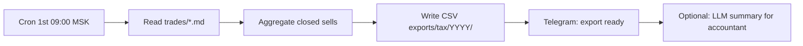

# Налоги на доходы от ценных бумаг (РФ)

> Доход от ценных бумаг облагается **НДФЛ**. Брокер часто — налоговый агент. Wiki не заменяет налогового специалиста.

## Главное

- Налогооблагаемый доход ≈ продажа − покупка − комиссии (уточняйте у брокера и ФНС).
- Ставки: 13% до лимита, 15% на превышение ([ФНС](https://www.nalog.gov.ru/rn77/fl/interest/taxation/tax_rates/)).
- **ИИС** тип А (вычет на взнос) или Б (освобождение дохода) — отдельный счёт и ограничения.
- Tax event — обычно **продажа**, не покупка; дивиденды — отдельный порядок.
- Automation v1: сбор данных в trade log; расчёт НДФЛ — брокер + специалист.

---

## Для новичка

Продали дороже покупки — возник доход. Убыток можно зачесть в определённых случаях ([ФНС](https://www.nalog.gov.ru/rn77/fl/interest/taxation/investment/)).

Брокер часто удерживает НДФЛ, но проверять справки — ваша задача.

---

## Подтверждённые факты

| # | Факт | Источник |
|---|------|----------|
| 1 | Доходы физических лиц от операций с ценными бумагами облагаются **НДФЛ** в порядке, установленном НК РФ. | [ФНС — Налогообложение инвестиций](https://www.nalog.gov.ru/rn77/fl/interest/taxation/investment/) |
| 2 | С 2021 года действует **прогрессивная шкала НДФЛ**: базовая ставка **13%** до установленного лимита дохода, **15%** на сумму превышения (актуальные лимиты — на сайте ФНС). | [ФНС — Налоговые ставки](https://www.nalog.gov.ru/rn77/fl/interest/taxation/tax_rates/) |
| 3 | **ИИС** — особый налоговый режим; тип А (вычет на взнос) или тип Б (освобождение от НДФЛ на доход при соблюдении условий). | [ФНС — ИИС](https://www.nalog.gov.ru/rn77/fl/interest/taxation/iis/) |
| 4 | НК РФ (часть вторая) — основной закон о налогах, включая НДФЛ (гл. 23). | [КонсультантПлюс: НК РФ](https://www.consultant.ru/document/cons_doc_LAW_28165/) |
| 5 | Брокер как **налоговый агент** удерживает НДФЛ и перечисляет в бюджет; инвестор получает справки (2-НДФЛ и аналоги). | [ФНС — Налогообложение инвестиций](https://www.nalog.gov.ru/rn77/fl/interest/taxation/investment/) |
| 6 | **Дивиденды** — отдельный порядок налогообложения; может отличаться от дохода от продажи акций. | [ФНС — Налогообложение инвестиций](https://www.nalog.gov.ru/rn77/fl/interest/taxation/investment/) |
| 7 | **Льгота на длительное владение** (LDTI) — освобождение от НДФЛ при выполнении условий по сроку владения и типу актива. | [ФНС — Налогообложение инвестиций](https://www.nalog.gov.ru/rn77/fl/interest/taxation/investment/) |

---

## Подробно: виды доходов

| Вид дохода | Пример | Налогообложение |
|------------|--------|-----------------|
| Продажа акций с прибылью | Купил SBER 250, продал 280 | НДФЛ на разницу |
| Продажа с убытком | Купил 280, продал 250 | Убыток для зачёта (условия ФНС) |
| Дивиденды | Выплата от эмитента | Отдельный порядок |
| Купон по облигациям | Купон ОФЗ | НДФЛ (уточняйте тип облигации) |
| Продажа БПИФ/ETF | TMOS, SBMX | Зависит от структуры фонда |

> Точный расчёт — по документам брокера и актуальным разъяснениям [ФНС](https://www.nalog.gov.ru/rn77/fl/interest/taxation/investment/).

---

## Подробно: ставки НДФЛ (ориентир)

| Ситуация | Ставка (ориентир) | Примечание |
|----------|-------------------|------------|
| Доход до лимита по прогрессивной шкале | **13%** | Лимит уточняйте на ФНС |
| Доход сверх лимита | **15%** | На сумму превышения |
| ИИС тип Б (при соблюдении условий) | **0%** на инвестдоход | Мин. срок, лимит взносов |
| Льгота длительного владения | **0%** при выполнении условий | Срок, тип актива, лимит |

**Актуальные ставки и лимиты:** [ФНС — Налоговые ставки](https://www.nalog.gov.ru/rn77/fl/interest/taxation/tax_rates/).

---

## Подробно: ИИС

| Тип | Суть | Условия (упрощённо) |
|-----|------|---------------------|
| **Тип А** | Вычет 13% на взнос (до лимита) | Срок ИИС, лимит взносов/год |
| **Тип Б** | Освобождение от НДФЛ на **инвестиционный доход** | Мин. 3 года, лимиты взносов |

**Важно для automation:**
- ИИС имеет **ограничения** (один счёт, срок, досрочное закрытие → потеря льгот).
- Auto-trading на ИИС — отдельный `account_id` и config flag.
- Оператор обязан соблюдать закон; bot не заменяет compliance.

Документация: [ФНС — ИИС](https://www.nalog.gov.ru/rn77/fl/interest/taxation/iis/).

---

## Подробно: льгота на длительное владение (LDTI)

**Идея:** если владели акциями определённого эмитента **≥ 3 лет** (и другие условия), доход от продажи может быть **освобождён** от НДФЛ в пределах лимита.

**Условия и лимиты** — на [ФНС](https://www.nalog.gov.ru/rn77/fl/interest/taxation/investment/). Automation может **track holding_days** в trade log для напоминания оператору.

---

## Примеры

### Пример 1: Простая сделка SBER

| Параметр | Значение |
|----------|----------|
| Покупка | 250 ₽ × 100 акций = 25 000 ₽ |
| Продажа через 45 дней | 280 ₽ × 100 = 28 000 ₽ |
| Комиссии | 50 ₽ |
| Gross profit | 2 950 ₽ |
| НДФЛ 13% (ориентир) | ~383 ₽ |
| Net profit | ~2 567 ₽ |

> Брокер может удержать налог автоматически. Цифры **иллюстративные**.

### Пример 2: index_dca через securities-flow

| Параметр | Значение |
|----------|----------|
| 1-е число месяца | Покупка TMOS на 10 000 ₽ |
| Holding | 12+ месяцев без продажи |
| Tax event | При **продаже** паёв, не при покупке |
| Log | `tax_note: "no event until sell"` |

### Пример 3: Убыток для зачёта

| Сделка | PnL |
|--------|-----|
| Trade A (GAZP) | +5 000 ₽ |
| Trade B (YNDX) | −3 000 ₽ |
| Taxable (упрощённо) | +2 000 ₽ (если зачёт разрешён) |

Правила зачёта — [ФНС](https://www.nalog.gov.ru/rn77/fl/interest/taxation/investment/).

### Пример 4: Trade log для бухгалтерии

```yaml
trade_id: sec-2026-07-05-001
ticker: SBER
side: sell
quantity: 100
buy_date: 2026-05-20
sell_date: 2026-07-05
buy_price_avg: 250.00
sell_price: 280.00
gross_pnl: 3000.00
fees: 50.00
holding_days: 46
ldti_eligible: false  # check manually
tax_note: "consult broker 2-NDFL report"
```

---

## FAQ

### Брокер сам платит налог?

Брокер как **налоговый агент** **удерживает** НДФЛ при определённых событиях (вывод, конец года). Но вы обязаны **проверять** справки и при необходимости **доплатить** или **заявить** вычеты через декларацию 3-НДFL.

### Нужна ли декларация 3-НДFL?

Зависит от ситуации: если налог полностью удержан агентом и нет других доходов — может не требоваться. При зарубежных активах, ИИС, вычетах — часто **да**. Консультируйтесь с ФНС или специалистом.

### n8n может рассчитать налог?

**v1: нет.** Только **сбор данных** для бухгалтерии. LLM может сформировать **summary** без юридических выводов. Расчёт НДФЛ — брокер + специалист.

### Как учитывать комиссии?

Включайте в `fees` field trade log. Брокерский отчёт — source of truth.

### Автоторговля на ИИС — legal?

Технически возможна через T-Invest API. **Ограничения ИИС** (срок, один счёт, лимиты) — ответственность оператора. Отдельный config flag `iis: true`.

---

## Частые ошибки

1. **Не учитывать комиссии** в PnL.
2. **Забыть про дивиденды** — отдельный tax event.
3. **Путать ИИС тип А и Б** — разные льготы.
4. **Игнорировать LDTI** — продать через 2.9 лет вместо 3.
5. **Доверять только bot log** — сверять с брокерским отчётом.
6. **LLM как налоговый консультант** — запрещено в guardrails.

---

## Ключевые понятия

| Термин | Определение |
|--------|-------------|
| НДФЛ | Налог на доходы физических лиц |
| Налоговый агент | Брокер, удерживающий налог |
| ИИС | Индивидуальный инвестиционный счёт |
| LDTI | Льгота длительного владения |
| 3-НДFL | Декларация о доходах |
| Tax event | Момент возникновения налога (обычно продажа) |

---

## Проверенные источники

1. **[ФНС — Налогообложение операций с ценными бумагами](https://www.nalog.gov.ru/rn77/fl/interest/taxation/investment/)** — основной раздел для инвесторов.
2. **[ФНС — Налоговые ставки НДФЛ](https://www.nalog.gov.ru/rn77/fl/interest/taxation/tax_rates/)** — прогрессивная шкала.
3. **[ФНС — ИИС](https://www.nalog.gov.ru/rn77/fl/interest/taxation/iis/)** — типы А и Б.
4. **[КонсультантПлюс: НК РФ ч. II](https://www.consultant.ru/document/cons_doc_LAW_28165/)** — Налоговый кодекс.
5. **[T-Invest API — Operations](https://tinkoff.github.io/investAPI/operations/)** — данные операций от брокера для reconciliation.

---

## Академические источники

См. также: [[Academic_sources]].

| Категория | Что изучать | Почему полезно | URL |
|---|---|---|---|
| MIT / A. Lo (2022) | 15.481x Adaptive Markets: Financial Market Dynamics and Human Behavior (Fall 2022) | Контекст рисков автоматизации и «оператор отвечает» — важно для корректных дисклеймеров в налоговых/комплаенс-выгрузках | https://ocw.mit.edu/courses/15-481x-adaptive-markets-financial-market-dynamics-and-human-behavior-fall-2022/resources/mit-economist-andrew-w-lo-on-finance-ai-and-human-behavior/ |
| Stanford GSB (курс) | GSBGEN 646 Behavioral Economics and the Psychology of Decision Making | Heuristics/biases и самоконтроль — полезно для снижения «churn» (лишних сделок) и количества tax events | https://explorecourses.stanford.edu/search?view=catalog&filter-coursestatus-Active=on&page=0&catalog=&q=GSBGEN+646%3A+Behavioral+Economics+and+the+Psychology+of+Decision+Making&collapse= |
| ВШЭ (ВКР, 2024) | Hedging Derivatives Under Incomplete Markets with Deep Learning (VKR 929592108) | Пример системного подхода к «решение → сделка → учёт»; полезно при проектировании tax-export пайплайна | https://www.hse.ru/en/edu/vkr/929592108 |

---

## В автоматической системе

### Trade log fields (Obsidian YAML)

```yaml
# Required for tax export
trade_id: sec-2026-07-05-001
ticker: SBER
figi: BBG004730N88
side: sell
quantity: 100
buy_date: 2026-05-20
sell_date: 2026-07-05
buy_price_avg: 250.00
sell_price: 280.00
gross_pnl: 3000.00
fees: 50.00
net_pnl: 2950.00
holding_days: 46
account_type: brokerage  # brokerage | iis_type_a | iis_type_b
tax_note: "consult broker report"
broker_report_ref: null
```

### n8n workflow: monthly-tax-export



**Schedule:** `0 9 1 * *`

**Code node — aggregate:**
```javascript
const sells = $input.all()
  .filter(t => t.json.side === 'sell' && t.json.sell_date?.startsWith('2026'))
  .map(t => t.json);

const totalGrossPnl = sells.reduce((s, t) => s + (t.gross_pnl || 0), 0);
const totalFees = sells.reduce((s, t) => s + (t.fees || 0), 0);

return [{
  json: {
    year: 2026,
    trade_count: sells.length,
    total_gross_pnl: totalGrossPnl,
    total_fees: totalFees,
    disclaimer: 'Not tax advice. Verify with broker and tax professional.',
    rows: sells
  }
}];
```

### LLM summary prompt (accountant helper)

```markdown
Summarize the following closed trades CSV for a tax accountant.
List: ticker, buy_date, sell_date, gross_pnl, fees, holding_days.
Calculate totals. Do NOT calculate exact НДФЛ — note "consult ФНС rates".
Output: markdown table in Russian.
```

**Guardrail:** LLM output tagged `informational_only: true` — not filed with ФНС.

### Reconciliation with broker

**Monthly workflow:**
1. T-Invest `GetOperations` for period
2. Compare with Obsidian trade log
3. Flag mismatches → Telegram WARN
4. Operator resolves manually

### Guardrails

| Rule | Enforcer |
|------|----------|
| No auto tax filing | Architecture |
| LLM no legal tax conclusions | Prompt + review |
| IIS trades separate account_id | Config |
| Tax export includes disclaimer | Template |

---

## Связанные темы

- [[Securities_flow_design]]
- [[MOEX_stocks]]
- [[Bonds_basics]]
- [[Crypto_regulation_RU]]
- [[LLM_rules_and_guardrails]]
- [[Tinkoff_Invest_API]]

---

## Что изучить дальше

1. [[Securities_flow_design]] — index_dca tax stubs.
2. [[Crypto_regulation_RU]] — налогообложение crypto (отдельный учёт).
3. [ФНС — ИИС](https://www.nalog.gov.ru/rn77/fl/interest/taxation/iis/) — если используете ИИС.
4. Документация вашего брокера — раздел «Налоги».
